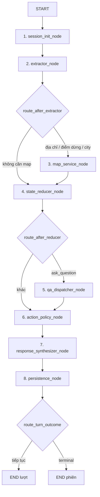
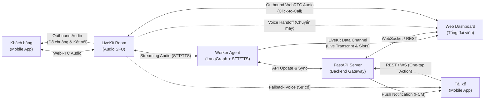
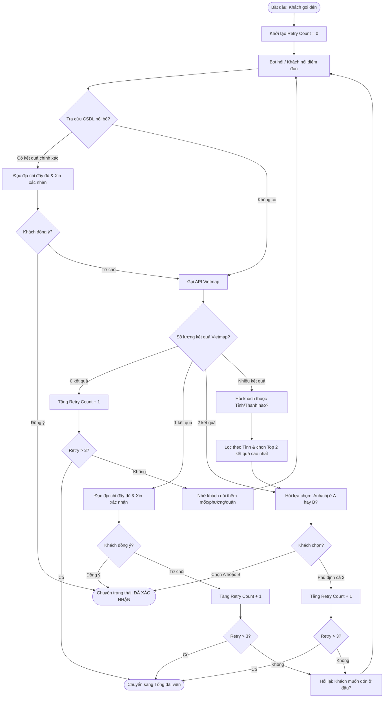

# HỆ THỐNG TỔNG ĐÀI ĐẶT XE THÔNG MINH PARROTGO — TÀI LIỆU TOÀN DIỆN
*(ParrotGo: Smart Voice Taxi Booking System — Full Consolidated Documentation)*

---

> **Dự án:** ParrotGo (Voice AI Agent for Taxi Dispatching)  
> **Ngôn ngữ & Nền tảng:** Python 3.11+, LangGraph, ChromaDB, SQLite, Vietmap API, LiveKit / VoIP Gateway  
> **Mục đích tài liệu:** Tài liệu này hợp nhất toàn bộ tài liệu kiến trúc, đặc tả dữ liệu, đồ thị trạng thái, hướng dẫn vận hành và các báo cáo tối ưu của dự án ParrotGo thành một tài liệu duy nhất, phục vụ việc tra cứu, chuyển giao và lưu trữ kỹ thuật.

---

<a id="mục-lục-toàn-diện"></a>
## MỤC LỤC TOÀN DIỆN (TABLE OF CONTENTS)

### Bảng tóm tắt các phân hệ tài liệu

| Phần | Tên phân hệ tài liệu | File nguồn | Vai trò chính |
| :--- | :--- | :--- | :--- |
| [Phần 1](#readme-md) | [TỔNG QUAN DỰ ÁN & HƯỚNG DẪN KHỞI CHẠY](#readme-md) | `README.md` | Giới thiệu tổng quan hệ thống ParrotGo MVP CLI, kiến trúc 8 nodes & 3 conditional edges, cấu trúc mã nguồn và hướng dẫn cài đặt / khởi chạy nhanh. |
| [Phần 2](#system-md) | [THIẾT KẾ HỆ THỐNG TỔNG THỂ](#system-md) | `system.md` | Kiến trúc hệ thống tổng đài thoại thông minh toàn diện: Voice Gateway SIP/VoIP, LiveKit WebRTC, Whisper ASR, TTS, LLM Orchestration và cơ chế Human Handoff. |
| [Phần 3](#architecture-md) | [KIẾN TRÚC KỸ THUẬT MVP CLI & CONTRACTS](#architecture-md) | `architecture.md` | Ranh giới giao tiếp ASR → Core → TTS, cấu trúc cuốc xe (booking slots), bất biến state, điều kiện ready_to_book và schema chuẩn dùng chung. |
| [Phần 4](#langgraph-md) | [ĐỒ THỊ ĐIỀU PHỐI LANGGRAPH](#langgraph-md) | `langgraph.md` | Thiết kế topology 8 nodes và 3 conditional edges của LangGraph, pseudocode chi tiết cho từng node xử lý lượt thoại đặt xe taxi. |
| [Phần 5](#planner-md) | [BỘ ĐIỀU PHỐI PLANNER, REDUCER VÀ LỜI THOẠI](#planner-md) | `planner.md` | Vòng đời slot, quy tắc Reducer không suy diễn, Policy ra quyết định action, và ngân hàng lời thoại chuẩn (Voice Dialog Templates). |
| [Phần 6](#extractor-md) | [BỘ TRÍCH XUẤT EXTRACTOR & NLU TỪ VĂN BẢN ASR](#extractor-md) | `extractor.md` | Đặc tả NLU bóc tách intent, slot, operation; xử lý lỗi ASR, tiếng ồn, từ lóng và ma trận 12 tình huống NLU tiêu biểu. |
| [Phần 7](#map-md) | [DỊCH VỤ BẢN ĐỒ MAP SERVICE & ĐỊA DANH](#map-md) | `map.md` | Tích hợp Vietmap API, chuẩn hóa địa danh, xử lý ngõ hẻm, alias địa phương, điểm đón/trả và ma trận 17 tình huống xử lý địa lý. |
| [Phần 8](#ask-md) | [XỬ LÝ HỎI ĐÁP Q&A, FAQ/RAG VÀ TRA CỨU PHIÊN](#ask-md) | `ask.md` | Xử lý câu hỏi ngoài lề gồm 3 nhóm: FAQ tĩnh qua Chroma RAG, tools động tính giá/quãng đường, và State Inspector tra cứu chuyến đi. |
| [Phần 9](#rag-md) | [CƠ SỞ TRI THỨC NGHIỆP VỤ — ĐẶT XE QUA TỔNG ĐÀI XANH SM](#rag-md) | `rag.md` | Tập tri thức nghiệp vụ dịch vụ đặt xe taxi (loại xe, giá cước, điểm đón/trả, đặt hộ/trước, biểu phí, hành lý thất lạc, khiếu nại). |
| [Phần 10](#database-md) | [LƯU TRỮ, QUẢN TRỊ DỮ LIỆU & VECTOR DB](#database-md) | `database.md` | Kiến trúc lưu trữ 3 tầng: State runtime, Persistent SQLite 6 bảng, Vector DB Chroma và quy trình nạp seed data địa danh / FAQ. |
| [Phần 11](#plan-md) | [KẾ HOẠCH & LỘ TRÌNH TRIỂN KHAI MVP CLI](#plan-md) | `plan.md` | Kế hoạch hành động 4 giai đoạn triển khai mã nguồn, cấu trúc module và bộ tiêu chí nghiệm thu acceptance criteria. |
| [Phần 12.1](#demo-risk-audit-2026-10-07-md) | [BÁO CÁO RÀ SOÁT RỦI RO DEMO PARROTGO (07/10/2026)](#demo-risk-audit-2026-10-07-md) | `reports/demo-risk-audit-2026-10-07.md` | Báo cáo kiểm thử rà soát rủi ro kịch bản demo: địa chỉ, mock fallback, ngữ cảnh NLU, xử lý thời gian tự nhiên. |
| [Phần 12.2](#demo-optimization-2026-10-08-md) | [KẾT QUẢ BỔ SUNG DỮ LIỆU & TỐI ƯU DEMO (08/10/2026)](#demo-optimization-2026-10-08-md) | `reports/demo-optimization-2026-10-08.md` | Kết quả bổ sung dữ liệu địa danh bền vững, nạp FAQ Chroma và tối ưu tỷ lệ pass test suite. |
| [Phần 12.3](#clarification-ux-fix-2026-10-08-md) | [SỬA TRẢI NGHIỆM LÀM RÕ ĐỊA ĐIỂM (08/10/2026)](#clarification-ux-fix-2026-10-08-md) | `reports/clarification-ux-fix-2026-10-08.md` | Tối ưu câu hỏi làm rõ địa điểm ngắn gọn, giảm độ dài đọc thoại và tránh bẫy câu hỏi A/B sai ngữ cảnh. |

---

### Danh mục chi tiết các đề mục

- **[Phần 1: TỔNG QUAN DỰ ÁN & HƯỚNG DẪN KHỞI CHẠY](#readme-md)** (`README.md`)
  - 1. Kiến trúc tổng quan
  - 2. Cấu trúc mã nguồn
  - 3. Cài đặt và Khởi chạy
  - 4. Quản lý và Nạp dữ liệu
  - Demo đã bổ sung dữ liệu và kiểm tra live
- **[Phần 2: THIẾT KẾ HỆ THỐNG TỔNG THỂ](#system-md)** (`system.md`)
  - 1. Kiến trúc tổng thể hệ thống
  - 2. Luồng hoạt động chi tiết (Workflows)
  - 3. Bảng phân định trạng thái và quyền hạn
- **[Phần 3: KIẾN TRÚC KỸ THUẬT MVP CLI & CONTRACTS](#architecture-md)** (`architecture.md`)
  - 1. Phạm vi và giao tiếp ASR → Core → TTS
  - 2. Thông tin cuốc xe
  - 3. Schema chuẩn
  - 4. Bất biến của state và xác nhận
  - 5. Điều kiện ready_to_book
  - 6. Đồng hồ và địa lý
  - 7. Lưu trữ và kết thúc phiên
- **[Phần 4: ĐỒ THỊ ĐIỀU PHỐI LANGGRAPH](#langgraph-md)** (`langgraph.md`)
  - 1. Topology: 8 node, 3 conditional edge
  - 2. Helper thuần dùng chung
  - 3. Node 1 — reset lượt, giữ state phiên
  - 4. Node 2 — Extractor
  - 5. Node 3 — Map, không bỏ qua đường alias
  - 6. Node 4 — nơi duy nhất thay booking_slots
  - 7. Node 5 — QA đọc state mới
  - 8. Node 6 — Policy chỉ đọc slot
  - 9. Node 7 — văn bản thoại sạch
  - 10. Node 8 — một transaction, phát câu trả lời sau commit
  - 11. Routing và lắp graph
- **[Phần 5: BỘ ĐIỀU PHỐI PLANNER, REDUCER VÀ LỜI THOẠI](#planner-md)** (`planner.md`)
  - 1. Trách nhiệm không chồng chéo
  - 2. Vòng đời slot
  - 3. Confirm, deny, cancel nhiều lượt
  - 4. Thứ tự quyết định action
  - 5. Ngân hàng lời thoại
  - 6. Guardrails thoại
  - 7. Ma trận nghiệm thu Planner
- **[Phần 6: BỘ TRÍCH XUẤT EXTRACTOR & NLU TỪ VĂN BẢN ASR](#extractor-md)** (`extractor.md`)
  - 1. Trách nhiệm
  - 2. Contract đầu vào/đầu ra
  - 3. Intent taxonomy
  - 4. Bóc tách theo ngữ cảnh và ASR
  - 5. Thời gian và đồng hồ tham chiếu
  - 6. Ma trận 12 tình huống NLU
  - 7. Prompt và validator
  - 8. Kiểm thử
- **[Phần 7: DỊCH VỤ BẢN ĐỒ MAP SERVICE & ĐỊA DANH](#map-md)** (`map.md`)
  - 1. Ranh giới và nguyên tắc
  - 2. Contract dịch vụ thống nhất
  - 3. Pipeline mọi địa chỉ, kể cả alias
  - 4. Ma trận 17 tình huống trong 8 nhóm
  - 5. Mega POI và fallback đúng tọa độ
  - 6. Đếm retry và fallback destination
  - 7. Mock offline và live adapter
  - 8. Kiểm thử Map bắt buộc
- **[Phần 8: XỬ LÝ HỎI ĐÁP Q&A, FAQ/RAG VÀ TRA CỨU PHIÊN](#ask-md)** (`ask.md`)
  - 1. Vị trí và trách nhiệm
  - 2. Contract
  - 3. Nhóm 1 — Static FAQ/RAG
  - 4. Nhóm 2 — Tools động
  - 5. Nhóm 3 — State Inspector
  - 6. Multi-intent và ưu tiên câu trả lời
  - 7. Kiểm thử hỏi đáp
- **[Phần 9: CƠ SỞ TRI THỨC NGHIỆP VỤ — ĐẶT XE QUA TỔNG ĐÀI XANH SM](#rag-md)** (`rag.md`)
  - 1. Quy định chung về dịch vụ đặt xe qua tổng đài
  - 2. Quy định về các loại xe
  - 3. Thông tin cần cung cấp khi đặt xe
  - 4. Quy định về điểm đón
  - 5. Quy định về điểm đến
  - 6. Đặt xe hộ và đặt nhiều xe
  - 7. Đặt xe ngay và đặt xe trước
  - 8. Quy trình tiếp nhận và điều phối xe
  - 9. Thời gian xe đến đón
  - 10. Quy định chờ khách tại điểm đón
  - 11. Thay đổi thông tin đặt xe
  - 12. Quy định hủy chuyến
  - 13. Cách tính cước và giá chuyến đi
  - 14. Quy định về phụ phí
  - 15. Quy định về thanh toán
  - 16. Khuyến mại và mã giảm giá
  - 17. Quy định về hành lý và đồ dùng cá nhân
  - 18. Trẻ em, người cao tuổi và người cần hỗ trợ
  - 19. Thú cưng và các quy định trong xe
  - 20. Quy định về hành trình và các điểm dừng
  - 21. Đặt xe đi sân bay, bến xe và đi tỉnh
  - 22. Biên nhận và hóa đơn
  - 23. Phản ánh, khiếu nại và đồ thất lạc
  - 24. Bảo mật và xác minh thông tin
  - 25. Các trường hợp tổng đài cần hỗ trợ thêm
- **[Phần 10: LƯU TRỮ, QUẢN TRỊ DỮ LIỆU & VECTOR DB](#database-md)** (`database.md`)
  - 1. Ba tầng độc lập
  - 2. SQLite persistent: 6 bảng
  - 3. DAL và transaction
  - 4. Danh mục địa lý: schema và khóa ổn định
  - 5. File dữ liệu và nạp địa danh sau này
  - 6. Chroma: cấu hình embedding thống nhất
  - 7. Contract FAQ chunks và ingestion
  - 8. Kiểm thử lưu trữ bắt buộc
- **[Phần 11: KẾ HOẠCH & LỘ TRÌNH TRIỂN KHAI MVP CLI](#plan-md)** (`plan.md`)
  - 1. Mục tiêu và phạm vi chốt
  - 2. Cấu trúc mã nguồn dự kiến
  - 3. Các giai đoạn triển khai
  - 4. Giao diện nạp dữ liệu dự kiến
  - 5. Cấu hình dự kiến
  - 6. Nghiệm thu và giới hạn
- **[Phần 12.1: BÁO CÁO RÀ SOÁT RỦI RO DEMO PARROTGO (07/10/2026)](#demo-risk-audit-2026-10-07-md)** (`reports/demo-risk-audit-2026-10-07.md`)
  - Kết luận
  - Phát hiện chi tiết
  - Rủi ro P2 và trải nghiệm
  - Thứ tự xử lý đề xuất
  - Bộ câu nghiệm thu trước demo
  - Giới hạn kiểm chứng
- **[Phần 12.2: KẾT QUẢ BỔ SUNG DỮ LIỆU & TỐI ƯU DEMO (08/10/2026)](#demo-optimization-2026-10-08-md)** (`reports/demo-optimization-2026-10-08.md`)
- **[Phần 12.3: SỬA TRẢI NGHIỆM LÀM RÕ ĐỊA ĐIỂM (08/10/2026)](#clarification-ux-fix-2026-10-08-md)** (`reports/clarification-ux-fix-2026-10-08.md`)

---


---

<a id="readme-md"></a>
## PHẦN 1: TỔNG QUAN DỰ ÁN & HƯỚNG DẪN KHỞI CHẠY

> **Tập tin nguồn:** [`README.md`](file:///E:/ParrotGo/README.md)  
> **Vai trò:** Giới thiệu tổng quan hệ thống ParrotGo MVP CLI, kiến trúc 8 nodes & 3 conditional edges, cấu trúc mã nguồn và hướng dẫn cài đặt / khởi chạy nhanh.

Hệ thống Core AI hội thoại đặt xe thông minh cho tổng đài ParrotGo, điều phối qua LangGraph (8 nodes, 3 conditional edges), lưu trữ giao dịch SQLite, hỗ trợ RAG Chroma cho chính sách FAQ và chuẩn hóa địa danh/cổng đón.

---

### 1. Kiến trúc tổng quan

Mỗi lượt hội thoại từ ASR được truyền vào Core và trả lời qua chuỗi thoại thuần túy (clean speech text) để đưa thẳng sang TTS:



#### 8 Nodes & 3 Conditional Edges:
1. **`session_init_node`**: Reset ngữ cảnh mỗi lượt, bảo toàn session state, nạp CRM profile.
2. **`extractor_node`**: NLU đa ý định, bóc tách slot, xử lý tự sửa đổi (self-correction), ngõ sâu, cổng Mega POI.
3. **`map_service_node`**: Tra cứu alias địa phương, giải quyết cổng đón, fuzzy match đường phố, tích hợp Vietmap (mock & live).
4. **`state_reducer_node`**: Cơ quan duy nhất cập nhật `booking_slots`, xử lý deny/confirm, tính lại `ready_to_book`.
5. **`qa_dispatcher_node`**: Truy vấn trạng thái phiên (State Inspector), công cụ ước tính lộ trình (Route tool), và tra cứu FAQ RAG (Chroma).
6. **`action_policy_node`**: Quyết định hành động thoại kế tiếp từ state (chỉ đọc).
7. **`response_synthesizer_node`**: Render mẫu thoại thuần TTS không chứa JSON/Markdown/ANSI/raw enums.
8. **`persistence_node`**: Giao dịch ACID đơn lẻ ghi transcript, audit log, CRM favorites và booking vào SQLite.

---

### 2. Cấu trúc mã nguồn

```text
ParrotGo/
├── data/
│   ├── parrotgo.db              # SQLite lưu trữ phiên, tin nhắn, cuốc xe, audit
│   ├── chroma_data/              # Vector database Chroma cho FAQ
│   └── seed_data/                # Dữ liệu mẫu địa danh và chính sách
│       ├── places.json
│       └── policy_faqs.json
├── src/
│   ├── config.py                 # Cấu hình Pydantic Settings
│   ├── core/
│   │   ├── state.py              # Schema chuẩn duy nhất
│   │   ├── validators.py         # Kiểm tra tính sẵn sàng, validation NLU và text
│   │   ├── time_utils.py         # Chuẩn hóa thời gian hẹn ISO và văn nói
│   │   ├── edges.py              # Định tuyến điều kiện trong LangGraph
│   │   ├── graph.py              # Lắp ghép StateGraph 8 node
│   │   └── nodes/                # 8 node LangGraph
│   ├── db/
│   │   ├── sqlite_manager.py     # DAL SQLite giao dịch toàn vẹn
│   │   ├── in_memory_cache.py    # Cache SQLite RAM địa danh, cổng, alias
│   │   └── chroma_client.py      # Chroma client an toàn khi rỗng
│   ├── services/
│   │   ├── llm_extractor.py      # Bộ trích xuất NLU (mock deterministic & LLM live)
│   │   ├── vietmap_client.py     # Client Vietmap 17 tình huống mock & live
│   │   ├── map_resolver.py       # Pipeline giải quyết địa chỉ toàn diện
│   │   ├── qa_dispatcher.py      # Hỏi đáp state, route, FAQ
│   │   ├── embedding_adapter.py  # Cấu hình embedding và manifest
│   │   └── templates.py          # Ngân hàng lời thoại chuẩn TTS
│   └── cli/
│       ├── runner.py             # Trình chạy hội thoại tương tác CLI
│       └── data.py               # Công cụ nạp và kiểm tra dữ liệu
├── tests/
│   ├── conftest.py
│   ├── test_db_layer.py
│   ├── test_extractor.py
│   ├── test_map_service.py
│   ├── test_qa.py
│   ├── test_planner.py
│   └── test_e2e_cli.py
├── requirements.txt           # Pinned dependencies cốt lõi
├── requirements-lock.txt      # Khóa toàn bộ cây phụ thuộc
├── setup_env.ps1              # Script tự động cài đặt môi trường (PowerShell)
├── setup_env.bat              # Script tự động cài đặt môi trường (Windows CMD)
├── setup_env.sh               # Script tự động cài đặt môi trường (Bash/Linux/WSL)
├── pyproject.toml
└── .env.example
```

---

### 3. Cài đặt và Khởi chạy

#### Cách 1: Tự động qua Setup Script (Khuyên dùng)

- **Trên Windows (PowerShell):**
  ```powershell
  .\setup_env.ps1
  ```
- **Trên Windows (Command Prompt):**
  ```cmd
  setup_env.bat
  ```
- **Trên Linux / macOS / WSL (Bash):**
  ```bash
  chmod +x setup_env.sh
  ./setup_env.sh
  ```

Script sẽ tự động:
1. Tạo môi trường ảo `.venv`
2. Nâng cấp `pip`
3. Cài đặt chính xác các thư viện từ `requirements.txt`
4. Khởi tạo file `.env` từ `.env.example` (nếu chưa có)
5. Chạy smoke test và kiểm tra toàn bộ suite test

#### Cách 2: Cài đặt thủ công
```bash
# Tạo và kích hoạt môi trường ảo
py -m venv .venv
.\.venv\Scripts\activate

# Cài đặt thư viện
pip install -r requirements.txt
pip install -e . --no-deps
```

#### Chạy kiểm thử toàn bộ:
```bash
py -m pytest -v
```

#### Chạy CLI đàm thoại tương tác:
```bash
py -m src.cli.runner --phone 0988888888 --name "Nguyễn Văn A" --city "Hà Nội"
```
*Lưu ý:* `stdout` chỉ xuất duy nhất lời thoại của bot (dành riêng cho TTS). Mọi thông tin log, prompt và trạng thái debug được xuất qua `stderr`.

---

### 4. Quản lý và Nạp dữ liệu

#### Xác thực và nạp địa danh:
```powershell
py -m src.cli.data validate-places --input data/seed_data/places.json
py -m src.cli.data upsert-places --input data/seed_data/places.json
```

#### Xác thực và nạp chính sách FAQ:
```powershell
py -m src.cli.data validate-faq --input data/seed_data/policy_faqs.json
py -m src.cli.data upsert-faq --input data/seed_data/policy_faqs.json
```

#### Xuất bản snapshot địa lý:
```powershell
py -m src.cli.data export-places --output data/snapshot_places.json
```

### Demo đã bổ sung dữ liệu và kiểm tra live

- Địa danh được lưu bền vững trong data/snapshot_places.json (GEO_DATA_PATH). Lệnh upsert-places đọc snapshot hiện có rồi cập nhật; runner hydrate khi khởi động. Nếu snapshot trống, runner nạp seed. Có các chi nhánh Vincom lấy từ Vietmap; tên Vincom vẫn cần làm rõ chi nhánh. Cổng mẫu chưa kiểm chứng không được dùng làm điểm đón mặc định live.
- RAG dùng ONNX all-MiniLM-L6-v2, 384 chiều, cosine. Bật RAG_ENABLED=true; cấu hình embedding nằm trong .env.example. Lần đầu model có thể cần tải; máy này đã có cache. Chỉ FAQ approved, có nguồn/phiên bản và đủ độ liên quan được trả. FAQ mới mô tả khả năng thực của MVP.
- MAP_MODE và LLM_MODE khai báo trong .env được tôn trọng. Dùng MAP_MODE=live, LLM_MODE=gemini hoặc groq với key tương ứng để kiểm tra thật. Timeout/retry được cấu hình; lỗi live không âm thầm chuyển thành parser mock.
- Một booking chỉ trở thành booked sau khi SQLite commit. Khi commit lỗi, thông tin giữ trong phiên và khách xác nhận lại để thử lưu. Mỗi runner gắn riêng với DB của nó.

Nạp dữ liệu trước buổi demo:

~~~~powershell
.\.venv\Scripts\python.exe -m src.cli.data upsert-places --input data/seed_data/places.json
.\.venv\Scripts\python.exe -m src.cli.data upsert-faq --input data/seed_data/policy_faqs.json
~~~~

Kiểm tra live và lưu báo cáo (nếu có API key trong .env):

~~~~powershell
.\.venv\Scripts\python.exe scripts/live_demo_check.py
~~~~

Script dùng thông tin khách giả và DB tạm; báo cáo không chứa API key. Giới hạn số hành khách trong cấu hình là giới hạn đội xe demo, cần điều chỉnh theo đội xe thực tế.

Kết quả cập nhật 08/10/2026 sau sửa UX: 206 test đạt, 31 kiểm tra live đạt. Xem [báo cáo lời thoại ngắn](#clarification-ux-fix-2026-10-08-md) và [báo cáo dữ liệu/RAG](#demo-optimization-2026-10-08-md). FAQ có thể bổ sung trường questions (cách hỏi khác), keywords và excluded_keywords; giữ source, version và approved trong metadata.

[⬆ Quay lại mục lục toàn diện](#mục-lục-toàn-diện)


---

<a id="system-md"></a>
## PHẦN 2: THIẾT KẾ HỆ THỐNG TỔNG THỂ

> **Tập tin nguồn:** [`system.md`](file:///E:/ParrotGo/system.md)  
> **Vai trò:** Kiến trúc hệ thống tổng đài thoại thông minh toàn diện: Voice Gateway SIP/VoIP, LiveKit WebRTC, Whisper ASR, TTS, LLM Orchestration và cơ chế Human Handoff.

### 1. Kiến trúc tổng thể hệ thống

Hệ thống kết hợp giữa truyền thông giọng nói thời gian thực (WebRTC) và kiến trúc hướng sự kiện (Event-driven) để tối ưu băng thông và tài nguyên máy chủ:

* **Tầng giao diện (Clients):**
  * **Mobile App Khách hàng:** Giao diện đặt xe qua thoại WebRTC, xem trạng thái cuốc xe và lộ trình di chuyển.
  * **Mobile App Tài xế:** Nhận cuốc xe, cập nhật trạng thái hành trình bằng thao tác một chạm (One-tap action) và tích hợp kênh gọi thoại khẩn cấp (Fallback Voice) với tổng đài viên khi phát sinh sự cố.
  * **Mobile App Tổng đài viên:** Tiếp nhận cuộc gọi chuyển tiếp khi khách hàng yêu cầu gặp người thật hoặc AI chuyển giao.
  * **Web Dashboard Tổng đài viên:** Bảng điều khiển trung tâm hiển thị luồng transcript thời gian thực, thông tin trích xuất cuốc xe, danh sách chuyến đi, công cụ can thiệp dữ liệu thủ công và tính năng gọi chủ động (Click-to-Call).

* **Tầng điều phối dịch vụ (Backend Gateway - FastAPI):**
  * Xử lý xác thực, cấp token LiveKit, quản lý vòng đời cuốc xe (Trip Lifecycle), lưu trữ cơ sở dữ liệu (PostgreSQL/MongoDB) và định tuyến thông báo đẩy (FCM).

* **Tầng truyền thông thời gian thực (Media & Data - LiveKit Cloud):**
  * **Audio SFU:** Quản lý truyền tải âm thanh đa chiều độ trễ thấp giữa Khách hàng, Agent, Tổng đài viên và Tài xế.
  * **Data Channels:** Kênh truyền dữ liệu siêu nhẹ phục vụ đồng bộ tức thì Live Transcript và trạng thái trích xuất (Slot-filling State) lên Dashboard.

* **Tầng AI xử lý giọng nói (LiveKit Worker Agents & Core AI):**
  * **Speech Pipeline:** STT (Speech-to-Text) và TTS (Text-to-Speech) tối ưu độ trễ thấp (Streaming Audio).
  * **AI Engine (LangGraph & Tools):** Quản lý ngữ cảnh hội thoại, trích xuất thực thể (Điểm đón, điểm đến, loại xe), gọi API bên ngoài và đồng bộ trạng thái hội thoại.

---

### 2. Luồng hoạt động chi tiết (Workflows)

#### 2.1. Sơ đồ tương tác kiến trúc & Phân luồng dữ liệu (Data & Media Flow)



---

#### 2.2. Sơ đồ luồng hoạt động tổng thể (End-to-End Flowchart)

```mermaid
flowchart TD
    %% GIAI ĐOẠN 1
    subgraph Phase1 ["Giai đoạn 1: Khách hàng gọi đặt xe & Tiếp nhận tự động bởi AI Agent"]
        Start1(["Khách hàng bấm Gọi trên Mobile App"]) --> Req1["Gửi Request khởi tạo cuộc gọi đến FastAPI"]
        Req1 --> InitLK["FastAPI tương tác LiveKit Cloud:<br/>- Tạo LiveKit Room<br/>- Kích hoạt LiveKit Worker Agent"]
        InitLK --> Token1["FastAPI cấp Access Token về App khách hàng"]
        Token1 --> ConnectRoom["Khách hàng kết nối vào LiveKit Room<br/>(Kênh WebRTC Audio 2 chiều)"]
        
        ConnectRoom --> VoiceConv["Đàm thoại thời gian thực:<br/>Khách hàng ◄──► AI Agent"]
        VoiceConv --> SpeechPipe["Speech Pipeline:<br/>Streaming Audio (STT bóc tách / TTS phản hồi)"]
        SpeechPipe --> LangGraphCore["LangGraph AI Core:<br/>Xử lý ngữ cảnh, bóc tách Entity (Slots) & Gọi Tools"]
        
        LangGraphCore --> DataChan["Đồng bộ tức thì qua LiveKit Data Channel:<br/>Đẩy Live Transcript & Slots (Tên, SĐT, Điểm đón/đến, Loại xe)"]
        DataChan -.-> LiveDash["Hiển thị trực tiếp trên Web Dashboard Tổng đài"]
        
        LangGraphCore --> EvalIntent{"Xác định khả năng xử lý?"}
    end

    %% GIAI ĐOẠN 2
    subgraph Phase2 ["Giai đoạn 2: Chuyển giao cuộc gọi cho Tổng đài viên (Human Handoff)"]
        EvalIntent -- "Khách yêu cầu người thật / Bot không xử lý được" --> TriggerHandoff["Agent kích hoạt tín hiệu Handoff qua FastAPI"]
        TriggerHandoff --> RingApp["FastAPI gửi tín hiệu rung chuông<br/>đến Mobile App của Tổng đài viên"]
        RingApp --> AgentAccept["Tổng đài viên bấm Nhận cuộc gọi"]
        AgentAccept --> JoinRoom["Cấp quyền kết nối thẳng vào LiveKit Room của khách"]
        
        JoinRoom --> HumanTalk["Tổng đài viên đàm thoại trực tiếp với Khách"]
        JoinRoom --> SilentMode["LiveKit Worker Agent chuyển sang<br/>'Silent Observer Mode':<br/>- Ngắt âm thanh phát (TTS)<br/>- Tiếp tục STT ngầm để lưu log & cập nhật DB"]
    end

    %% ĐIỂM CHỐT CUỐC XE
    EvalIntent -- "AI chốt đủ thông tin & Khách xác nhận" --> BookingConfirmed["Cuốc xe được XÁC NHẬN (Confirmed)"]
    HumanTalk --> BookingConfirmed

    %% GIAI ĐOẠN 3
    subgraph Phase3 ["Giai đoạn 3: Điều phối Tài xế & Cập nhật hành trình (Tối ưu hóa)"]
        BookingConfirmed --> DispatchDriver["FastAPI phát cuốc xe:<br/>Gửi Push Notification (FCM) đến App tài xế"]
        
        DispatchDriver --> StepByStep["Tài xế cập nhật trạng thái One-tap (REST / WS):<br/>1. Đã đến điểm đón<br/>2. Đã đón khách<br/>3. Hoàn thành chuyến đi"]
        StepByStep --> SyncBE["Gửi tín hiệu trực tiếp về FastAPI<br/>(Không cần kết nối phòng thoại)"]
        SyncBE -.-> LiveStatus["Hiển thị tức thì trạng thái lên Web Dashboard"]
        
        StepByStep --> CheckIncident{"Phát sinh sự cố hành trình?<br/>(Không tìm thấy khách, hủy xe, sự cố xe...)"}
        CheckIncident -- "Không có sự cố" --> TripSuccess(["Hoàn thành chuyến đi thành công"])
        
        CheckIncident -- "Có sự cố" --> CallSupport["Tài xế bấm 'Gọi hỗ trợ' trên App"]
        CallSupport --> CreateFallback["Hệ thống tạo LiveKit Room riêng biệt<br/>(Fallback Voice WebRTC)"]
        CreateFallback --> VoiceTroubleshoot["Tài xế & Tổng đài viên kết nối thoại giải quyết sự cố"]
        VoiceTroubleshoot --> TripSuccess
    end

    %% GIAI ĐOẠN 4
    subgraph Phase4 ["Giai đoạn 4: Giám sát và Can thiệp trên Web Dashboard"]
        LiveDash --> LiveMonitor["Bảng giám sát trực tiếp (Live Call Monitoring):<br/>- Xem danh sách cuộc gọi theo thời gian thực<br/>- Đọc Live Transcript ngay khi dứt câu<br/>- Theo dõi dữ liệu bóc tách (Slot values)"]
        LiveStatus --> LiveMonitor
        
        LiveMonitor --> CheckCorrection{"Cần can thiệp dữ liệu thủ công?"}
        CheckCorrection -- "Phát hiện sai lệch / Cần điều chỉnh" --> ManualOverride["Can thiệp thủ công (Manual Override):<br/>- Sửa địa chỉ đón/đến, đổi thông tin xe<br/>- Thay đổi trạng thái cuốc xe thủ công<br/>➔ Đồng bộ trực tiếp vào LangGraph & Database"]
        CheckCorrection -- "Không can thiệp" --> AuditHistory["Tra cứu & Quản lý lịch sử:<br/>- Tìm kiếm theo SĐT khách hàng<br/>- Xem lại Full Transcript cuộc gọi"]
        ManualOverride --> AuditHistory
    end

    %% GIAI ĐOẠN 5: CUỘC GỌI CHỦ ĐỘNG (OUTBOUND CALL)
    subgraph Phase5 ["Giai đoạn 5: Cuộc gọi chủ động từ Tổng đài viên (Outbound Calling)"]
        LiveMonitor --> TriggerOutbound["Tổng đài viên xem Danh sách / Lịch sử cuốc xe<br/>và bấm nút 'Gọi Khách hàng' hoặc 'Gọi Tài xế'"]
        AuditHistory --> TriggerOutbound
        
        TriggerOutbound --> ReqOutbound["Web Dashboard gửi Request tạo cuộc gọi đến FastAPI"]
        ReqOutbound --> InitOutboundRoom["FastAPI tương tác LiveKit Cloud:<br/>- Tạo LiveKit Outbound Room<br/>- Cấp Access Token cho Web Dashboard"]
        InitOutboundRoom --> RingTarget["FastAPI gửi Push Notification / Ringing<br/>đến App Khách hàng hoặc App Tài xế"]
        
        RingTarget --> TargetAnswers{"Người nhận bắt máy?"}
        TargetAnswers -- "Bắt máy" --> ConnectOutbound["App người nhận kết nối vào LiveKit Outbound Room"]
        ConnectOutbound --> OutboundTalk["Đàm thoại trực tiếp 2 chiều (WebRTC Audio):<br/>Tổng đài viên (Web Browser) ◄──► Khách hàng / Tài xế (App)"]
        OutboundTalk --> EndOutbound(["Kết thúc cuộc gọi & Ghi nhận log cuốc xe"])
        TargetAnswers -- "Từ chối / Nhỡ máy" --> MissedCall["Ghi nhận trạng thái cuộc gọi nhỡ trên Dashboard"]
        MissedCall --> EndOutbound
    end
```



---

#### 2.3. Chi tiết các bước nghiệp vụ theo giai đoạn

##### Giai đoạn 1: Khách hàng gọi đặt xe & Tiếp nhận tự động bởi AI Agent
1. **Khởi tạo kết nối:** Khách hàng bấm gọi trên Mobile App. Request gửi đến **FastAPI**.
2. **Cấp phát phiên:** **FastAPI** tương tác với **LiveKit Cloud** tạo phòng, kích hoạt **LiveKit Worker Agent** tham gia, sau đó trả Access Token về cho App khách hàng kết nối vào phòng.
3. **Đối thoại và trích xuất dữ liệu:**
   * Khách hàng nói chuyện trực tiếp với AI Agent.
   * LangGraph xử lý logic nghiệp vụ, gọi tools kiểm tra địa chỉ và tính giá cước.
   * **Đồng bộ thời gian thực:** Song song với phản hồi giọng nói (TTS), Worker Agent liên tục đẩy văn bản phiên âm (Transcript) và dữ liệu biểu mẫu đã bóc tách (Tên, SĐT, Điểm đón, Điểm đến, Loại xe) qua **LiveKit Data Channel** trực tiếp đến **Web Dashboard** của tổng đài viên.

---

##### Giai đoạn 2: Chuyển giao cuộc gọi cho Tổng đài viên (Human Handoff)
1. **Kích hoạt chuyển tiếp:** Khi khách yêu cầu gặp người thật hoặc bot không xử lý được ý định sau nhiều lần thử, Agent kích hoạt tín hiệu Handoff qua **FastAPI**.
2. **Đổ chuông:** Hệ thống gửi tín hiệu rung chuông đến **Mobile App của Tổng đài viên**.
3. **Tiếp quản cuộc gọi:**
   * Tổng đài viên bấm nhận cuộc gọi và được cấp quyền kết nối thẳng vào LiveKit Room của khách hàng.
   * **LiveKit Agent** lập tức chuyển sang **Chế độ quan sát (Silent Observer Mode)**: Ngắt phát âm thanh (TTS), tiếp tục chạy STT ngầm để ghi nhận lời thoại giữa khách và tổng đài viên, đồng thời cập nhật dữ liệu lên hệ thống.

---

##### Giai đoạn 3: Điều phối tài xế & Cập nhật hành trình (Tối ưu hóa)
1. **Phát cuốc xe:** Khi cuốc xe được xác nhận (bởi AI hoặc Tổng đài viên), **FastAPI** đẩy thông báo (Push Notification) đến App tài xế.
2. **Cập nhật trạng thái qua nút bấm (Data-driven):**
   * Tài xế bấm **Đã đến điểm đón** ➔ **Đã đón khách** ➔ **Hoàn thành chuyến đi**.
   * Mỗi thao tác gửi tín hiệu trực tiếp về **FastAPI** để cập nhật trạng thái chuyến đi và hiển thị tức thì trên Web Dashboard mà không cần kết nối phòng thoại.
3. **Kênh thoại sự cố (Fallback Voice Channel):**
   * Nếu có vấn đề phát sinh (không tìm thấy khách, khách hủy xe, sự cố giao thông), Tài xế có thể bấm nút **Gọi hỗ trợ** trên App/Dashboard.
   * Lúc này hệ thống mới tạo một LiveKit Room riêng kết nối cuộc gọi thoại WebRTC giữa Tài xế và Tổng đài viên để xử lý.

---

##### Giai đoạn 4: Giám sát và Can thiệp trên Web Dashboard
* **Giám sát trực tiếp (Live Call Monitoring):**
  * Theo dõi danh sách các cuộc gọi đang diễn ra theo thời gian thực.
  * Nhấp vào một cuộc gọi để đọc ngay **Live Transcript** (chữ hiển thị tức thì khi người nói dứt câu qua Data Channel) và xem bảng thông tin trích xuất tự động (Slot values).
* **Can thiệp dữ liệu thủ công (Manual Override):**
  * Tổng đài viên có thể nhấp chuột trực tiếp vào các trường dữ liệu trên Dashboard để chỉnh sửa (ví dụ: sửa lại số nhà, đổi điểm đến) nếu AI nhận diện nhầm. Dữ liệu chỉnh sửa được đồng bộ thẳng vào phiên xử lý của LangGraph và Database.
  * Thay đổi trạng thái cuốc xe thủ công khi cần can thiệp hành chính.
* **Tra cứu & Lịch sử:**
  * Tìm kiếm theo số điện thoại khách hàng để kiểm tra lịch sử cuốc xe, xem lại toàn bộ bản ghi chép cuộc gọi (Full Transcript).

---

##### Giai đoạn 5: Cuộc gọi chủ động từ Tổng đài viên (Outbound Calling từ Web Dashboard)
1. **Kích hoạt cuộc gọi (Click-to-Call):**
   * Khi đang xem **Lịch sử cuốc xe** hoặc **Danh sách cuốc xe đang hoạt động**, tổng đài viên có thể bấm trực tiếp nút **Gọi khách hàng** hoặc **Gọi tài xế** trên giao diện Web Dashboard.
2. **Khởi tạo phòng thoại Outbound:**
   * Web Dashboard gửi request đến **FastAPI**.
   * **FastAPI** tương tác với **LiveKit Cloud** để khởi tạo một LiveKit Room riêng cho cuộc gọi chủ động và cấp token âm thanh WebRTC cho trình duyệt của tổng đài viên.
3. **Đổ chuông & Kết nối người nhận:**
   * **FastAPI** gửi tín hiệu cuộc gọi đến (Push Notification / Socket) để rung chuông trên **Mobile App của Khách hàng** hoặc **Mobile App của Tài xế**.
   * Khi khách hàng hoặc tài xế bấm nhận cuộc gọi, App của họ tự động kết nối vào phòng LiveKit đã tạo.
4. **Đàm thoại & Lưu trữ:**
   * Tổng đài viên nói chuyện trực tiếp với Khách hàng/Tài xế qua micro/tai nghe trình duyệt Web (WebRTC Audio hai chiều độ trễ thấp).
   * Khi cuộc gọi kết thúc, thông tin cuộc gọi (thời lượng, thời điểm, trạng thái nghe máy/nhỡ) được lưu vào lịch sử cuốc xe.

---

### 3. Bảng phân định trạng thái và quyền hạn

| Đối tượng | Kênh kết nối chính | Kênh phụ / Khi có sự cố | Dữ liệu truyền tải |
| :--- | :--- | :--- | :--- |
| **Khách hàng** | WebRTC Audio (với Agent) | WebRTC Audio (với Tổng đài viên khi Handoff / Outbound Call) | Luồng âm thanh hai chiều (In/Out) |
| **AI Worker Agent** | WebRTC Audio (vào LiveKit Room) | LiveKit Data Channel | Audio In/Out, Transcript, Slots JSON |
| **Tổng đài viên (App)** | Standby (Nhận Push Noti) | WebRTC Audio (vào LiveKit Room) | Luồng âm thanh hai chiều |
| **Tổng đài viên (Web)** | LiveKit Data Channel + WebSockets | WebRTC Audio (Click-to-Call Outbound), REST API can thiệp dữ liệu | Transcript thời gian thực, Trạng thái chuyến đi, Form can thiệp, Audio In/Out (Outbound Call) |
| **Tài xế** | REST API / WebSockets (App Action) | WebRTC Audio (Gọi hỗ trợ khẩn cấp / Nhận Outbound Call) | Tọa độ GPS, Trạng thái cuốc (Accepted/Picked/Done), Audio In/Out |

[⬆ Quay lại mục lục toàn diện](#mục-lục-toàn-diện)


---

<a id="architecture-md"></a>
## PHẦN 3: KIẾN TRÚC KỸ THUẬT MVP CLI & CONTRACTS

> **Tập tin nguồn:** [`architecture.md`](file:///E:/ParrotGo/architecture.md)  
> **Vai trò:** Ranh giới giao tiếp ASR → Core → TTS, cấu trúc cuốc xe (booking slots), bất biến state, điều kiện ready_to_book và schema chuẩn dùng chung.

Tài liệu này chốt phạm vi và schema dùng chung. Luồng thực thi nằm trong [langgraph.md](#langgraph-md), quy tắc hội thoại trong [planner.md](#planner-md), NLU trong [extractor.md](#extractor-md), địa chỉ trong [map.md](#map-md), hỏi đáp trong [ask.md](#ask-md), lưu trữ trong [database.md](#database-md), lộ trình triển khai trong [plan.md](#plan-md).

### 1. Phạm vi và giao tiếp ASR → Core → TTS

MVP là bot đặt xe qua CLI. Mỗi lượt nhận một phát ngôn văn bản hoàn chỉnh như ASR trả về: có thể thiếu dấu câu, có số viết bằng chữ, câu cụt hoặc tự sửa giữa câu. Không cần triển khai ASR/TTS để chạy MVP.

- `user_current_input` giữ nguyên văn bản nhận được. Chuẩn hóa tìm kiếm trên bản sao; không sửa transcript.
- Core trả `final_response_text: str` chỉ gồm lời bot có thể truyền thẳng sang TTS: không JSON, Markdown, ANSI, tên enum, log hay debug state.
- Tên, số điện thoại, UUID phiên, thành phố cấu hình và đồng hồ tham chiếu là metadata phiên/lượt, không phải câu đặt xe.
- Chế độ CLI thuần dùng stdout cho lời bot, stderr cho prompt nhập, log và giao diện Rich. Dòng trống/EOF là thao tác CLI, không gửi vào NLU.
- Mỗi phiên xử lý tuần tự một lượt tại một thời điểm. Khi terminal, tạo phiên mới nếu muốn đặt tiếp; không tiếp tục invoke thread cũ.

RAG và dữ liệu địa danh được phép rỗng. Xây adapter, schema và công cụ nạp dữ liệu trước; không bắt buộc tạo 30–50 chính sách hoặc danh mục địa danh thật để chạy MVP.

`booked` trong MVP nghĩa là **khách đã xác nhận và yêu cầu đã được lưu thành công vào SQLite**. Chưa có hệ thống điều xe, tài xế, tổng đài chuyển cuộc gọi hay cam kết thời gian tài xế tới. Mẫu thoại phải phản ánh đúng khả năng này. Tích hợp dispatch và chuyển máy thật là giai đoạn sau.

### 2. Thông tin cuốc xe

Bốn thông tin cốt lõi:

| Slot | Điều kiện nghiệp vụ |
| --- | --- |
| `pickup` | Tọa độ hợp lệ và điểm đón có thể tìm được: địa chỉ cụ thể, mốc cố định kèm ghi chú, hoặc cổng Mega POI đã giải quyết. Không dùng tâm phường hay tâm khu rộng để giả làm điểm đón. |
| `destination` | Địa chỉ, địa danh, trục đường hoặc xã/phường có tỉnh/thành đã xác định. `raw` khác rỗng chưa đủ chứng minh hợp lệ. |
| `vehicle_type` | `xe_may`, `oto_4_cho` hoặc `oto_7_cho`. |
| `pickup_time` | `now` hoặc ISO 8601 có múi giờ, đã qua kiểm tra ngữ nghĩa. |

`stopovers`, `passengers`, `general_note` là tùy chọn; không hỏi nếu khách không nêu. Khi khách đã yêu cầu điểm dừng thì phải giải quyết và đưa vào tóm tắt, không âm thầm bỏ qua. Không tự gán số khách bằng sức chứa xe.

Giá/km và chính sách chỉ lấy từ dữ liệu đã duyệt. Không tự nhân thành tổng tiền cố định. Quãng đường/thời gian hành trình chỉ trả khi khách hỏi, dưới dạng khoảng và nói rõ phụ thuộc hành trình/giao thông thực tế. Lịch hẹn đón khác với thời gian hành trình.

### 3. Schema chuẩn

Khi triển khai, đặt định nghĩa duy nhất trong `src/core/state.py`; các module import từ đây. `BotState` và `ParrotGoGraphState` là cùng một kiểu. TypedDict chỉ mô tả kiểu; đầu vào LLM, seed và dữ liệu tool cần validator runtime.

`metadata` trong contract là dict, mặc định `{}`. Adapter chấp nhận trường thiếu hoặc `null` và chuẩn hóa bằng `value or {}` trước khi dùng.

~~~python
from typing import Any, Dict, List, Literal, Optional
from typing_extensions import TypedDict

Intent = Literal[
    "provide_info", "change_info", "confirm", "deny", "cancel",
    "ask_question", "chit_chat", "request_operator", "repeat_request", "unclear",
]
SlotStatus = Literal["empty", "extracted", "confirmed", "needs_clarification"]
Precision = Literal["exact", "anchor", "road", "ward", "poi", "unknown"]
BookingStatus = Literal[
    "collecting", "ready_to_book", "confirming", "booked",
    "cancel_pending", "canceled", "operator_required",
]

class Coordinates(TypedDict):
    lat: float
    lng: float

class AddressComponents(TypedDict, total=False):
    detail: Optional[str]
    street: Optional[str]
    ward: Optional[str]
    district: Optional[str]
    province_city: Optional[str]

class AddressSlot(TypedDict):
    raw: Optional[str]                   # Toàn bộ địa chỉ/chi tiết khách nói
    formatted: Optional[str]             # Tên/địa chỉ chuẩn từ nguồn địa lý
    coords: Optional[Coordinates]
    components: AddressComponents
    note: Optional[str]
    place_id: Optional[str]              # Khóa địa điểm ổn định, không join bằng tên
    gate_id: Optional[str]
    location_precision: Precision
    is_mega_poi: bool
    default_point_used: bool
    gate_resolved: bool
    requires_confirmation: bool          # Đề xuất CRM/fuzzy chưa được khách chấp nhận
    clarification_kind: Optional[str]    # city, ab, narrow, landmark, mega_poi_gate
    candidates: List[Dict[str, Any]]       # Giữ xuyên lượt; lời thoại tối đa 2 lựa chọn
    status: SlotStatus

class ValueSlot(TypedDict):
    value: Any
    status: SlotStatus

class PickupTimeSlot(TypedDict):
    value: Optional[str]                 # now hoặc ISO có offset
    raw: Optional[str]                   # Chuỗi hẹn gốc; có raw lỗi thì không mặc định now
    anchored_at: Optional[str]           # turn_received_at lúc giải nghĩa thời gian
    status: SlotStatus

class StopoverSlot(TypedDict):
    address: AddressSlot
    order: int                           # Liên tiếp từ 1, theo thứ tự khách yêu cầu

class BookingSlots(TypedDict):
    pickup: AddressSlot
    destination: AddressSlot
    pickup_time: PickupTimeSlot
    vehicle_type: ValueSlot
    stopovers: List[StopoverSlot]
    passengers: ValueSlot
    general_note: Optional[str]
    distance_km: Optional[float]
    duration_minutes: Optional[float]

class ExtractedSlotUpdate(TypedDict):
    slot_name: str
    value: Any
    source_text: str
    metadata: Dict[str, Any]

class BotAction(TypedDict):
    action_type: Literal[
        "ask_slot", "confirm_slots", "confirm_booking", "clarify_address",
        "answer_question", "inform_success", "general_reply",
        "confirm_cancel", "inform_canceled", "human_handoff",
    ]
    target_slots: List[str]               # pickup, destination, stopovers:0, ...
    metadata: Dict[str, Any]              # confirm_booking chứa booking_revision

class QAResponse(TypedDict):
    category: Literal["static_faq", "dynamic_tool", "session_state"]
    success: bool
    answer_text: str
    source: str
    metadata: Dict[str, Any]

class ParrotGoGraphState(TypedDict):
    session_id: str
    customer_phone: str
    customer_name: str
    session_city: Optional[str]           # None = chưa biết; không tự ép thành Hà Nội
    timezone: str                        # MVP: Asia/Ho_Chi_Minh
    turn_received_at: str                 # ISO có offset, do adapter ghi một lần/lượt
    crm_profile: Optional[Dict[str, Any]]
    messages: List[Dict[str, str]]
    user_current_input: str
    intents: List[Intent]
    primary_intent: Optional[Intent]
    turn_extracted_slots: List[ExtractedSlotUpdate]
    turn_addressed_slots: List[str]       # Lượt này thực sự trả lời slot nào
    clarification_response: Optional[
        Literal["detail", "unknown", "reject_candidates"]
    ]
    map_service_result: Optional[Dict[str, Any]]
    qa_response: Optional[QAResponse]
    tool_status: Optional[Literal["SUCCESS", "NOT_FOUND", "AMBIGUOUS", "API_ERROR"]]
    booking_slots: BookingSlots
    current_focus: Optional[str]
    last_bot_action: Optional[BotAction]
    fallback_count: int                   # Số lượt unclear liên tiếp, không có entity hợp lệ
    slot_retry_counts: Dict[str, int]       # Chỉ số nguyên; không chứa cờ điều phối
    pending_modify_target: bool
    handoff_reason: Optional[str]
    booking_revision: int
    ready_to_book: bool                   # Reducer tính lại, Policy chỉ đọc
    booking_status: BookingStatus
    booking_id: Optional[str]             # DAL cấp sau khi transaction commit
    final_response_text: str
    is_terminal: bool
    turn_index: int

BotState = ParrotGoGraphState
~~~

Khởi tạo địa chỉ: chuỗi/tọa độ/ID/note = `None`, components = `{}`, candidates = `[]`, precision = `unknown`, mọi cờ = `False`, status = `empty`. Slot giá trị = `{"value": None, "status": "empty"}`. Thời gian thêm raw/anchored_at = `None`. Stopovers rỗng; dữ liệu hành trình = `None`.

### 4. Bất biến của state và xác nhận

1. Extractor chỉ bóc tách; Map chỉ trả kết quả đã kiểm chứng; **Reducer là nơi duy nhất sửa booking_slots, retry và ready_to_book**. Policy không sửa trực tiếp dict đầu vào.
2. Áp dụng thông tin mới trước Q&A. Q&A đọc state sau Reducer và không tự thay điểm đến khi khách chỉ hỏi về địa danh khác.
3. `confirmed` chỉ dùng sau xác nhận rõ của khách. Geocode thành công và fallback hợp lệ có status `extracted`, không tự đóng vai xác nhận.
4. Mọi thay đổi nội dung cuốc, kể cả điểm dừng/số khách/ghi chú, làm mất hiệu lực tóm tắt trước đó. `confirm_booking.metadata.booking_revision` phải khớp phiên bản hiện tại.
5. Xác nhận kèm sửa đổi luôn đọc lại tóm tắt. Chỉ chuyển `booked` khi không có sửa đổi cùng lượt, ready còn đúng, không có yêu cầu hủy/chuyển hỗ trợ hoặc lỗi chặn.
6. `deny` một slot không có thay thế: invalidate đúng slot, giữ raw để làm rõ nhưng không dùng tọa độ/giá trị đã bị từ chối để đặt xe. `deny` tóm tắt nhiều slot không rõ mục tiêu: đặt `pending_modify_target=True`; không tự đổ lỗi cho destination.
7. Cờ pending được xóa khi khách chỉ rõ/cập nhật/xóa một thông tin cuốc. Nếu khách chỉ hỏi FAQ hoặc nói “ừ” với câu hỏi cần sửa gì, vẫn hỏi mục tiêu sửa.
8. `cancel_pending` được giữ qua Q&A/xã giao. Confirm hủy → `canceled`; deny hủy → quay lại thu thập/xác nhận.
9. Terminal (`booked/canceled/operator_required`) không bị node lượt mới mở lại.

### 5. Điều kiện ready_to_book

Reducer kiểm tra cuối mỗi lượt, sau merge, deny, fallback và xác nhận:

- Pickup status hợp lệ; coords hữu hạn trong giới hạn lat/lng; precision `exact` hoặc `anchor`; đề xuất CRM/fuzzy đã được chấp nhận. Mega POI phải `gate_resolved=True`; điểm mặc định phải có gate ID, tọa độ cổng và note.
- Destination status hợp lệ; formatted có nội dung; components.province_city xác định; precision thuộc `exact/anchor/road/ward/poi`; không còn đề xuất chờ xác nhận.
- Loại xe đúng enum và status hợp lệ.
- Giờ đón là `now` hoặc ISO có offset còn trong tương lai so với `turn_received_at`; status hợp lệ. Giờ hẹn đã qua cần hỏi lại.
- Các stopover được khách yêu cầu có coords hợp lệ, status hợp lệ, không còn đề xuất chờ xác nhận; Mega POI có điểm cổng đã giải quyết. Số khách nếu đã nêu là số nguyên dương.
- Không có `pending_modify_target`, `handoff_reason` hay `API_ERROR`.

### 6. Đồng hồ và địa lý

`turn_received_at` do adapter ghi trước invoke, không thay đổi khi retry cùng lượt. Giờ tương đối được neo một lần tại lượt nhận; không tính lại ở lượt xác nhận. Hẹn giờ không rõ ngày hoặc giờ đã qua không được tự đẩy sang ngày mai. Chi tiết trong [extractor.md](#extractor-md).

`session_city` là vùng điểm đón. Cấu hình mặc định chỉ gán khi tạo phiên; nếu không cấu hình thì giữ `None` và hỏi tỉnh/thành khi cần. Điểm đến có tỉnh/thành khác dùng địa lý riêng của điểm đến. Khi thay vùng điểm đón, Map phải kiểm tra lại những địa chỉ bị ảnh hưởng, không chỉ sửa một chuỗi city rồi giữ tọa độ cũ.

### 7. Lưu trữ và kết thúc phiên

Trước lượt đầu: upsert khách hàng và tạo `call_sessions` trong một transaction. Mỗi lượt lưu message, audit, trạng thái phiên và booking/CRM (nếu chốt) trong **một transaction**. Chỉ phát lời thành công ra CLI/TTS sau commit. Ràng buộc uniqueness bảo vệ khi chạy lại cùng lượt; không tăng tổng cuốc/favorite hai lần.

MVP dùng checkpointer RAM để giữ state trong cùng tiến trình; SQLite giữ lịch sử nghiệp vụ. Sau restart tạo phiên mới, chưa phục hồi hội thoại dở dang. Phục hồi state/checkpoint bền vững là nâng cấp riêng, không suy ra từ việc đã có transcript SQLite.

[⬆ Quay lại mục lục toàn diện](#mục-lục-toàn-diện)


---

<a id="langgraph-md"></a>
## PHẦN 4: ĐỒ THỊ ĐIỀU PHỐI LANGGRAPH

> **Tập tin nguồn:** [`langgraph.md`](file:///E:/ParrotGo/langgraph.md)  
> **Vai trò:** Thiết kế topology 8 nodes và 3 conditional edges của LangGraph, pseudocode chi tiết cho từng node xử lý lượt thoại đặt xe taxi.

Nguồn schema duy nhất: [architecture.md](#architecture-md). Quy tắc hội thoại: [planner.md](#planner-md). Map/QA/DAL tương ứng: [map.md](#map-md), [ask.md](#ask-md), [database.md](#database-md).

### 1. Topology: 8 node, 3 conditional edge

~~~mermaid
flowchart TD
    START --> Init[1. session_init_node]
    Init --> Ext[2. extractor_node]
    Ext --> MapCheck{route_after_extractor}
    MapCheck -- địa chỉ / điểm dừng / city --> Map[3. map_service_node]
    MapCheck -- không cần map --> Reduce[4. state_reducer_node]
    Map --> Reduce
    Reduce --> QACheck{route_after_reducer}
    QACheck -- ask_question --> QA[5. qa_dispatcher_node]
    QACheck -- khác --> Policy[6. action_policy_node]
    QA --> Policy
    Policy --> Synth[7. response_synthesizer_node]
    Synth --> Persist[8. persistence_node]
    Persist --> Outcome{route_turn_outcome}
    Outcome -- tiếp tục --> EndTurn[END lượt]
    Outcome -- terminal --> EndSession[END phiên]
~~~

Mỗi invoke xử lý đúng một lượt, không có vòng tự hỏi lại trong graph. Cả hai nhánh cuối đi tới LangGraph END; CLI quyết định đọc lượt tiếp hay đóng phiên.

Các khối Python dưới đây là pseudocode có thể kiểm thử với adapter giả, chưa phải mã nguồn ứng dụng. Khi triển khai import schema từ `src/core/state.py`; không định nghĩa lại TypedDict trong từng node.

### 2. Helper thuần dùng chung

Múi giờ MVP là `Asia/Ho_Chi_Minh`. Python trên Windows cần `tzdata` để ZoneInfo hoạt động. Validator thời gian chạy trước khi ghi slot; không giao LLM quyết định tính hợp lệ.

~~~python
import copy
import math
import re
from datetime import datetime, timedelta
from zoneinfo import ZoneInfo

CORE = ["pickup", "destination", "vehicle_type", "pickup_time"]
VALID_STATUS = {"extracted", "confirmed"}
VEHICLES = {"xe_may", "oto_4_cho", "oto_7_cho"}
STATUS_SEVERITY = {"SUCCESS": 1, "AMBIGUOUS": 2, "NOT_FOUND": 3, "API_ERROR": 4}

def parse_aware(value):
    dt = datetime.fromisoformat(value)
    if dt.tzinfo is None or dt.utcoffset() is None:
        raise ValueError("Timestamp phải có múi giờ")
    return dt

def valid_coords(coords):
    if not isinstance(coords, dict):
        return False
    lat, lng = coords.get("lat"), coords.get("lng")
    return (
        isinstance(lat, (float, int)) and not isinstance(lat, bool)
        and isinstance(lng, (float, int)) and not isinstance(lng, bool)
        and math.isfinite(lat) and math.isfinite(lng)
        and -90 <= lat <= 90 and -180 <= lng <= 180
    )

def normalize_pickup_time(value, source_text, received_at, timezone):
    """HH:MM không tự sang ngày mai; thời gian tương đối neo đúng lượt nhận."""
    raw = source_text or (str(value) if value is not None else "")
    result = {"value": None, "raw": raw, "anchored_at": received_at,
              "status": "needs_clarification"}
    ref = parse_aware(received_at).astimezone(ZoneInfo(timezone))
    if value == "now":
        return {**result, "value": "now", "status": "extracted"}
    try:
        text = str(value).strip()
        relative = re.fullmatch(r"\+([1-9]\d*)(m|h)", text)
        clock = re.fullmatch(r"(\d{1,2}):(\d{2})", text)
        if relative:
            amount = int(relative.group(1))
            dt = ref + (timedelta(minutes=amount) if relative.group(2) == "m"
                        else timedelta(hours=amount))
        elif clock:
            dt = ref.replace(hour=int(clock.group(1)), minute=int(clock.group(2)),
                             second=0, microsecond=0)
        else:
            dt = parse_aware(text).astimezone(ZoneInfo(timezone))
        if dt <= ref:
            return result
        return {**result, "value": dt.isoformat(), "status": "extracted"}
    except (TypeError, ValueError, OverflowError):
        return result

def valid_time(slot, received_at):
    if slot.get("status") not in VALID_STATUS:
        return False
    if slot.get("value") == "now":
        return True
    try:
        return parse_aware(slot["value"]) > parse_aware(received_at)
    except (TypeError, ValueError, KeyError):
        return False

def relative_destination_known(slot):
    """Không chấp nhận raw mơ hồ: dữ liệu phải do Map xác định tên và tỉnh/thành."""
    return (
        bool((slot.get("formatted") or "").strip())
        and bool((slot.get("components") or {}).get("province_city"))
        and slot.get("location_precision") in {"exact", "anchor", "road", "ward", "poi"}
    )

def address_ready(slot, role):
    if slot.get("status") not in VALID_STATUS or slot.get("requires_confirmation"):
        return False
    if role == "pickup":
        if not valid_coords(slot.get("coords")):
            return False
        if slot.get("location_precision") not in {"exact", "anchor"}:
            return False
    elif not relative_destination_known(slot):
        return False
    if role == "stopover" and not valid_coords(slot.get("coords")):
        return False
    if slot.get("is_mega_poi") and role in {"pickup", "stopover"}:
        if not slot.get("gate_resolved"):
            return False
    if slot.get("default_point_used"):
        if not (slot.get("gate_id") and valid_coords(slot.get("coords")) and slot.get("note")):
            return False
    return True

def get_target(slots, target):
    if target.startswith("stopovers:"):
        return slots["stopovers"][int(target.split(":")[1])]["address"]
    return slots[target]

def set_target(slots, target, value):
    if target.startswith("stopovers:"):
        slots["stopovers"][int(target.split(":")[1])]["address"] = value
    else:
        slots[target] = value

def address_targets(slots):
    return ["pickup", "destination"] + [
        f"stopovers:{i}" for i in range(len(slots["stopovers"]))
    ]

def target_role(target):
    return "stopover" if target.startswith("stopovers:") else target

def positive_passengers(slot):
    val = slot.get("value")
    return isinstance(val, int) and not isinstance(val, bool) and val > 0

def check_is_ready_to_book(slots, received_at):
    return (
        address_ready(slots["pickup"], "pickup")
        and address_ready(slots["destination"], "destination")
        and slots["vehicle_type"]["status"] in VALID_STATUS
        and slots["vehicle_type"]["value"] in VEHICLES
        and valid_time(slots["pickup_time"], received_at)
        and all(address_ready(s["address"], "stopover") for s in slots["stopovers"])
        and (slots["passengers"]["status"] == "empty"
             or (positive_passengers(slots["passengers"])
                 and slots["passengers"]["status"] in VALID_STATUS))
    )
~~~

`get_initial_booking_slots()` và `empty_address_slot()` trả schema mặc định ở architecture. Helper target phải được validator bảo vệ chỉ số stopover hợp lệ trước khi gọi.

### 3. Node 1 — reset lượt, giữ state phiên

Adapter đã gọi `db_start_session` trước lượt đầu; node này không tạo lại phiên hay mặc định lại city. `turn_received_at` do adapter cung cấp.

~~~python
def session_init_node(state):
    if state.get("is_terminal") or state.get("booking_status") in {
        "booked", "canceled", "operator_required"
    }:
        raise ValueError("Phiên đã kết thúc; cần session_id mới")
    parse_aware(state["turn_received_at"])
    return {
        "booking_slots": state.get("booking_slots") or get_initial_booking_slots(),
        "crm_profile": state.get("crm_profile") or
                       db_get_customer_crm_profile(state["customer_phone"]),
        "session_city": state.get("session_city"),
        "fallback_count": state.get("fallback_count", 0),
        "slot_retry_counts": state.get("slot_retry_counts") or {},
        "pending_modify_target": state.get("pending_modify_target", False),
        "handoff_reason": state.get("handoff_reason"),
        "booking_revision": state.get("booking_revision", 0),
        "booking_status": state.get("booking_status", "collecting"),
        "booking_id": state.get("booking_id"),
        "turn_index": state.get("turn_index", 0) + 1,
        "is_terminal": False,
        "intents": [], "primary_intent": None,
        "turn_extracted_slots": [], "turn_addressed_slots": [],
        "clarification_response": None, "map_service_result": None,
        "qa_response": None, "tool_status": None, "final_response_text": "",
    }
~~~

### 4. Node 2 — Extractor

`run_llm_extractor` trả contract trong extractor.md. `validate_extractor_output` kiểm tra enum, kiểu, chỉ số stopover, metadata, source và operation; gộp nhiều update cùng slot theo giá trị sửa cuối cùng. Lỗi schema/timeout có fallback, không làm sập graph. Đây là xử lý lỗi có giới hạn, không gọi `try/except` đơn lẻ là một circuit breaker hoàn chỉnh.

~~~python
def extractor_node(state):
    context = {
        "user_text": state["user_current_input"],
        "session_city": state.get("session_city"),
        "timezone": state["timezone"],
        "turn_received_at": state["turn_received_at"],
        "last_bot_action": state.get("last_bot_action"),
        "existing_slots_summary": extract_slots_summary(state["booking_slots"]),
        "recent_dialog_turns": state.get("messages", [])[-4:],
    }
    try:
        result = validate_extractor_output(run_llm_extractor(context), context)
    except Exception:
        result = {
            "intents": ["unclear"], "primary_intent": "unclear",
            "extracted_slots": [], "addressed_slots": [],
            "clarification_response": None, "confidence": 0.0,
        }
    misunderstood = (
        result["intents"] == ["unclear"] and not result["extracted_slots"]
    )
    return {
        "intents": result["intents"], "primary_intent": result["primary_intent"],
        "turn_extracted_slots": result["extracted_slots"],
        "turn_addressed_slots": result["addressed_slots"],
        "clarification_response": result["clarification_response"],
        "fallback_count": state.get("fallback_count", 0) + 1 if misunderstood else 0,
    }
~~~

### 5. Node 3 — Map, không bỏ qua đường alias

`resolve_address_update` thực hiện toàn bộ pipeline trong map.md: hợp nhất câu trả lời làm rõ, CRM, alias theo city, fuzzy, Vietmap, sub-POI, bảo toàn raw/note/components. Trả `{"slot": AddressSlot, "tool_status": ...}`; mọi đường alias cũng đi qua xử lý gate và metadata.

`prepare_address_updates` là helper của Map:
- Lấy pickup/destination và `stopovers:i` mới; expand `stopovers` thành các update theo thứ tự.
- Nếu có city mới, kiểm tra lại pickup hiện có và các địa chỉ phụ thuộc vùng cũ; đồng thời requery slot đang chờ trả lời city. Giữ city riêng của điểm đến được nói rõ.
- Operation `clear` không geocode. Với stopovers list, normalize append thành operation replace chứa danh sách items đầy đủ (điểm cũ + điểm mới); target stopovers:i trỏ vào danh sách này. Giữ các điểm không bị sửa.
- Không tạo địa chỉ từ những địa danh chỉ xuất hiện trong câu hỏi QA.

~~~python
def map_service_node(state):
    updates = state.get("turn_extracted_slots", [])
    city = next((s["value"] for s in reversed(updates)
                 if s["slot_name"] == "session_city"), state.get("session_city"))
    prepared, stopover_operation = prepare_address_updates(state, city)
    results, overall = {}, "SUCCESS"
    for target, update in prepared:
        result = resolve_address_update(
            update=update, target=target, session_city=city,
            existing_slots=state["booking_slots"],
            crm_profile=state.get("crm_profile"),
        )
        if stopover_operation and target.startswith("stopovers:"):
            index = int(target.split(":")[1])
            stopover_operation["items"][index]["address"] = result["slot"]
        else:
            results[target] = result["slot"]
        overall = max(overall, result["tool_status"],
                      key=lambda item: STATUS_SEVERITY[item])
    return {
        "map_service_result": {"addresses": results,
                               "stopover_operation": stopover_operation},
        "tool_status": overall, "session_city": city,
    }
~~~

`stopover_operation` là `None` hoặc `{"operation": "replace"|"clear", "items": List[StopoverSlot]}`. Input append được helper dựng thành danh sách replacement đầy đủ trước resolve. Khi expand danh sách mới, resolve từng điểm rồi đặt vào items; không đưa chỉ số chưa tồn tại vào `addresses`. Update `stopovers:i` chỉ áp dụng vào điểm đang tồn tại.

Không có dữ liệu local là miss bình thường. Mock không biết địa chỉ trả NOT_FOUND. Live timeout/HTTP lỗi/schema nhà cung cấp hỏng trả API_ERROR; không tự chuyển từ live sang mock để giả thành công.

### 6. Node 4 — nơi duy nhất thay booking_slots

`merge_map_results` copy đầy đủ AddressSlot, áp dụng stopover_operation và target hiện hữu. `invalidate_target` giữ raw để làm rõ nhưng bỏ formatted, coords, ID/gate/candidate bị từ chối, đặt precision unknown và status needs_clarification; slot giá trị bỏ value. `clear_booking_target` xóa theo schema mặc định. Các helper này thuộc reducer, không gọi mạng.

`apply_verified_default_gate` là helper thuần: nhận bản ghi cổng đã duyệt từ DAL; thay coords/gate_id/formatted, giữ raw/note khách, thêm chỉ dẫn cổng, đặt precision anchor, gate_resolved/default_point_used true và status extracted. Không có cổng thì không gán cờ thành công.

~~~python
def state_reducer_node(state):
    slots = copy.deepcopy(state["booking_slots"])
    before = copy.deepcopy(slots)
    updates = state.get("turn_extracted_slots", [])
    intents = set(state.get("intents", []))
    last = state.get("last_bot_action") or {}
    last_type = last.get("action_type")
    targets = last.get("target_slots") or []
    last_meta = last.get("metadata") or {}
    retry = dict(state.get("slot_retry_counts") or {})
    pending = state.get("pending_modify_target", False)
    reason = state.get("handoff_reason")
    status = state.get("booking_status", "collecting")
    city = state.get("session_city")
    edits = bool(updates)              # Bao gồm cả optional slot và clear
    map_res = state.get("map_service_result") or {}
    merge_map_results(slots, map_res)

    for item in updates:
        name, val = item["slot_name"], item["value"]
        meta = item.get("metadata") or {}
        if meta.get("operation") == "clear":
            if name == "session_city":
                city = None
            elif name == "pickup_time":
                slots[name] = normalize_pickup_time(
                    None, item["source_text"], state["turn_received_at"], state["timezone"])
            else:
                clear_booking_target(slots, name)
        elif name == "pickup_time":
            slots[name] = normalize_pickup_time(
                val, item["source_text"], state["turn_received_at"], state["timezone"]
            )
        elif name in {"vehicle_type", "passengers"}:
            valid = val in VEHICLES if name == "vehicle_type" else (
                isinstance(val, int) and not isinstance(val, bool) and val > 0
            )
            slots[name] = {"value": val, "status": "extracted" if valid else "needs_clarification"}
        elif name == "general_note":
            slots[name] = val
        elif name == "session_city":
            city = val
    if edits:
        pending = False
        if status not in {"cancel_pending", "canceled", "operator_required"}:
            status = "collecting"
        slots["distance_km"] = None
        slots["duration_minutes"] = None

    time = slots["pickup_time"]
    if time["status"] == "empty" and time["value"] is None and time["raw"] is None and (
        slots["pickup"]["raw"] or slots["destination"]["raw"]
    ):
        slots["pickup_time"] = {"value": "now", "raw": None, "anchored_at": None,
                                "status": "extracted"}
    elif time["value"] is not None and not valid_time(time, state["turn_received_at"]):
        time["status"] = "needs_clarification"

    # Địa chỉ thay thế tự nguyện mở episode mới; phản hồi cứu hộ vẫn tính episode cũ.
    addressed = set(state.get("turn_addressed_slots", []))
    for item in updates:
        name = item["slot_name"]
        if (name in address_targets(slots) and name not in addressed
                and (item.get("metadata") or {}).get("operation", "replace") == "replace"):
            retry[name] = 0

    # Deny không có thay thế: invalidate đúng mục tiêu, không xóa các slot khác.
    replaced = {u["slot_name"] for u in updates}
    if "stopovers" in replaced:
        replaced.update(t for t in targets if t.startswith("stopovers:"))
    unknown_answer = last_type == "clarify_address" and (
        state.get("clarification_response") == "unknown"
    )
    if "cancel" not in intents and "deny" in intents:
        if last_type == "confirm_cancel":
            status = "collecting"
        elif last_type in {"confirm_slots", "clarify_address"} and not unknown_answer:
            if len(targets) == 1 and targets[0] not in replaced:
                invalidate_target(slots, targets[0])
            elif not edits and len(targets) > 1:
                pending = True
        elif last_type == "confirm_booking":
            status = "collecting"
            pending = not edits

    # Chỉ đếm phản hồi thực sự cho câu hỏi slot; FAQ/xã giao chen ngang không tính.
    addressed = set(state.get("turn_addressed_slots", []))
    response = state.get("clarification_response")
    if last_type == "clarify_address":
        for target in targets:
            if target not in addressed:
                continue
            slot = get_target(slots, target)
            role = target_role(target)
            if address_ready(slot, role):
                retry[target] = 0
                continue
            retry[target] = retry.get(target, 0) + 1
            if last_meta.get("type") == "mega_poi_gate" and response in {"unknown", "detail"}:
                gate = in_memory_lookup_default_gate(slot.get("place_id"), "pickup")
                if gate:
                    apply_verified_default_gate(slot, gate)
                    retry[target] = 0
                else:
                    reason = "missing_safe_pickup"
            elif role == "destination":
                if response != "reject_candidates" and relative_destination_known(slot):
                    slot["status"] = "extracted"
                    slot["requires_confirmation"] = False
                    slot["note"] = join_notes(slot.get("note"),
                        "Điểm đến tương đối; trao đổi chi tiết khi gần đến nơi.")
                    retry[target] = 0
                else:
                    reason = "destination_unresolved"
            elif role == "stopover":
                reason = "stopover_unresolved"
            elif slot.get("clarification_kind") == "landmark" or response == "reject_candidates":
                reason = "pickup_unresolved"
    for target in address_targets(slots):
        if address_ready(get_target(slots, target), target_role(target)):
            retry[target] = 0

    # Confirm chỉ tác động action còn hiệu lực; cancel/operator luôn chặn đặt.
    if "confirm" in intents and "deny" not in intents and "cancel" not in intents:
        if last_type == "confirm_cancel":
            status = "canceled"
        elif last_type == "confirm_slots":
            for target in targets:
                if target not in replaced:
                    slot = get_target(slots, target)
                    candidate = {**slot, "requires_confirmation": False}
                    if relative_destination_known(candidate):
                        slot["requires_confirmation"] = False
                        if address_ready(candidate, target_role(target)):
                            slot["status"] = "confirmed"
                        else:
                            slot["status"] = "needs_clarification"
                            slot["clarification_kind"] = "narrow"
        elif last_type == "confirm_booking":
            revision_matches = last_meta.get("booking_revision") == state.get("booking_revision", 0)
            allowed = (
                not edits and revision_matches and not pending and not reason
                and "request_operator" not in intents and state.get("fallback_count", 0) < 2
                and state.get("tool_status") != "API_ERROR"
                and check_is_ready_to_book(slots, state["turn_received_at"])
            )
            if allowed:
                for name in CORE:
                    slots[name]["status"] = "confirmed"
                for stop in slots["stopovers"]:
                    stop["address"]["status"] = "confirmed"
                if slots["passengers"]["status"] != "empty":
                    slots["passengers"]["status"] = "confirmed"
                status = "booked"
            elif status != "cancel_pending":
                status = "collecting"

    # Ready tính sau TẤT CẢ thay đổi, không để Policy fallback rồi dùng cờ cũ.
    ready = (
        check_is_ready_to_book(slots, state["turn_received_at"])
        and not pending and not reason and state.get("tool_status") != "API_ERROR"
    )
    if status in {"collecting", "ready_to_book", "confirming"}:
        status = "ready_to_book" if ready else "collecting"
    return {
        "booking_slots": slots, "slot_retry_counts": retry,
        "pending_modify_target": pending, "handoff_reason": reason,
        "booking_revision": state.get("booking_revision", 0) + int(slots != before),
        "session_city": city, "ready_to_book": ready, "booking_status": status,
    }
~~~

Retry reset khi slot được giải quyết. Địa chỉ thay thế tự nguyện (không trả lời câu clarify trước) mở episode mới; reducer reset retry đúng target trước tính readiness. Không reset chỉ vì câu hỏi chen ngang. City được Map requery trước khi Reducer áp dụng.

### 7. Node 5 — QA đọc state mới

~~~python
def qa_dispatcher_node(state):
    response = dispatch_questions(
        user_text=state["user_current_input"], slots=state["booking_slots"],
        session_city=state.get("session_city"), timezone=state["timezone"],
    )
    # dispatch_questions bắt lỗi tool/KB và luôn trả QAResponse có answer_text.
    return {"qa_response": response}
~~~

FAQ rỗng không gây handoff. Tool QA lỗi trả lời không có dữ liệu; chỉ lỗi định vị thiết yếu chặn đặt xe theo tool_status Map. Nếu câu có nhiều câu hỏi, dispatcher trả lời các phần có nguồn trong tối đa 1–2 câu; không làm mất entity vừa cập nhật.

### 8. Node 6 — Policy chỉ đọc slot

~~~python
def action_result(kind, targets, status, **metadata):
    return {
        "last_bot_action": {"action_type": kind, "target_slots": targets,
                            "metadata": metadata},
        "booking_status": status,
        "current_focus": targets[0] if targets else None,
    }

def action_policy_node(state):
    status = state["booking_status"]
    slots = state["booking_slots"]
    intents = set(state.get("intents", []))
    retry = state.get("slot_retry_counts") or {}

    if status == "canceled":
        return action_result("inform_canceled", [], status)
    if status == "booked":
        return action_result("inform_success", [], status)
    if status == "operator_required":
        return action_result("human_handoff", [], status, reason=state.get("handoff_reason"))
    reason = state.get("handoff_reason")
    if ("request_operator" in intents or reason or state.get("fallback_count", 0) >= 2
            or state.get("tool_status") == "API_ERROR" or retry.get("pickup", 0) >= 2):
        reason = reason or (
            "operator_requested" if "request_operator" in intents else
            "api_error" if state.get("tool_status") == "API_ERROR" else
            "pickup_retry_limit" if retry.get("pickup", 0) >= 2 else "fallback_limit"
        )
        return action_result("human_handoff", [], "operator_required", reason=reason)
    if "cancel" in intents or status == "cancel_pending":
        return action_result("confirm_cancel", [], "cancel_pending")
    if state.get("pending_modify_target"):
        return action_result("general_reply", [], "collecting", type="ask_modify_slot")
    if "repeat_request" in intents and not state.get("turn_extracted_slots"):
        previous = state.get("last_bot_action") or {}
        if previous:
            metadata = {**(previous.get("metadata") or {}), "repeat_previous": True}
            return action_result(previous["action_type"], previous.get("target_slots") or [],
                                 status, **metadata)

    for target in address_targets(slots):
        slot = get_target(slots, target)
        if slot["requires_confirmation"]:
            return action_result("confirm_slots", [target], "collecting", type="proposed_address")
    pickup = slots["pickup"]
    if pickup["is_mega_poi"] and not pickup["gate_resolved"]:
        return action_result("clarify_address", ["pickup"], "collecting", type="mega_poi_gate")
    for target in address_targets(slots):
        slot = get_target(slots, target)
        if slot["status"] == "needs_clarification":
            return action_result("clarify_address", [target], "collecting",
                                 type=slot["clarification_kind"] or "narrow")
    if state["ready_to_book"]:
        return action_result("confirm_booking", CORE, "confirming",
                             booking_revision=state["booking_revision"])
    if intents == {"unclear"}:
        return action_result("general_reply", [], status, type="unclear_prompt")
    if "chit_chat" in intents and slots["pickup"]["status"] == "empty":
        return action_result("general_reply", ["pickup"], status, type="greeting")

    # Không có fallback trả pickup khi thực ra chỉ lỗi giờ/loại xe/điểm dừng.
    missing = next_missing_requested_slot(slots, state["turn_received_at"])
    if missing is None:
        raise ValueError("State không ready nhưng không xác định được slot cần xử lý")
    return action_result("ask_slot", [missing], "collecting")
~~~

`next_missing_requested_slot` dùng cùng validator readiness: pickup → destination → vehicle_type → pickup_time → điểm dừng đã yêu cầu → passengers đã nêu nhưng lỗi. Không hỏi optional rỗng. Policy chỉ trả state updates, không mutate input.

### 9. Node 7 — văn bản thoại sạch

~~~python
def format_pickup_time_display(slot, timezone):
    if slot["value"] == "now":
        return "đón ngay bây giờ"
    if slot["value"] is None:
        return "thời gian đón chưa xác định"
    dt = parse_aware(slot["value"]).astimezone(ZoneInfo(timezone))
    minute = f" {dt.minute} phút" if dt.minute else ""
    return f"đón lúc {dt.hour} giờ{minute}, ngày {dt.day} tháng {dt.month} năm {dt.year}"

def response_synthesizer_node(state):
    qa = state.get("qa_response") or {}
    action = state["last_bot_action"]
    # Giữ action hiệu lực khi repeat; không chỉ gán general_reply rồi mất confirm context.
    action_text = last_bot_text(state.get("messages", [])) if (
        (action.get("metadata") or {}).get("repeat_previous")
    ) else render_template_by_action(
        action=state["last_bot_action"], slots=state["booking_slots"],
        customer_name=state["customer_name"],
        pickup_time_display=format_pickup_time_display(
            state["booking_slots"]["pickup_time"], state["timezone"]),
        previous_bot_text=last_bot_text(state.get("messages", [])),
    )
    text = join_speech(qa.get("answer_text", ""), action_text)
    validate_spoken_text(text)   # Không ANSI/JSON/Markdown/enum; số, địa chỉ đọc tự nhiên
    messages = list(state.get("messages", [])) + [
        {"role": "user", "content": state["user_current_input"]},
        {"role": "bot", "content": text},
    ]
    return {
        "final_response_text": text, "messages": messages,
        "is_terminal": state["booking_status"] in {"booked", "canceled", "operator_required"},
    }
~~~

Tóm tắt chứa cả điểm dừng/số khách/ghi chú đã yêu cầu. Template nhắc khác biệt giữa raw chi tiết và điểm ghim; không hứa tài xế vào ngách hay ETA khi chưa có khả năng điều xe. QA success=False vẫn được đọc answer_text.

### 10. Node 8 — một transaction, phát câu trả lời sau commit

~~~python
def persistence_node(state):
    # DAL lưu turn + audit + session + booking + CRM trong cùng transaction.
    # UNIQUE(session_id, turn_index) và UNIQUE(bookings.session_id) chống ghi trùng.
    result = db_persist_turn(state)
    return {"booking_id": result.get("booking_id")}
~~~

Nếu lỗi ghi DB: raise PersistenceError, graph không trả kết quả thành công cho adapter. CLI chưa phát final_response_text, báo “Dạ hiện tại em chưa thể xác nhận việc lưu yêu cầu, mình thử lại sau giúp em ạ.” và đóng lượt lỗi. Không retry bằng cách đưa cùng phát ngôn vào một lượt mới. Kiểm tra outcome bằng session/turn key rồi resume node persistence với payload cũ hoặc mở phiên mới khi đã xác định chưa lưu; không phát lại success trước khi biết kết quả commit.

### 11. Routing và lắp graph

~~~python
def route_after_extractor(state):
    if any(
        s["slot_name"] in {"pickup", "destination", "stopovers", "session_city"}
        or s["slot_name"].startswith("stopovers:")
        for s in state.get("turn_extracted_slots", [])
    ):
        return "map_service_node"
    return "state_reducer_node"

def route_after_reducer(state):
    return "qa_dispatcher_node" if "ask_question" in state["intents"] else "action_policy_node"

def route_turn_outcome(state):
    return "terminate_session" if state["is_terminal"] else "end_turn"
~~~

~~~python
from langgraph.checkpoint.memory import InMemorySaver
from langgraph.graph import END, START, StateGraph
from src.core.state import ParrotGoGraphState

def build_parrotgo_graph():
    builder = StateGraph(ParrotGoGraphState)
    nodes = {
        "session_init_node": session_init_node,
        "extractor_node": extractor_node,
        "map_service_node": map_service_node,
        "state_reducer_node": state_reducer_node,
        "qa_dispatcher_node": qa_dispatcher_node,
        "action_policy_node": action_policy_node,
        "response_synthesizer_node": response_synthesizer_node,
        "persistence_node": persistence_node,
    }
    for name, handler in nodes.items():
        builder.add_node(name, handler)
    builder.add_edge(START, "session_init_node")
    builder.add_edge("session_init_node", "extractor_node")
    builder.add_conditional_edges("extractor_node", route_after_extractor, {
        name: name for name in ["map_service_node", "state_reducer_node"]})
    builder.add_edge("map_service_node", "state_reducer_node")
    builder.add_conditional_edges("state_reducer_node", route_after_reducer, {
        name: name for name in ["qa_dispatcher_node", "action_policy_node"]})
    builder.add_edge("qa_dispatcher_node", "action_policy_node")
    builder.add_edge("action_policy_node", "response_synthesizer_node")
    builder.add_edge("response_synthesizer_node", "persistence_node")
    builder.add_conditional_edges("persistence_node", route_turn_outcome, {
        "end_turn": END, "terminate_session": END})
    return builder.compile(checkpointer=InMemorySaver())
~~~

Gọi với `config={"configurable": {"thread_id": session_id}}`. Lượt đầu truyền metadata + input; lượt tiếp chỉ truyền user_current_input và turn_received_at, không ghi đè state tích lũy.

`InMemorySaver` mất checkpoint khi process dừng. Khi nâng cấp persistent checkpointer phải thêm package, quản lý connection/lifecycle và kiểm thử resume cùng idempotency DAL; không coi là đổi một dòng đã đủ. Tham chiếu [LangGraph persistence](https://docs.langchain.com/oss/python/langgraph/persistence).

[⬆ Quay lại mục lục toàn diện](#mục-lục-toàn-diện)


---

<a id="planner-md"></a>
## PHẦN 5: BỘ ĐIỀU PHỐI PLANNER, REDUCER VÀ LỜI THOẠI

> **Tập tin nguồn:** [`planner.md`](file:///E:/ParrotGo/planner.md)  
> **Vai trò:** Vòng đời slot, quy tắc Reducer không suy diễn, Policy ra quyết định action, và ngân hàng lời thoại chuẩn (Voice Dialog Templates).

Schema: [architecture.md](#architecture-md). Pseudocode thực thi duy nhất: [langgraph.md](#langgraph-md). Địa chỉ: [map.md](#map-md). QA: [ask.md](#ask-md).

### 1. Trách nhiệm không chồng chéo

Reducer copy và cập nhật booking_slots, retry, revision, pending_modify_target và ready_to_book. Policy chỉ đọc state đã reduce và chọn action/status/current_focus; không sửa slot tại chỗ. Synthesizer chỉ render lời thoại và tích lũy messages. Persistence commit trước khi CLI/TTS phát lời success.

NLU không xác nhận hộ; Map không tự booked; QA không tự thay slot. Tất cả module import schema duy nhất từ src/core/state.py.

### 2. Vòng đời slot

~~~mermaid
stateDiagram-v2
    [*] --> empty
    empty --> extracted: dữ liệu mới hợp lệ
    empty --> needs_clarification: dữ liệu mới chưa rõ
    extracted --> confirmed: khách xác nhận action còn hiệu lực
    extracted --> needs_clarification: khách từ chối / giá trị không còn hợp lệ
    needs_clarification --> extracted: giải quyết địa chỉ / fallback hợp lệ
    confirmed --> extracted: khách thay đổi hợp lệ
    confirmed --> needs_clarification: sửa đổi chưa giải quyết
    extracted --> empty: khách yêu cầu xóa
    needs_clarification --> empty: khách yêu cầu xóa
    confirmed --> empty: khách yêu cầu xóa
~~~

Geocode thành công/fallback hợp lệ dùng extracted; confirmed chỉ khi khách xác nhận. Raw giữ phát ngôn đầy đủ; note/gate/components không bị mất qua alias hoặc merge.

### 3. Confirm, deny, cancel nhiều lượt

| Action trước | Phản hồi khách | Reducer/Policy |
| --- | --- | --- |
| confirm_slots một địa chỉ đề xuất | Đồng ý, không sửa | Chấp nhận đề xuất nếu candidate còn hợp lệ; nếu mới xác nhận tên đường thì vẫn hỏi mốc pickup, không coi tâm đường là điểm đón. |
| confirm_slots/clarify một slot | “Không”, không thay thế | Invalidate đúng slot; giữ raw làm ngữ cảnh, bỏ tọa độ/candidate bị từ chối. |
| confirm_slots nhiều slot | Deny không rõ mục tiêu | pending_modify_target=True; không xóa toàn bộ. |
| confirm_booking | “Đúng” | Booked chỉ khi revision khớp, dữ liệu vẫn ready, không có edit/cancel/handoff cùng lượt. |
| confirm_booking | “Ừ nhưng đổi xe/giờ/điểm dừng/ghi chú” | Áp dụng edit, tăng revision, đọc lại tóm tắt mới, không booked ngay. |
| confirm_booking | “Không” | pending_modify_target=True; hỏi khách muốn sửa gì. |
| ask_modify_slot | “Loại xe” | Clear vehicle_type và pending; hỏi xe mới. |
| ask_modify_slot | “Đổi bảy chỗ” | Cập nhật xe, clear pending; đủ điều kiện thì đọc tóm tắt mới. |
| ask_modify_slot | Chỉ hỏi FAQ hoặc “ừ” | Giữ pending, tiếp tục hỏi mục tiêu sửa. |
| confirm_cancel | Đồng ý | canceled, inform_canceled, terminal. |
| confirm_cancel | Từ chối | Quay lại thu thập/tóm tắt theo readiness. |
| confirm_cancel | FAQ/xã giao | Trả QA nếu có, giữ cancel_pending, nhắc xác nhận hủy. |

Sửa đổi rõ ràng luôn có ưu tiên so với việc invalidate do deny: “không, bảy chỗ” không được xóa xe bảy chỗ vừa nhận. Named slot không replacement dùng operation=clear. Thay đổi city/optional cũng vô hiệu tóm tắt cũ.

`pending_modify_target` là bool riêng, không nhét vào Dict[str,int] retry. Retry chỉ tăng khi khách thực sự trả lời slot đang clarify, reset khi giải quyết hoặc mở episode địa chỉ mới. Unclear đơn thuần đếm liên tiếp; QA/chat/deny hiểu được reset fallback_count.

### 4. Thứ tự quyết định action

Các bước apply entity/confirm/deny thuộc Reducer, QA đã chạy trước Policy. Không trộn các bước đó thành một cây action thứ hai.

| Ưu tiên | Điều kiện | Action |
| --- | --- | --- |
| 1 | Trạng thái đã canceled/booked/operator_required | inform_canceled/inform_success/human_handoff; bảo toàn terminal. |
| 2 | Khách yêu cầu hỗ trợ, lỗi định vị thiết yếu, fallback >=2, pickup retry >=2, không có điểm fallback an toàn | human_handoff. |
| 3 | Cancel mới hoặc cancel_pending | confirm_cancel. |
| 4 | Chưa biết khách muốn sửa slot nào | general_reply, type=ask_modify_slot. |
| 5 | Yêu cầu đọc lại không kèm edit | Đọc lời trước, giữ action hiệu lực để khách có thể xác nhận câu vừa nhắc. |
| 6 | Đề xuất CRM/fuzzy cần chấp nhận | confirm_slots đúng địa chỉ đề xuất. |
| 7 | Pickup chưa giải quyết, gồm Mega gate | clarify_address pickup, hỏi theo dữ liệu thật. |
| 8 | Destination/stopover đã yêu cầu còn chưa rõ | clarify_address đúng target; fallback đã được Reducer xử lý. |
| 9 | Đủ ready, không pending/lỗi | confirm_booking chứa booking_revision. |
| 10 | Unclear đơn thuần lần đầu hoặc chào hỏi đầu phiên | general_reply ngắn. |
| 11 | Chưa đủ thông tin | ask_slot theo validator: pickup → destination → vehicle_type → pickup_time → optional đã yêu cầu nhưng lỗi. |

Không có “next slot mặc định = pickup” khi tất cả đều có giá trị nhưng thời gian/xe không hợp lệ. Không đọc tóm tắt bằng cờ ready của lượt cũ.

### 5. Ngân hàng lời thoại

Các placeholder lấy từ slot đã kiểm tra; tên xe dùng mapping văn nói. Câu hỏi mở một mục tiêu, tối đa hai ứng viên địa chỉ thực tế. Khi làm rõ, chỉ nói phần cần phân biệt (chi nhánh, quận hoặc phường), không đọc cả chuỗi địa chỉ. Khi đã ghi nhận một điểm rồi hỏi điểm tiếp theo, dùng lời ghi nhận ngắn. Mẫu sau có thể điều chỉnh cách xưng hô, không được thêm thông tin thiếu nguồn.

~~~python
VEHICLE_DISPLAY = {
    "xe_may": "xe máy",
    "oto_4_cho": "ô tô bốn chỗ",
    "oto_7_cho": "ô tô bảy chỗ",
}
RESPONSE_TEMPLATES = {
    "greeting": "Dạ em chào anh/chị. Mình muốn xe đón ở đâu ạ?",
    "ask_pickup": "Dạ mình cho em xin địa chỉ hoặc mốc cụ thể nơi đón ạ?",
    "ask_destination": "Dạ mình muốn đi đến đâu ạ?",
    "ask_vehicle_type": "Dạ mình muốn đi loại xe nào ạ?",
    "ask_pickup_time": "Dạ mình muốn đón vào ngày nào, lúc mấy giờ ạ?",
    "ask_passengers": "Dạ mình đi bao nhiêu người ạ?",
    "clarify_city": "Dạ địa điểm này thuộc tỉnh hoặc thành phố nào ạ?",
    "clarify_ab": "Dạ mình ở {area_a} hay {area_b} ạ?",
    "clarify_narrow": "Dạ mình cho em thêm số nhà hoặc mốc dễ tìm gần đó ạ?",
    "clarify_destination": "Dạ mình cho em biết thêm đường hoặc xã, phường thuộc tỉnh, thành phố nào ạ?",
    "clarify_stopover": "Dạ điểm dừng thứ {order} của mình ở địa chỉ hoặc mốc nào ạ?",
    "clarify_mega_gate": "Dạ ở {poi_name}, mình đang gần cổng, tòa nhà hoặc mốc nào dễ thấy ạ?",
    "confirm_proposed_address": "Dạ có phải mình muốn {role_text} tại {address} không ạ?",
    "ask_modify_slot": "Dạ mình muốn điều chỉnh thông tin nào của chuyến đi ạ?",
    "confirm_booking": (
        "Dạ em ghi nhận {vehicle_type} đón tại {pickup_address}, "
        "đi đến {destination_address}, {pickup_time_display}.{optional_summary} "
        "Thông tin này đã đúng chưa ạ?"
    ),
    "inform_success_immediate": "Dạ em đã lưu yêu cầu đặt xe của mình thành công ạ.",
    "inform_success_scheduled": "Dạ em đã lưu yêu cầu đặt xe theo giờ hẹn của mình thành công ạ.",
    "confirm_cancel": "Dạ mình có chắc muốn hủy yêu cầu đặt xe này không ạ?",
    "inform_canceled": "Dạ em đã hủy yêu cầu đặt xe trong phiên này ạ.",
    "human_handoff": "Dạ trường hợp này cần nhân viên hỗ trợ để xử lý chính xác ạ.",
    "unclear_prompt": "Dạ em chưa hiểu rõ, mình nói lại giúp em ạ?",
    "persistence_error": "Dạ hiện tại em chưa thể xác nhận việc lưu yêu cầu, mình thử lại sau giúp em ạ.",
}
~~~

`human_handoff` trong CLI là đánh dấu operator_required và kết thúc phiên tự động; không hứa “đã nối máy” khi chưa có tổng đài. `inform_success` chỉ sau transaction commit; không hứa có tài xế hay ETA. `inform_canceled` hủy yêu cầu trong phiên MVP, không giả hủy cuốc đã dispatch ở hệ thống ngoài.

#### Render địa chỉ và thời gian

- Ưu tiên raw đầy đủ để đọc đúng số nhà/ngách khách cung cấp; dùng formatted để đọc tên chuẩn và city khi cần.
- Pickup ghim đầu ngõ/mốc lân cận: nói ngắn “bản đồ ghim tại đầu ngõ…” khi khác với nơi khách đứng; giữ note cho dữ liệu cuốc. Không hứa tài xế đi vào ngách.
- Default Mega gate: đọc tên cổng thật từ gate record, không luôn nói “cổng chính”. Ghi rõ đang dùng điểm ghim mặc định để khách kiểm tra trong tóm tắt.
- ISO đã neo được đọc thành giờ/ngày bằng formatter; không gửi ISO, +15m, enum hoặc ký hiệu kỹ thuật cho TTS.
- Summary gồm điểm dừng theo thứ tự, số khách/ghi chú khi đã nêu. Optional rỗng không được tạo câu hỏi.
- Không thêm km/phút hành trình, giá hay chính sách vào tóm tắt nếu khách chưa hỏi.

Ví dụ làm rõ chi nhánh theo từng lượt:

- Khách: “Đi Vincom” → Bot: “Dạ Vincom ở tỉnh hoặc thành phố nào ạ?”
- Khách: “Hà Nội” → Bot: “Dạ mình muốn đến Vincom chi nhánh nào ở Hà Nội ạ?”
- Khách: “Bà Triệu nhé” → Bot ghi nhận chi nhánh và hỏi ngắn địa chỉ đón.

#### Repeat và ghép lời

Nếu repeat_request không kèm edit, giữ action trước (target và revision), thêm metadata.repeat_previous=True và đọc lại lời trước. Ví dụ đọc lại confirm_booking vẫn là confirm_booking, nên “đúng” ở lượt sau chốt đúng phiên bản. Nếu vừa edit vừa xin đọc lại thì render tóm tắt hiện tại, không phát nội dung cũ.

`join_speech` ghép QA answer_text kể cả success=False với action, loại khoảng trắng thừa/câu lặp. Không cắt chuỗi cơ học làm rơi câu hỏi hoặc điều kiện quan trọng. Thông thường 1–3 câu; tóm tắt nhiều điểm có thể dài hơn nhưng phải giữ các yêu cầu khách cần xác nhận.

### 6. Guardrails thoại

Không đọc từ ba địa chỉ trở lên. Không tự bịa gate A/B. Không suy diễn “bảo trì”, “đường truyền kém” từ một timeout. Không hứa điều xe/chuyển máy thật trong MVP. Không trả chính sách mẫu khi KB rỗng.

Điểm đến sân bay/ga/bến xe chỉ được thêm nhắc trừ hao khi trả lời câu hỏi thời gian/route theo ask.md. TTS nhận lời thoại thuần; log/Panel/JSON state chỉ ở stderr/kênh debug.

### 7. Ma trận nghiệm thu Planner

| Test | Kịch bản | Kết quả |
| --- | --- | --- |
| TC-PLN-01 | Happy path tuần tự | Hỏi đúng slot thiếu, mặc định now khi khách không hẹn, confirm rồi commit một booking. |
| TC-PLN-02 | One-shot đầy đủ | extracted → confirm_booking, chưa booked ở lượt đầu. |
| TC-PLN-03 | Entity + QA | Cập nhật trước QA, ghép answer + action. |
| TC-PLN-04 | Tự sửa bốn → bảy chỗ | Chỉ giữ xe sau cùng. |
| TC-PLN-05 | Deny + replacement | Giữ slot khác; không invalidate giá trị mới. |
| TC-PLN-06 | Yêu cầu người thật | operator_required, không hứa nối máy. |
| TC-PLN-07 | Unclear hai lượt liên tiếp | Handoff; unclear → QA → unclear thì counter chỉ là 1. |
| TC-PLN-08 | Chưa city, đường trùng | Hỏi city mở, không đoán A/B hai tỉnh. |
| TC-PLN-09 | Ngõ sâu | Raw/note đủ, không hứa xe vào ngách. |
| TC-PLN-10 | Mega pickup unknown | Cổng default đã duyệt có coords khác tâm; thiếu gate → hỗ trợ. |
| TC-PLN-11 | Hỏi km/giá | Range và thông tin có nguồn; không tổng cước. |
| TC-PLN-12 | Cancel → confirm | canceled terminal được Policy bảo toàn. |
| TC-PLN-13 | Destination sân bay | Không tự đọc ETA; cảnh báo khi có câu hỏi thời gian. |
| TC-PLN-14 | API_ERROR + slot success | Lỗi Map không bị che. |
| TC-PLN-15 | Hỏi lại phiên | Đọc state mới nhất, không tự xác nhận. |
| TC-PLN-16 | Confirm + edit core | Đọc lại tóm tắt mới, không booked. |
| TC-PLN-17 | Deny chung → đổi xe → confirm | Cờ pending được xóa; chốt đúng xe mới. |
| TC-PLN-18 | Cancel_pending + QA | Giữ chờ hủy, fallback KB nếu cần. |
| TC-PLN-19 | Deny confirm_slots một pickup | Không chốt địa chỉ bị từ chối. |
| TC-PLN-20 | Metadata null | Normalize dict, không AttributeError. |
| TC-PLN-21 | Destination mơ hồ | Raw “đâu đó” không ready; ward/road + city đã xác định mới được fallback. |
| TC-PLN-22 | Hai QA chen clarify | Retry pickup không tăng. |
| TC-PLN-23 | Giờ 25:99/quá khứ/mơ hồ | Hỏi giờ; không default now hay đọc ISO. |
| TC-PLN-24 | +15m rồi confirm sau hai phút | Giữ giờ tuyệt đối ban đầu, không cộng thêm 15 phút. |
| TC-PLN-25 | Confirm + optional edit | Thêm stopover/note/passengers đều đọc lại summary. |
| TC-PLN-26 | Chỉ có stopovers | Chạy Map, giữ thứ tự, không bỏ điểm lỗi. |
| TC-PLN-27 | Repeat summary → confirm | Giữ action/revision, xác nhận đúng summary vừa nhắc. |
| TC-PLN-28 | CRM/fuzzy bị deny | Chỉ invalidate đề xuất đó; giữ thông tin khác. |
| TC-PLN-29 | Persistence lỗi/replay | Không phát success trước commit; không trùng booking/message/CRM. |
| TC-PLN-30 | Session terminal nhận input mới | Bị chặn, cần UUID mới. |

[⬆ Quay lại mục lục toàn diện](#mục-lục-toàn-diện)


---

<a id="extractor-md"></a>
## PHẦN 6: BỘ TRÍCH XUẤT EXTRACTOR & NLU TỪ VĂN BẢN ASR

> **Tập tin nguồn:** [`extractor.md`](file:///E:/ParrotGo/extractor.md)  
> **Vai trò:** Đặc tả NLU bóc tách intent, slot, operation; xử lý lỗi ASR, tiếng ồn, từ lóng và ma trận 12 tình huống NLU tiêu biểu.

Schema chung: [architecture.md](#architecture-md). Địa chỉ: [map.md](#map-md). State và retry: [langgraph.md](#langgraph-md). Lời thoại: [planner.md](#planner-md).

### 1. Trách nhiệm

Nhận nguyên phát ngôn ASR, đọc ngữ cảnh, trích xuất mọi intent và thông tin đặt xe. Không sinh tọa độ, không tự đánh dấu booked, không tự trả chính sách/giá và không viết lời bot.

Giữ văn bản gốc trong user_current_input/source_text. Chuẩn hóa trên bản sao cho phân tích; không ép người dùng gõ lệnh, JSON, dấu câu hoặc số dạng chữ số.

Luồng đúng: Extractor → Map nếu có địa chỉ/city/stopover → Reducer → QA nếu có câu hỏi → Policy → Synthesizer.

### 2. Contract đầu vào/đầu ra

Import `Intent`, `ExtractedSlotUpdate`, `BotAction` từ `src/core/state.py`, không tạo schema lệch ở module khác.

~~~python
from typing import Any, Dict, List, Literal, Optional
from typing_extensions import TypedDict
from src.core.state import BotAction, ExtractedSlotUpdate, Intent

class ExtractorInputContext(TypedDict):
    user_text: str
    session_city: Optional[str]
    timezone: str
    turn_received_at: str
    last_bot_action: Optional[BotAction]   # Đầy đủ metadata, target và revision
    existing_slots_summary: Dict[str, Any]
    recent_dialog_turns: List[Dict[str, str]]

class ExtractorOutput(TypedDict):
    intents: List[Intent]
    primary_intent: Intent
    extracted_slots: List[ExtractedSlotUpdate]
    addressed_slots: List[str]
    clarification_response: Optional[
        Literal["detail", "unknown", "reject_candidates"]
    ]
    confidence: float
~~~

`primary_intent` phục vụ audit; Policy quyết định theo toàn bộ intents, không chỉ primary. Chuẩn hóa thứ tự intents để ổn định, ưu tiên primary: operator → cancel → deny → change/provide → confirm → question → repeat → chat → unclear.

#### Slot và operation

| slot_name | value |
| --- | --- |
| pickup, destination | Chuỗi địa chỉ/query. Metadata chứa nguyên địa chỉ, phần bổ sung và ghi chú. |
| pickup_time | `now`, `+15m`/`+2h`, `HH:MM` hoặc ISO có offset. Đây là kết quả NLU, chưa phải giá trị lưu DB. |
| vehicle_type | `xe_may`, `oto_4_cho`, `oto_7_cho`. |
| stopovers | List `{"value": str, "source_text": str, "metadata": {}}` theo thứ tự; Map dựng StopoverSlot chuẩn. |
| stopovers:i | Chuỗi bổ sung/sửa cho điểm dừng index i đang tồn tại (index bắt đầu 0). |
| passengers | Số nguyên dương; validator/reducer kiểm tra. |
| general_note | Chuỗi yêu cầu/ghi chú do khách nói. |
| session_city | Tỉnh/thành của điểm đón hoặc None khi yêu cầu xóa vùng. |

Metadata:
- `operation`: `replace` (mặc định), `augment` (chỉ bổ sung địa chỉ đang hỏi), `clear` (xóa slot được nêu rõ; value=None). Stopovers list còn hỗ trợ `append`. Không suy diễn “không” chung thành clear toàn bộ.
- `raw_full`, `head_alley`, `detail`, `direction_modifier`, `anchor_landmark`, `driver_note`.
- `component_type`, `action=disambiguation_resolve` khi bổ sung district/ward/city.
- `address_city` cho địa chỉ có tỉnh/thành được nói rõ; điểm đến khác tỉnh không tự sửa session_city.
- `is_mega_poi`, `sub_poi`; `is_crm_alias`, `crm_alias_type`.
- Metadata dict mặc định `{}`; normalize missing/null thành dict trước mọi `.get`.

`addressed_slots` cho biết khách **thực sự trả lời** slot nào trong action trước: cung cấp chi tiết, từ chối candidate hoặc nói không biết. FAQ/chit_chat/repeat đơn thuần không có addressed_slots. Slot mới tự nguyện không phải câu trả lời cho slot khác đang hỏi.

`clarification_response` chỉ mô tả phản hồi cho action `clarify_address`:
- detail: có bổ sung/thay thế/đáp án.
- unknown: “không biết số nhà/cổng”, “cứ đến cổng chính”, khi không từ chối địa điểm.
- reject_candidates: “không phải nơi đó”, “không phải cả hai”.
- None: không trả lời câu làm rõ.

Nếu câu nói từ chối và cung cấp địa chỉ mới rõ ràng, update replace mới được ưu tiên; không tự xóa lại giá trị mới. Nếu nói “loại xe sai” nhưng chưa có thay thế, xuất update vehicle_type với operation=clear để hỏi lại đúng loại xe.

### 3. Intent taxonomy

| Intent | Hành vi bóc tách |
| --- | --- |
| provide_info | Cung cấp giá trị mới; giữ mọi entity hợp lệ. |
| change_info | Sửa thông tin đang có; ghi đúng slot và giá trị sau cùng. |
| confirm | Chỉ xác nhận câu bot vừa hỏi; không biến câu cung cấp dữ liệu đầu tiên thành chốt cuốc. |
| deny | Từ chối mục tiêu của action trước; chỉ rõ slot sai nếu câu nói cho biết. |
| cancel | “Không đi nữa”, “hủy đặt xe”; không lẫn với “không đúng địa chỉ”. |
| ask_question | Hỏi FAQ, route, thông tin state; có thể đồng thời provide/change. |
| chit_chat | Chào hỏi, trò chuyện ngắn. |
| request_operator | Muốn gặp người thật/tổng đài viên. |
| repeat_request | Yêu cầu nhắc lại. |
| unclear | Không hiểu được nội dung; vẫn giữ entity nhận diện hợp lệ nếu có. |

“Không biết cổng” là phản hồi unknown cho slot đang hỏi, không phải noise và không tự tính vào chuỗi unclear. Fallback counter chỉ tăng khi kết quả sau chuẩn hóa là unclear đơn thuần, không có update; mọi lượt hiểu được (QA/chat/deny/repeat kể cả không có entity) reset về 0.

### 4. Bóc tách theo ngữ cảnh và ASR

- “Bốn chỗ”, “xe con” → oto_4_cho; “bảy chỗ”, “xe gia đình” → oto_7_cho; “xe ôm” → xe_may. Không đổi loại xe chỉ vì khách hỏi “7 chỗ chở được mấy người?”.
- Số nhà/ngõ/ngách đọc bằng chữ được chuẩn hóa theo ngữ cảnh. Giữ slash, suffix (148A, 34/56); không thay số điện thoại hoặc tên riêng bằng quy tắc số toàn cục.
- Thiếu dấu câu vẫn tách đón/đến qua “đón ở”, “từ”, “chở qua”, “về”, “sang”; nếu chưa rõ role thì hỏi, không tự gán cả hai.
- “Xe bốn… à thôi bảy chỗ” chỉ giữ giá trị sửa cuối cùng. Nhiều update cùng slot trong một lượt cần validator gộp theo sửa cuối cùng.
- Câu trả lời ngắn “Thanh Xuân”, “cổng sau”, “bảy chỗ” phải đọc target/metadata action trước.
- Khi đang hỏi “cần sửa gì” và khách nói “loại xe”, clear vehicle_type, không yêu cầu bot hỏi lại mục tiêu sửa.
- Địa danh trong câu hỏi route tạm (“nếu ra Bờ Hồ thì bao xa?”) là tham số QA, không tự ghi đè destination của cuốc.
- “Nhà/công ty/chỗ cũ” cần metadata CRM; Extractor không suy ra địa chỉ từ profile rồi coi khách đã nói địa chỉ đó.
- “Đối diện/cách 50 mét/cổng sau” thành driver_note, không sinh lat/lng.

### 5. Thời gian và đồng hồ tham chiếu

Context luôn có turn_received_at ISO có offset và timezone Asia/Ho_Chi_Minh. Validator thuần trong langgraph.md chuẩn hóa trước khi ghi PickupTimeSlot:

| Câu nói/kết quả NLU | Xử lý |
| --- | --- |
| “đi ngay” → now | Hợp lệ. |
| “sau mười lăm phút” → +15m | Neo tại turn_received_at, lưu ISO cụ thể. Lượt xác nhận không cộng thêm 15 phút. |
| “15 giờ 30” → 15:30 | Nếu giờ hôm nay còn phía trước thì dùng hôm nay; nếu đã qua thì hỏi ngày, không tự chuyển sang mai. |
| “mai lúc 8 giờ” | NLU dùng ngày mai so với đồng hồ nhận; trả ISO có offset, validator kiểm tra. |
| “tối”, “tầm chiều”, “mai” không giờ | Chưa đủ rõ → pickup_time needs_clarification; không mặc định now. |
| 25:99, ngày không tồn tại, +0m, thời gian quá khứ, ISO không offset | Không hợp lệ, hỏi làm rõ. |

Nếu khách không nêu thời gian, chỉ mặc định now khi bắt đầu có địa chỉ và pickup_time chưa có raw/giá trị. Nếu khách đã hẹn giờ nhưng hẹn sai hoặc mơ hồ, giữ raw để hỏi lại. TTS đọc ngày/giờ từ ISO đã neo, không phát raw ISO hoặc “+15m”.

### 6. Ma trận 12 tình huống NLU

| TH | Câu khách và context | Output/hợp đồng |
| --- | --- | --- |
| 1 | “Đón 12 Nguyễn Trãi, đổi 7 chỗ, giá bao nhiêu một cây?” | provide_info/change_info/ask_question; pickup và vehicle_type cùng lượt. |
| 2 | “Bốn chỗ… à thôi bảy chỗ” | Chỉ vehicle_type=oto_7_cho. |
| 3 | “12 Cầu Giấy sang viện 108” | Pickup và destination riêng; không bỏ một đầu. |
| 4 | “Thanh Xuân” sau hỏi quận | Pickup augment, component_type=district, action=disambiguation_resolve. |
| 5 | “12 ngách 34/56 ngõ 78 Cầu Giấy” | Value=query đầu ngõ, raw_full đầy đủ, driver_note chi tiết. |
| 6 | “Đối diện cổng bảo tàng” | Value=mốc, direction_modifier/note giữ nguyên. |
| 7 | “Ngã tư A giao B” | is_intersection, street_1/street_2, note góc đứng. |
| 8 | “Cột 9 sảnh E tầng 2 Nội Bài” | Value=POI, sub_poi đầy đủ, raw_full/note; không chỉ trả tên sân bay. |
| 9 | “Qua công ty anh” | is_crm_alias=true, crm_alias_type=work; Map hỏi xác nhận đề xuất. |
| 10 | “Không, bảy chỗ cơ” sau xác nhận nhiều slot | deny + provide/change; chỉ update vehicle_type, giữ slot khác. |
| 11 | Câu nhiễu nhưng “ra ga Hà Nội” rõ | Giữ destination; không bỏ entity vì unclear. |
| 12 | “Cho gặp người thật” | request_operator; Policy chuyển operator_required. |

Ví dụ ngõ sâu, metadata đủ để cả alias và API giữ đúng thông tin:

~~~json
{
  "intents": ["provide_info"],
  "primary_intent": "provide_info",
  "extracted_slots": [{
    "slot_name": "pickup",
    "value": "Ngõ 78 Cầu Giấy",
    "source_text": "số 12 ngách 34/56 ngõ 78 Cầu Giấy",
    "metadata": {
      "operation": "replace",
      "raw_full": "Số 12 ngách 34/56 ngõ 78 Cầu Giấy",
      "head_alley": "Ngõ 78 Cầu Giấy",
      "detail": "Số 12 ngách 34/56",
      "driver_note": "Bản đồ ghim đầu ngõ 78; khách ở số 12 ngách 34/56."
    }
  }],
  "addressed_slots": ["pickup"],
  "clarification_response": null,
  "confidence": 0.94
}
~~~

### 7. Prompt và validator

Prompt yêu cầu: multi-intent, recency, bảo toàn entity, không bịa tọa độ/chính sách, chỉ augment khi action đang hỏi làm rõ, chỉ confirm mục tiêu vừa hỏi, tách thông tin QA khỏi thay đổi cuốc, phân biệt unknown/reject_candidates. Đầu ra JSON theo schema, không Markdown.

Validator runtime:
- Bắt buộc danh sách intents hợp lệ, confidence hữu hạn [0,1], enum/slot/operation đúng, metadata dict sau normalize.
- Loại update không có căn cứ trong phát ngôn hoặc ngữ cảnh; không cho LLM ghi booking_status, coords hay ready.
- Index stopover phải tồn tại; clear/append/replace phải hợp lệ theo slot; primary thuộc intents.
- source_text giữ đoạn gốc; raw_full không được làm mất chi tiết. Dữ liệu tham chiếu từ state chỉ dùng khi augment/CRM đúng contract.
- Timeout và lỗi parse/schema → fallback dưới đây; tối đa retry có giới hạn trong adapter, không vòng gọi LLM vô hạn.

~~~json
{
  "intents": ["unclear"],
  "primary_intent": "unclear",
  "extracted_slots": [],
  "addressed_slots": [],
  "clarification_response": null,
  "confidence": 0.0
}
~~~

### 8. Kiểm thử

Bao phủ 12 tình huống; số bằng chữ, không dấu/dấu câu, câu cụt, self-correction, metadata null, deny chung/deny một slot, confirm kèm optional edit, named slot không replacement, unknown cổng và reject địa điểm, QA chen ngang không addressed, chỉ stopovers và stopovers:i, city-only, thời gian tương đối neo đồng hồ, hẹn quá khứ/ngày mơ hồ.

Test deterministic dùng extractor fake/fixtures; đánh giá NLU thật là suite riêng với model/config cố định, không coi mock pass là model đã hiểu ASR thật.

[⬆ Quay lại mục lục toàn diện](#mục-lục-toàn-diện)


---

<a id="map-md"></a>
## PHẦN 7: DỊCH VỤ BẢN ĐỒ MAP SERVICE & ĐỊA DANH

> **Tập tin nguồn:** [`map.md`](file:///E:/ParrotGo/map.md)  
> **Vai trò:** Tích hợp Vietmap API, chuẩn hóa địa danh, xử lý ngõ hẻm, alias địa phương, điểm đón/trả và ma trận 17 tình huống xử lý địa lý.

Schema chuẩn: [architecture.md](#architecture-md). NLU: [extractor.md](#extractor-md). Dữ liệu địa lý: [database.md](#database-md). Luồng node: [langgraph.md](#langgraph-md).

### 1. Ranh giới và nguyên tắc

Map nhận văn bản được Extractor bóc tách và ngữ cảnh địa lý, trả AddressSlot + tool_status. Không tự quyết định booked hay phát câu thoại. Reducer áp dụng kết quả; Policy chọn câu hỏi.

Không có GPS thiết bị/Caller ID hay bản đồ ngầm trong CLI. Tên/SĐT là metadata mở phiên. Địa chỉ chưa xác định không được gán tọa độ giả. Độ chính xác cần đủ để tìm được điểm đón, không phải lời hứa GPS tuyệt đối.

- Pickup: địa chỉ cụ thể hoặc mốc cố định + ghi chú; Mega POI cần cổng/sảnh đã xác định.
- Destination: có thể tương đối nếu Map xác định được tên đường/POI/xã-phường và tỉnh/thành. Câu “đâu đó”, “về quê”, “chỗ kia” chưa có antecedent không hợp lệ.
- Stopover: nếu khách chủ động yêu cầu thì cần coords và ghi chú rõ, giữ thứ tự; không tự bỏ điểm chưa tìm được.
- Tối đa hai lựa chọn địa chỉ trong lời thoại. Nhiều hơn hai → hỏi một thuộc tính để thu hẹp.
- Kho địa danh rỗng hợp lệ. Miss local → live Map nếu bật; mock không biết → NOT_FOUND.
- Không ép khách nói số nhà điểm đến đã xác định tương đối.

### 2. Contract dịch vụ thống nhất

~~~python
def resolve_address_update(update, target, session_city, existing_slots, crm_profile):
    """Trả {"slot": AddressSlot, "tool_status": MapToolStatus}.
    target: pickup, destination hoặc stopovers:i."""

def prepare_address_updates(state, city):
    """Chuẩn bị địa chỉ mới, bổ sung và requery do city thay đổi.
    Trả (list[(target, update)], stopover_operation)."""

def resolve_vietmap_address(raw_address, role, address_city, metadata):
    """Adapter nhà cung cấp trả kết quả đã chuẩn hóa, không trả JSON API thẳng vào state."""
~~~

`AddressSlot` luôn đủ trường trong architecture.md. `components` và `candidates` được giữ xuyên lượt. Status geocode/fallback hợp lệ là `extracted`; `confirmed` chỉ sau khách xác nhận.

| Tool status | Slot status | Ý nghĩa |
| --- | --- | --- |
| SUCCESS | extracted | Đủ dữ liệu cho role, có thể vẫn chờ xác nhận đề xuất CRM/fuzzy. |
| AMBIGUOUS | needs_clarification | Nhiều ứng viên hoặc điểm chưa đủ hẹp; giữ candidates. |
| NOT_FOUND | needs_clarification | Không tìm thấy/không có dữ liệu đủ dùng; không phải lỗi mạng. |
| API_ERROR | needs_clarification | Live timeout/HTTP lỗi/payload hỏng; lỗi định vị thiết yếu → hỗ trợ thủ công. |

Tổng hợp nhiều địa chỉ theo `API_ERROR > NOT_FOUND > AMBIGUOUS > SUCCESS`. Không che lỗi pickup bằng success destination. Adapter nhà cung cấp phải validate coords hữu hạn và ngữ nghĩa độ chính xác; có lat/lng không đồng nghĩa pickup hợp lệ.

### 3. Pipeline mọi địa chỉ, kể cả alias

1. **Giữ nguyên văn:** lưu raw bằng metadata.raw_full nếu có, nếu không dùng source/address đầy đủ. Chuỗi query riêng lấy head_alley/anchor/value. Không mất số ngách, từ chỉ hướng, sub_poi.
2. **Hợp nhất câu trả lời bổ sung:** chỉ khi metadata.operation=augment hoặc action=disambiguation_resolve. Ghép district/ward/city/gate vào địa chỉ đang chờ, giữ candidates/notes. `replace` là địa chỉ mới, không nối địa chỉ cũ. `clear` do Reducer xử lý.
3. **City:** ưu tiên địa lý được nói rõ trong địa chỉ. Nếu pickup thiếu city, dùng session_city; cả hai thiếu và kết quả không duy nhất thì hỏi tỉnh/thành, không đoán Hà Nội. Destination khác tỉnh không bị lọc mất theo pickup.
4. **CRM:** nếu is_crm_alias, tìm home/work/frequent theo profile. Có đề xuất hợp lệ → extracted + requires_confirmation=True. Không có → hỏi địa chỉ, không gửi literal “work_address” lên geocoder.
5. **Local alias:** lookup theo normalized key + city, có thể nhiều match. Copy đầy đủ place_id, components, poi_type/is_mega_poi, note và formatted. Không return sớm trước bước gate/metadata.
6. **Fuzzy/Vietmap:** match tên chuẩn nhưng phải giữ giá trị khách nói. Fuzzy correction là đề xuất cần xác nhận; nếu pickup chỉ là tên đường vẫn cần mốc cụ thể sau khi chấp nhận tên.
7. **Sub-POI/gate:** xử lý cho cả kết quả alias và API theo mục 5. Gate join bằng place_id ổn định, không canonical_name.
8. **Note:** nối note khách/driver_note, chỉ dẫn địa điểm, note đầu ngõ/số lân cận và gate; loại trùng, không dùng toán tử `or` làm rơi phần còn lại. Tọa độ query có thể là mốc nhưng raw vẫn đầy đủ.
9. Trả slot hoàn chỉnh và tool_status. Nếu geocoder không có components thì chỉ bổ sung city từ ngữ cảnh đã xác định; không tự bịa ward/district.

Thay session_city → re-resolve pickup hiện có nếu phụ thuộc vùng cũ, cùng các địa chỉ tương ứng; xóa kết quả hành trình cũ. Pickup ở tỉnh khác nói rõ có thể cập nhật vùng điểm đón qua slot session_city. City riêng của destination không tự đổi vùng pickup.

### 4. Ma trận 17 tình huống trong 8 nhóm

| TH | Nhóm | Tình huống/ví dụ | Xử lý |
| --- | --- | --- | --- |
| 1 | 1 | “Đón ở Hà Nội/phường X” | Pickup hỏi mốc cụ thể, không dùng tâm vùng. Destination cần tối thiểu xã/phường + tỉnh/thành đã xác định. |
| 2 | 1 | “Đường Nguyễn Trãi”, địa danh trùng tên | Chưa biết city → hỏi city mở. Có city → lọc, hai ứng viên hỏi A/B, nhiều hơn hỏi ward/district. Pickup vẫn cần số nhà/mốc. |
| 3 | 2 | “15 Lê Văn Lương” | Khớp đúng số nhà/đường/city thì lấy ứng viên đúng; không hỏi số 15 hay 17 chỉ vì API có lân cận. |
| 4 | 3 | “Kengnam”, “Lăng Bác” | Tra alias theo city; đọc tên chuẩn để khách kiểm tra trong tóm tắt. |
| 5 | 4 | “Đối diện cổng bảo tàng” | Geocode mốc, note hướng đứng; không tính tọa độ ảo bên kia đường. |
| 6 | 6 | “Công ty anh”, “chỗ cũ” | Tra CRM, hỏi confirm_slots trước dùng. Deny chỉ invalidate địa chỉ đó. |
| 7 | 4 | “Ngã tư A giao B” | Resolve giao lộ/mốc đã xác định, note góc đứng; không giả định nhà cung cấp có endpoint giao lộ. |
| 8 | 5 | Mega POI nói chung | Phân biệt role pickup/destination/stopover trước chọn gate. |
| 9 | 8 | Khách đang di chuyển/không biết vị trí | Hỏi một mốc cố định; không dừng được/không resolve được → human_handoff. |
| 10 | 3 | “Tôn Thất Thuyếp” | Fuzzy trong city, đề xuất tên chuẩn để khách xác nhận; không âm thầm đổi. |
| 11 | 5 | “Đi Times City” | Dùng cổng dropoff đã duyệt nếu có; nếu chưa có có thể nhận POI tương đối + city, không giả cờ default. |
| 12 | 5 | “Đón Times City, không biết tòa” | Hỏi cổng/mốc một lần; unknown → lookup default pickup thật, không có thì hỗ trợ. |
| 13 | 2 | Ngách sâu “12 ngách 34/56 ngõ 78” | Query đầu ngõ, raw giữ toàn bộ, note bản đồ ghim đầu ngõ. Không hứa xe vào ngách. |
| 14 | 7 | Đọc cả đón và đến | Resolve cả hai cùng lượt; chỉ song song khi không phụ thuộc city/pickup vừa resolve. |
| 15 | 7 | “Số 5… à thôi số 8” | Extractor lấy sửa đổi sau cùng; Map không resolve/lưu cả hai làm điểm đón. |
| 16 | 5 | “Cột 9 sảnh E tầng 2 Nội Bài” | Lookup sub-POI đã duyệt, thay coords bằng gate cụ thể, giữ raw/note. |
| 17 | 8 | Geocoder 0 kết quả | Một câu cứu hộ mốc lớn; vẫn thất bại/không biết → hỗ trợ, không dùng raw bất kỳ để chốt. |

#### Nhóm 1: city và làm rõ

Lọc thành phố/địa lý là bước trước xếp hạng. Bias từ pickup/CRM chỉ giúp xếp hạng, không loại địa chỉ destination xa mà khách đã nói rõ. Không hardcode bán kính 15 km làm rào cản chuyến liên tỉnh.

Với tên chuỗi nhiều chi nhánh như Vincom, ưu tiên một câu hỏi mở về chi nhánh trong thành phố đã biết; giữ toàn bộ candidates để xử lý câu trả lời tiếp theo. Không đọc danh sách địa chỉ đầy đủ hoặc ngụ ý chỉ có hai lựa chọn khi dữ liệu còn nhiều hơn.

Câu A/B lấy thuộc tính khác nhau của hai candidates thực tế. “Thanh Xuân” trả lời cho “Nguyễn Trãi ở đâu” là augment; geocoder nhận địa chỉ tổng hợp, không geocode riêng tên quận rồi dùng tâm quận làm điểm đón.

#### Nhóm 2: độ khớp và ghim mốc

Top-1 dominance có thể thử threshold 0.85 và gap 0.20 trên thang điểm chuẩn hóa; phải kiểm thử/hiệu chỉnh với fixture và nguồn thực tế. Chỉ đủ điểm chuỗi chưa cho phép bỏ qua mismatch số nhà, city hay khác role.

Số nhà 148A nhưng chỉ có 148: chỉ dùng làm anchor nếu xác định cùng tuyến/khu vực và khách kiểm tra được qua tóm tắt/note. Không tùy ý chọn số gần nhất khác đường. Bot đọc raw 148A và nói rõ bản đồ ghim mốc lân cận khi cần.

#### Nhóm 3–4: tên địa danh, hướng và giao lộ

Fuzzy threshold là tham số thử nghiệm, không xác suất đúng. Kho đường rỗng thì bỏ bước fuzzy. Alias nhiều địa điểm phải làm rõ; không coi key không dấu là đảm bảo duy nhất.

Không tự cộng/trừ lat/lng để suy ra “đối diện”, “cách 50 m”. Chỉ giữ tọa độ mốc cố định và note. Nếu mốc còn mơ hồ thì pickup vẫn cần làm rõ.

### 5. Mega POI và fallback đúng tọa độ

Nhận diện từ field is_mega_poi. Adapter dữ liệu cũ thiếu cờ suy ra từ poi_type `mega_poi/airport/mall/hospital/station/complex`. Với nguồn đã biên tập có cờ explicit false, tôn trọng đánh giá của dữ liệu; không coi mọi bệnh viện/tòa nhà là khu rộng.

#### Pickup

- Khách nêu cổng/sảnh: lookup `in_memory_lookup_sub_poi(place_id, sub_poi)`. Chỉ chốt gate_resolved khi có cổng xác định và coords hợp lệ. Tên gate còn thiếu/không khớp không đồng nghĩa tâm POI là gate.
- Chưa có gate: slot needs_clarification, clarification_kind=mega_poi_gate. Bot hỏi mở một câu về cổng/tòa/mốc, không dựng “sảnh A/B”.
- Khách thực sự trả lời không biết hoặc bổ sung vẫn không giải quyết được: Reducer lookup default gate theo place_id và role pickup. Nếu có bản ghi đã duyệt, thay coords/formatted/gate_id, đặt gate_resolved/default_point_used true, precision anchor; giữ raw và thêm driver_instruction/cảnh báo.
- Không có cổng default đã duyệt hoặc khách từ chối địa điểm/cổng: không giả default thành công; handoff_reason=missing_safe_pickup/pickup_unresolved. Không hỏi cổng lặp lại.
- FAQ/xã giao chen ngang không được xem là phản hồi không biết và không tiêu lượt gate.

#### Destination

Nếu có default dropoff đã duyệt thì dùng thật và đặt default_point_used true với note/coords/gate_id. Nếu không có, nhận POI tương đối đã xác định + city; giữ default_point_used false, note trao đổi chi tiết khi gần tới. Không bắt khách chọn sảnh.

#### Stopover

Cần resolve điểm dừng có coords theo yêu cầu. Mega POI stopover dùng gate đã duyệt; thiếu gate thì hỏi làm rõ điểm dừng đã yêu cầu, không tự dùng tâm khu rộng. Mặc định role stopover không fallback bằng cổng pickup nếu dữ liệu không phù hợp mục đích dừng.

### 6. Đếm retry và fallback destination

`slot_retry_counts` đếm **phản hồi chưa giải quyết được slot**, không đếm mọi lượt hội thoại. Extractor phải trả addressed_slots; reducer tăng khi bot vừa clarify và khách thực sự đáp lại slot đó.

| Role/kịch bản | Giới hạn |
| --- | --- |
| Pickup mơ hồ thông thường | Tối đa 2 phản hồi làm rõ chưa giải quyết; đạt 2 → hỗ trợ. Địa chỉ thay thế rõ ràng mở episode mới. |
| Pickup không tìm thấy/đang di chuyển | Một phản hồi cứu hộ mốc cố định; vẫn không xác định → hỗ trợ. |
| Mega pickup | Một phản hồi về gate; fallback gate đã duyệt hoặc hỗ trợ. |
| Destination | Một phản hồi làm rõ. Nếu đã có đường/POI/xã-phường + city được xác định → chấp nhận tương đối; không có → hỗ trợ. |
| Stopover khách yêu cầu | Một phản hồi làm rõ không thành → hỗ trợ; không âm thầm bỏ. |

Destination fallback chỉ nằm trong Reducer, trước tính ready. Khách từ chối candidate (“không phải nơi đó”) phải invalidate candidate; không dùng nguyên candidate để fallback. Câu “không biết số nhà” có thể chấp nhận ward/road đã xác định, khác với từ chối địa điểm.

### 7. Mock offline và live adapter

Chế độ `MAP_MODE=mock|live` rõ ràng. Không tự mock khi live lỗi hoặc thiếu key. Live thiếu config báo lỗi khởi động; mock không cần key.

Fixture gồm: địa chỉ đúng, trùng city, ngõ sâu, anchor, alias, gate có/không default, city khác, stopovers, NOT_FOUND và API_ERROR. Tọa độ fixture phục vụ kiểm thử, không cam kết vị trí/cổng thực tế. Bản ghi không có trong mock trả NOT_FOUND.

Khi xây live adapter, chọn endpoint/schema theo tài liệu Vietmap của phiên bản dùng, thêm timeout và retry giới hạn cho request đọc. Kết quả route phải có cờ khả năng traffic; không tuyên bố có traffic thời gian thực nếu response/API không cung cấp.

### 8. Kiểm thử Map bắt buộc

17 tình huống trên; metadata null; raw_full/driver_note/sub_poi đi qua alias không mất; Times City poi_type=mega_poi; default coords khác tâm place; thiếu gate không có default_point_used; alias trùng ở hai city; augment district giữ address gốc; city-only requery pending address; destination liên tỉnh không bị city pickup loại; chỉ stopovers vẫn đi Map; API_ERROR không bị che bởi slot success.

[⬆ Quay lại mục lục toàn diện](#mục-lục-toàn-diện)


---

<a id="ask-md"></a>
## PHẦN 8: XỬ LÝ HỎI ĐÁP Q&A, FAQ/RAG VÀ TRA CỨU PHIÊN

> **Tập tin nguồn:** [`ask.md`](file:///E:/ParrotGo/ask.md)  
> **Vai trò:** Xử lý câu hỏi ngoài lề gồm 3 nhóm: FAQ tĩnh qua Chroma RAG, tools động tính giá/quãng đường, và State Inspector tra cứu chuyến đi.

Schema chung: [architecture.md](#architecture-md). Lưu/nạp RAG: [database.md](#database-md). Node QA luôn chạy sau Reducer theo [langgraph.md](#langgraph-md). Ghép lời thoại: [planner.md](#planner-md).

### 1. Vị trí và trách nhiệm

Luồng: Extractor → Map nếu cần → Reducer áp dụng thông tin mới → QA → Policy → Synthesizer.

Khách vừa đổi destination vừa hỏi thời gian: QA dùng destination mới. Khách chỉ hỏi “nếu ra sân bay thì sao?”: dùng địa danh đó làm tham số truy vấn tạm, không tự đổi cuốc. Tool QA không ghi booking_slots; nếu cần cache route, cache riêng theo toàn bộ waypoint/loại xe, không dùng kết quả tuyến cũ sau edit.

Phản hồi gồm câu trả lời QA + hành động hội thoại tiếp theo. `success=False` vẫn có answer_text được phát ra; thiếu dữ liệu không được làm biến mất câu trả lời.

### 2. Contract

Import `QAResponse` từ `src/core/state.py`:

~~~python
def dispatch_questions(user_text, slots, session_city, timezone):
    """Trả QAResponse, xử lý mọi câu hỏi nhận diện được trong giới hạn 1–2 câu."""

def query_chroma_faq(query, vehicle_type):
    """Trả QAResponse static_faq; kho rỗng không gọi embedding."""

def execute_route_qa_tool(query, slots):
    """Trả QAResponse dynamic_tool; dùng coords đủ/đã xác định, không suy đoán."""

def inspect_session_state(query, slots):
    """Trả QAResponse session_state từ dữ liệu phiên, không gọi RAG."""
~~~

QAResponse luôn gồm category, success, answer_text, source, metadata=dict. Metadata có thể chứa reason, source/version, score, route range, nhưng không đưa JSON kỹ thuật vào lời TTS.

Ví dụ khi kho rỗng:

~~~json
{
  "category": "static_faq",
  "success": false,
  "answer_text": "Dạ hiện tại em chưa có thông tin đã xác nhận về quy định này ạ.",
  "source": "empty_kb",
  "metadata": {"reason": "no_approved_data"}
}
~~~

Không có cờ should_handoff tự động cho mọi câu hỏi chưa trả lời được. Lỗi FAQ/tool QA không làm mất cuốc. Chỉ lỗi định vị thiết yếu hoặc yêu cầu gặp người thật đi luồng handoff trong Policy.

### 3. Nhóm 1 — Static FAQ/RAG

Chủ đề có thể hỗ trợ khi có dữ liệu: giá/km, sức chứa, hành lý, thú cưng, hàng hóa, ghế trẻ em, hút thuốc, hủy/phụ phí. Đây là danh mục câu hỏi, không phải khẳng định chính sách hiện có.

Kho runtime ban đầu rỗng hoặc RAG disabled đều hợp lệ. Không tạo/chèn giá cước mẫu, không tự khẳng định “chở được 6–7 khách”, “miễn phí hủy” hay chính sách thú cưng khi chưa có nguồn đã duyệt.

Retrieval:
1. Nếu disabled/count=0: trả fallback ngay, không cần tải model hay key embedding.
2. Query cùng embedding adapter/manifest với ingestion; metric cosine. Filter approved và vehicle_type phù hợp.
3. Match tốt: đọc canonical_answer của chunk đã duyệt.
4. Match trung bình: có thể tóm tắt tối đa 1–2 câu từ context đã duyệt; chỉ trả khi bằng chứng trực tiếp và nhất quán. Nếu không đủ hoặc mâu thuẫn → fallback.
5. Điểm thấp/không có hit/API embedding lỗi → fallback có reason; không dùng kiến thức model tự trả chính sách công ty.

Ngưỡng 0.82/0.65 chỉ là giá trị thử ban đầu, hiệu chỉnh bằng tập câu hỏi tiếng Việt/ASR và câu ngoài phạm vi. Score không phải xác suất chính sách đúng. Ingestion/upsert/delete và đổi model theo database.md. Nếu vehicle chưa chọn và bảng giá chia theo xe, hỏi ngắn loại xe hoặc trả những mức có nguồn; không suy ra mức của xe khác.

### 4. Nhóm 2 — Tools động

| Tool | Input và điều kiện |
| --- | --- |
| estimate_route_matrix | Origin/destination, ordered stopovers, vehicle_type; các điểm phải có coords hợp lệ. |
| check_point_on_route | Route endpoints và waypoint tạm; báo độ vòng thêm, không tự thêm stopover vào cuốc. |
| search_mega_poi_gate | place_id + role; chỉ trả gate đã duyệt. |
| get_weather_forecast | location + thời gian; adapter weather là tùy chọn, chưa cấu hình trả chưa có thông tin. |

“Từ đây/ra đấy” chỉ tham chiếu pickup/destination khi state có antecedent hợp lệ. Không có coords destination vẫn có thể đủ đặt cuốc tương đối, nhưng chưa đủ gọi route tool; phải nói chưa ước tính được, không dùng tọa độ 0/0.

Nhiều điểm: route theo đúng thứ tự pickup → stopovers → destination. Không bỏ stopover để báo quãng đường ngắn hơn. Vehicle thiếu thì hỏi hoặc báo chưa thể ước tính, không tự chọn xe khác.

#### Quãng đường, thời gian và giá

- Chỉ báo route khi khách hỏi. Không chèn km/phút vào confirm_booking hoặc inform_success.
- Không tính tổng tiền cố định; đơn giá/km chỉ trả từ chính sách đã duyệt. Thiếu bảng giá thì nói chưa có thông tin giá.
- Route result phải nêu nguồn và khả năng traffic. Nếu nhà cung cấp không trả live traffic, không gọi đó là thời gian đến chính xác.
- Biên độ ban đầu: km `[floor(km*0.95), ceil(km*1.15)]`; phút `[floor(minutes), ceil(minutes*1.4)]` khi cần đệm giao thông. Đây là heuristic configurable, không cam kết chắc chắn; kiểm tra giá trị hữu hạn/dương trước format.
- Báo bằng văn nói “khoảng tám đến mười cây số”, “khoảng hai mươi lăm đến ba mươi lăm phút”; với chuyến ngắn formatter tránh khoảng vô nghĩa và số lẻ máy móc.
- Khi khách hỏi tổng cước: giải thích cước phụ thuộc đồng hồ/hành trình thực tế theo chính sách có nguồn; không tự nhân range thành số tiền cuối.
- Nếu destination là sân bay/ga/bến xe: chỉ thêm nhắc trừ hao khi **đang trả lời câu hỏi thời gian/hành trình**. Không tự gắn “35–45 phút” khi khách chỉ đặt xe.

Tool lỗi/timeout: trả “Dạ hiện tại em chưa ước tính được quãng đường/thời gian cho tuyến này ạ.”, tiếp tục hành động đặt xe nếu các slot cốt lõi vẫn hợp lệ. Không suy luận bảo trì hay lỗi đường truyền điện thoại từ một lỗi HTTP.

### 5. Nhóm 3 — State Inspector

“Nãy tôi đặt đi đâu?”, “xe gì?”, “hẹn giờ nào?”, “đọc lại chuyến đi” đọc thẳng state mới.

- extracted: “Em đang ghi nhận…”; không tạo thêm yêu cầu xác nhận ngoài BotAction.
- confirmed: đọc giá trị đã xác nhận.
- needs_clarification: nói rõ đang chờ làm rõ, không trình bày candidate chưa chọn như địa chỉ chắc chắn.
- empty: nói chưa có thông tin.
- Tóm tắt gồm bộ 4 và optional đã yêu cầu, giờ theo formatter chuẩn; không bịa booking_id/tài xế.
- “Đọc lại” không thay booking_status/revision và không xác nhận hộ khách.

### 6. Multi-intent và ưu tiên câu trả lời

Ví dụ “Đón 12 Cầu Giấy, bảy chỗ có chở chó không?”:
1. NLU chỉ ghi pickup nếu câu hỏi không chọn bảy chỗ.
2. Reducer cập nhật pickup.
3. QA tìm chính sách có nguồn; kho rỗng nói chưa có thông tin.
4. Synth ghép câu QA với hỏi destination hoặc action phù hợp hiện tại.

Khi đang cancel_pending: QA trả lời phí hủy nếu có nguồn; thiếu nguồn thì fallback; cuối câu nhắc confirm_cancel. Không đổi sang confirm_booking do QA chen ngang. Câu hỏi chen ngang không tăng slot_retry.

### 7. Kiểm thử hỏi đáp

| Test | Kết quả cần đạt |
| --- | --- |
| TC-QA-01: thú cưng | Chỉ trả chính sách fixture đã duyệt trong test; kho runtime rỗng fallback. |
| TC-QA-02: giá/km | Đúng loại xe/nguồn/version; không tính tổng tiền và không tự dùng giá mẫu. |
| TC-QA-03: route | Dùng coords/stopover mới, trả đúng phần khách hỏi. |
| TC-QA-04: weather chưa có adapter | Fallback thông tin, không giả trời mưa/nắng. |
| TC-QA-05: hỏi destination | Đọc state hiện tại, nói rõ nếu còn needs_clarification. |
| TC-QA-06: đọc lại | Đúng thời gian đã neo và optional, không thay state. |
| TC-QA-07: hỏi + sửa slot | Update trước QA, giữ mọi entity hợp lệ. |
| TC-QA-08: kho rỗng/disabled | Không embedding call, answer_text không bị Synth nuốt. |
| TC-QA-09: tool lỗi | Lời fallback có nghĩa, không tự handoff khi cuốc vẫn đủ dữ liệu. |
| TC-QA-10: địa danh QA tạm | Không ghi đè destination/stopovers. |
| TC-QA-11: nhiều câu hỏi | Trả phần có nguồn, chỉ rõ phần thiếu; không mất nhánh. |
| TC-QA-12: cancel_pending + FAQ | Giữ chờ hủy, không tiêu retry, nhắc xác nhận hủy. |

[⬆ Quay lại mục lục toàn diện](#mục-lục-toàn-diện)


---

<a id="rag-md"></a>
## PHẦN 9: CƠ SỞ TRI THỨC NGHIỆP VỤ — ĐẶT XE QUA TỔNG ĐÀI XANH SM

> **Tập tin nguồn:** [`rag.md`](file:///E:/ParrotGo/rag.md)  
> **Vai trò:** Tập tri thức nghiệp vụ dịch vụ đặt xe taxi (loại xe, giá cước, điểm đón/trả, đặt hộ/trước, biểu phí, hành lý thất lạc, khiếu nại).

**Loại dữ liệu:** Quy định và quy trình nghiệp vụ giả lập phục vụ Voice Chatbot.

### 1. Quy định chung về dịch vụ đặt xe qua tổng đài

- [GEN-01] Khách hàng có thể gọi đến tổng đài Xanh SM để yêu cầu đặt xe mà không cần sử dụng ứng dụng trên điện thoại.
- [GEN-02] Dịch vụ đặt xe qua tổng đài Xanh SM hỗ trợ khách hàng 24 giờ mỗi ngày, bao gồm cả thứ Bảy, Chủ nhật và ngày lễ.
- [GEN-03] Khách hàng không cần tạo tài khoản Xanh SM để đặt xe qua tổng đài.
- [GEN-04] Khách hàng cần cung cấp thông tin cần thiết để tổng đài tiếp nhận và điều phối xe phù hợp.
- [GEN-05] Việc tiếp nhận yêu cầu đặt xe không đồng nghĩa với việc đã có tài xế nhận chuyến.
- [GEN-06] Yêu cầu đặt xe chỉ được xác nhận thành công sau khi hệ thống tìm được tài xế và xác nhận chuyến đi.
- [GEN-07] Tổng đài không thu phí riêng cho việc tạo yêu cầu đặt xe. Khách hàng chỉ thanh toán cước chuyến đi và những khoản phụ phí hợp lệ nếu có.

### 2. Quy định về các loại xe

- [CAR-01] Khi đặt xe qua tổng đài Xanh SM, khách hàng chỉ có thể lựa chọn hai loại xe là ô tô 4 chỗ và ô tô 7 chỗ.
- [CAR-02] Tổng đài Xanh SM không hỗ trợ đặt xe máy hoặc các loại phương tiện khác ngoài ô tô 4 chỗ và ô tô 7 chỗ.
- [CAR-03] Nếu khách hàng muốn lựa chọn thêm các loại dịch vụ xe khác, hãy hướng dẫn khách hàng sử dụng ứng dụng Xanh SM trên điện thoại.
- [CAR-04] Xe ô tô 4 chỗ có thể phục vụ tối đa 4 hành khách, không tính tài xế.
- [CAR-05] Xe ô tô 7 chỗ có thể phục vụ tối đa 6 hành khách, không tính tài xế.
- [CAR-06] Khách hàng có thể yêu cầu xe 7 chỗ ngay cả khi số lượng hành khách ít hơn 6 người.
- [CAR-07] Khách hàng không thể lựa chọn chính xác biển số xe, màu xe hoặc tài xế cụ thể khi đặt xe qua tổng đài.
- [CAR-08] Nếu loại xe khách hàng yêu cầu không còn xe trống, tổng đài có thể đề xuất loại xe khác nhưng chỉ được thay đổi sau khi khách hàng đồng ý.

### 3. Thông tin cần cung cấp khi đặt xe

- [BOOK-01] Khi đặt xe qua tổng đài, khách hàng cần cung cấp địa chỉ đón chi tiết, điểm đến ở mức vùng tối thiểu theo DEST-01, thời gian đón, loại xe và số điện thoại liên hệ.
- [BOOK-02] Khách hàng nên cung cấp số lượng người đi để tổng đài tư vấn loại xe có sức chứa phù hợp.
- [BOOK-03] Khách hàng không bắt buộc cung cấp số nhà, cổng hoặc địa chỉ điểm đến chính xác ngay khi tạo yêu cầu, nhưng cần xác định được tối thiểu xã/phường hiện hành hoặc đơn vị cấp huyện trước sáp nhập, kèm tỉnh/thành phố.
- [BOOK-04] Nếu chưa biết địa chỉ điểm đến chính xác, khách hàng có thể thông báo vùng tối thiểu nói trên và trao đổi chi tiết với tài xế trước khi khởi hành. Chỉ tên tỉnh/thành phố hoặc chưa có vùng dự kiến thì cần hỏi bổ sung trước khi tạo yêu cầu.
- [BOOK-05] Khách hàng có thể sử dụng số điện thoại đang gọi đến làm số liên hệ đặt xe.
- [BOOK-06] Khách hàng có thể cung cấp số điện thoại liên hệ khác với số đang gọi để tài xế thuận tiện liên lạc.
- [BOOK-07] Trước khi gửi yêu cầu điều xe, tổng đài cần xác nhận lại điểm đón (giữ nguyên địa chỉ khách nói), điểm đến, các điểm dừng đã yêu cầu theo thứ tự, loại xe, thời gian đón và số điện thoại liên hệ; vùng tương đối được đọc ở mức đã xác minh.
- [BOOK-08] Nếu khách hàng cung cấp thông tin chưa đầy đủ hoặc chưa rõ ràng, tổng đài cần yêu cầu bổ sung trước khi tạo yêu cầu đặt xe.
- [BOOK-09] Khách hàng có thể yêu cầu tổng đài nhắc lại thông tin đặt xe trước khi xác nhận.

### 4. Quy định về điểm đón

- [PICK-01] Khách hàng cần cung cấp địa chỉ đón chi tiết hoặc mốc đón cụ thể; hệ thống giữ nguyên địa chỉ khách nói để hỗ trợ tìm và đón khách. Độ chi tiết khách cung cấp được phân biệt với độ chính xác bản đồ trả về.
- [PICK-02] Khách hàng có thể cung cấp điểm đón bằng số nhà, tên đường, tên tòa nhà, khách sạn, trung tâm thương mại hoặc địa danh cụ thể.
- [PICK-03] Nếu lời khách chỉ có tên vùng hoặc chưa có địa chỉ/mốc đón cụ thể, tổng đài cần hỏi thêm chi tiết hoặc địa điểm nhận diện gần đó. Khách đã nói địa chỉ chi tiết nhưng bản đồ thiếu số nhà/ngõ/ngách thì áp dụng PICK-09, không tự yêu cầu khách lặp lại chi tiết đã cung cấp.
- [PICK-04] Khách hàng có thể yêu cầu xe đón tại cổng tòa nhà, cổng bệnh viện, cổng trường học hoặc một vị trí thuận tiện khác.
- [PICK-05] Nếu vị trí khách yêu cầu nằm trong khu vực cấm dừng hoặc cấm đỗ, tài xế có thể đề xuất một điểm đón hợp lệ gần đó.
- [PICK-06] Đối với các con hẻm hoặc đường nhỏ mà xe ô tô không thể đi vào, khách hàng cần di chuyển ra vị trí mà xe có thể tiếp cận an toàn.
- [PICK-07] Nếu khách hàng không biết địa chỉ hiện tại, tổng đài có thể hướng dẫn khách xác định tên đường, biển hiệu hoặc địa danh gần nhất.
- [PICK-08] Tổng đài không được tự suy đoán tọa độ điểm đón hoặc thay địa chỉ khách nói bằng một địa điểm khác; địa chỉ và mức định vị được đọc lại trong tóm tắt để khách xác nhận.
- [PICK-09] Khi khách đã cung cấp địa chỉ đón chi tiết nhưng bản đồ chỉ xác định được xã/phường hiện hành và tỉnh/thành phố chứa địa chỉ đó, yêu cầu vẫn được chấp nhận. Bắt buộc giữ nguyên địa chỉ khách nói trong dữ liệu cuốc và ghi kèm nguyên văn vào ghi chú, cùng vùng đã xác minh và mức định vị. Không bắt buộc tìm được tọa độ ngõ/ngách/cổng hoặc hỏi lại chỉ vì bản đồ thiếu chi tiết.
- [PICK-10] Khách chỉ nói tên xã/phường hoặc hệ thống chỉ xác định đến cấp huyện trước sáp nhập thì chưa đủ cho điểm đón; cần bổ sung chi tiết hoặc xác định xã/phường hiện hành còn thiếu. Tọa độ tâm vùng nếu có không được trình bày như điểm đón chính xác.

### 5. Quy định về điểm đến

- [DEST-01] Khi đặt xe qua tổng đài, khách cần cung cấp điểm đến ở mức tối thiểu xã/phường hiện hành hoặc đơn vị cấp huyện trước sáp nhập, kèm tỉnh/thành phố; địa chỉ chi tiết có thể trao đổi với tài xế khi lên xe.
- [DEST-02] Nếu khách chưa xác định địa chỉ đến chính xác nhưng vùng tối thiểu đã được nguồn địa lý xác minh và các thông tin còn lại đầy đủ, tổng đài vẫn tiếp nhận yêu cầu. Không bắt buộc số nhà, tọa độ hoặc cổng điểm đến; chỉ tỉnh/thành phố hoặc chưa xác định vùng thì cần hỏi bổ sung.
- [DEST-03] Trước khi bắt đầu di chuyển, khách hàng cần xác nhận điểm đến cụ thể với tài xế.
- [DEST-04] Tài xế có trách nhiệm cập nhật thông tin điểm đến vào hệ thống trước khi khởi hành nếu thông tin này chưa được cung cấp khi đặt xe.
- [DEST-05] Khách hàng có thể thay đổi điểm đến trong quá trình di chuyển nếu tài xế có thể đáp ứng và tuyến đường mới phù hợp với phạm vi phục vụ.
- [DEST-06] Việc thay đổi điểm đến có thể làm thay đổi quãng đường và tổng cước phải thanh toán.
- [DEST-07] Nếu khách hàng muốn đi nhiều địa điểm trong cùng một chuyến, khách hàng cần thông báo trước cho tài xế.
- [DEST-08] Nếu điểm đến nằm ngoài phạm vi phục vụ, tài xế hoặc tổng đài sẽ thông báo và hướng dẫn phương án phù hợp.
- [DEST-09] Tổng đài không được cam kết giá chuyến đi cố định nếu chưa có xác nhận giá từ hệ thống.
- [DEST-10] Điểm dừng trung gian áp dụng cùng mức tối thiểu với điểm đến: xã/phường hiện hành hoặc đơn vị cấp huyện trước sáp nhập và tỉnh/thành phố đã xác minh. Không bắt buộc số nhà, tọa độ hoặc cổng; giữ tên/địa chỉ khách nói và thứ tự các điểm dừng.
- [DEST-11] Với tên có nhiều địa điểm như “Vincom”, tổng đài hỏi để xác định Vincom đó thuộc xã/phường hiện hành hoặc huyện trước đây nào và tỉnh/thành phố nào; tên chi nhánh có thể giúp xác định vùng. Khách trả lời được tỉnh thì tiếp tục hỏi vùng còn thiếu. Khi vùng tối thiểu đã xác định thì không hỏi thêm số nhà/cổng chỉ để tăng độ chi tiết.

### 6. Đặt xe hộ và đặt nhiều xe

- [MULTI-01] Khách hàng có thể gọi tổng đài để đặt xe hộ người thân, bạn bè hoặc đồng nghiệp.
- [MULTI-02] Khi đặt xe hộ người khác, khách hàng cần cung cấp địa chỉ đón và số điện thoại của người trực tiếp sử dụng dịch vụ.
- [MULTI-03] Tổng đài có thể ghi nhận tên hoặc đặc điểm nhận diện của người được đón để hỗ trợ tài xế tìm khách.
- [MULTI-04] Khách hàng có thể yêu cầu đặt nhiều xe cùng lúc nếu cần phục vụ một nhóm đông người.
- [MULTI-05] Mỗi xe được đặt cho nhóm khách sẽ được tạo thành một yêu cầu đặt xe riêng.
- [MULTI-06] Tổng đài không bảo đảm tất cả xe trong một yêu cầu đặt nhiều xe sẽ đến cùng một thời điểm.
- [MULTI-07] Khách hàng có thể đặt xe cho người thân không sử dụng điện thoại thông minh, nhưng cần cung cấp phương thức liên hệ phù hợp.

### 7. Đặt xe ngay và đặt xe trước

- [TIME-01] Khách hàng có thể yêu cầu xe đến đón ngay sau khi tổng đài tiếp nhận thông tin.
- [TIME-02] Khách hàng có thể yêu cầu đặt xe trước tối đa 24 giờ so với thời gian dự kiến khởi hành.
- [TIME-03] Đối với yêu cầu đặt xe trước, khách hàng cần đặt sớm hơn giờ đón mong muốn ít nhất 30 phút.
- [TIME-04] Khách hàng có thể lựa chọn thời gian đón cụ thể khi đặt xe trước.
- [TIME-05] Thời gian đón dự kiến không phải là cam kết tài xế sẽ đến chính xác tuyệt đối vào thời điểm đó.
- [TIME-06] Việc đặt xe trước không bảo đảm có xe nếu tại thời điểm điều phối không có phương tiện phù hợp.
- [TIME-07] Khách hàng có thể liên hệ tổng đài để yêu cầu thay đổi giờ đón đối với chuyến xe đặt trước.
- [TIME-08] Nếu khách hàng muốn đặt xe khởi hành ngay, tổng đài không cần yêu cầu khách cung cấp giờ đón cụ thể mà sẽ ghi nhận nhu cầu đón sớm nhất có thể.

### 8. Quy trình tiếp nhận và điều phối xe

- [DISP-01] Sau khi khách hàng xác nhận thông tin, tổng đài gửi yêu cầu đặt xe đến hệ thống điều phối.
- [DISP-02] Hệ thống điều phối ưu tiên tìm xe phù hợp đang hoạt động gần điểm đón của khách hàng.
- [DISP-03] Việc tìm xe phụ thuộc vào loại xe, khu vực, số lượng xe trống và điều kiện giao thông.
- [DISP-04] Khi có tài xế nhận chuyến, khách hàng sẽ được thông báo về trạng thái đặt xe.
- [DISP-05] Khi chuyến xe được xác nhận, khách hàng có thể nhận thông tin tài xế, biển số xe và thời gian dự kiến đến điểm đón.
- [DISP-06] Nếu chưa tìm được tài xế, tổng đài cần thông báo trạng thái chờ điều phối thay vì xác nhận đặt xe thành công.
- [DISP-07] Nếu hệ thống không tìm được xe phù hợp, tổng đài sẽ thông báo và đề xuất khách hàng thử lại sau hoặc thay đổi loại xe.
- [DISP-08] Khách hàng không thể yêu cầu hệ thống bắt buộc phân công một tài xế cụ thể.
- [DISP-09] Khách hàng có quyền từ chối loại xe thay thế do tổng đài đề xuất.

### 9. Thời gian xe đến đón

- [ETA-01] Thời gian xe đến điểm đón phụ thuộc vào vị trí hiện tại của tài xế và điều kiện giao thông.
- [ETA-02] Thời gian đón do hệ thống cung cấp chỉ mang tính dự kiến và có thể thay đổi trong quá trình tài xế di chuyển.
- [ETA-03] Khách hàng có thể liên hệ tổng đài để kiểm tra tình trạng chuyến xe đang chờ đón.
- [ETA-04] Nếu tài xế đến muộn hơn dự kiến, khách hàng có thể yêu cầu tổng đài kiểm tra lại vị trí và trạng thái tài xế.
- [ETA-05] Trong trường hợp tài xế không thể tiếp tục đến đón, tổng đài có thể hỗ trợ tìm một xe khác.
- [ETA-06] Nếu khách hàng không muốn chờ thêm, khách hàng có thể yêu cầu hủy chuyến chưa bắt đầu.
- [ETA-07] Tổng đài không được tự đưa ra thời gian xe đến nếu hệ thống chưa cung cấp kết quả dự kiến.

### 10. Quy định chờ khách tại điểm đón

- [WAIT-01] Sau khi đến điểm đón, tài xế sẽ liên hệ với khách hàng để thông báo xe đã tới.
- [WAIT-02] Khách hàng được miễn phí chờ trong 5 phút đầu tiên kể từ thời điểm bắt đầu tính chờ hợp lệ.
- [WAIT-03] Sau 5 phút miễn phí, hệ thống áp dụng phí chờ giả lập 3.000 đồng cho mỗi phút tiếp theo nếu chuyến đi được thực hiện.
- [WAIT-04] Thời điểm bắt đầu tính chờ đối với chuyến đặt trước không được sớm hơn giờ đón mà khách hàng đã xác nhận.
- [WAIT-05] Nếu khách hàng chưa thể ra xe, khách hàng nên thông báo cho tài xế hoặc tổng đài.
- [WAIT-06] Tài xế có thể hủy yêu cầu đón nếu khách hàng không xuất hiện sau 15 phút và không liên lạc được.
- [WAIT-07] Nếu chuyến đi bị hủy trước khi khách lên xe, khách hàng không bị thu phí chờ trong chính sách giả lập này.
- [WAIT-08] Nếu tài xế đến sai điểm đón đã xác nhận, thời gian chờ do sai vị trí không được tính phí cho khách hàng.

### 11. Thay đổi thông tin đặt xe

- [EDIT-01] Khách hàng có thể yêu cầu thay đổi điểm đón trước khi chuyến đi bắt đầu.
- [EDIT-02] Việc thay đổi điểm đón sau khi đã phân công tài xế có thể khiến hệ thống phải tìm tài xế khác.
- [EDIT-03] Khách hàng có thể yêu cầu thay đổi loại xe từ 4 chỗ sang 7 chỗ hoặc ngược lại nếu chuyến đi chưa bắt đầu.
- [EDIT-04] Nếu muốn thay đổi loại xe, tổng đài cần kiểm tra khả năng phục vụ trước khi xác nhận.
- [EDIT-05] Khách hàng có thể thay đổi số điện thoại liên hệ trước khi tài xế đến đón.
- [EDIT-06] Khách hàng có thể thay đổi thời gian đón đối với chuyến đặt trước nếu hệ thống còn hỗ trợ điều chỉnh.
- [EDIT-07] Nếu thông tin mới không thể áp dụng cho chuyến hiện tại, tổng đài có thể đề xuất hủy yêu cầu cũ và tạo yêu cầu mới.
- [EDIT-08] Khi thay đổi thông tin đặt xe, tổng đài cần xác nhận lại thông tin mới với khách hàng.

### 12. Quy định hủy chuyến

- [CANCEL-01] Khách hàng có thể yêu cầu hủy chuyến xe thông qua tổng đài trước khi bắt đầu di chuyển.
- [CANCEL-02] Việc hủy chuyến trước khi khách hàng lên xe được miễn phí theo chính sách giả lập này.
- [CANCEL-03] Khách hàng có thể hủy chuyến ngay cả khi hệ thống đã phân công tài xế.
- [CANCEL-04] Nếu khách hàng muốn hủy chuyến, tổng đài cần xác nhận đúng chuyến xe trước khi gửi yêu cầu hủy.
- [CANCEL-05] Sau khi hủy thành công, hệ thống không tiếp tục điều phối xe cho yêu cầu đã hủy.
- [CANCEL-06] Nếu khách hàng muốn đặt lại xe sau khi hủy, tổng đài cần tạo một yêu cầu đặt xe mới.
- [CANCEL-07] Nếu khách hàng đã lên xe và chuyến đi đang diễn ra, yêu cầu kết thúc chuyến sẽ được xử lý như kết thúc chuyến sớm và cước được tính theo phần dịch vụ đã sử dụng.
- [CANCEL-08] Nếu tài xế tự ý yêu cầu khách hàng hủy chuyến mà không có lý do phù hợp, khách hàng có thể phản ánh với tổng đài.

### 13. Cách tính cước và giá chuyến đi

- [FARE-01] Đối với chuyến xe đặt qua tổng đài, cước phí được tính theo quãng đường di chuyển thực tế do hệ thống đồng hồ tính cước ghi nhận.
- [FARE-02] Giá cước đặt xe qua tổng đài không bắt buộc phải được chốt thành một số tiền cố định trước khi khách hàng lên xe.
- [FARE-03] Nếu khách hàng yêu cầu biết trước chi phí chuyến đi, tổng đài có thể cung cấp giá tham khảo khi hệ thống có đủ dữ liệu tính giá.
- [FARE-04] Giá tham khảo không phải là giá cam kết thanh toán cuối cùng.
- [FARE-05] Trong bộ dữ liệu giả lập này, xe 4 chỗ có cước mở cửa 18.000 đồng cho 1 km đầu tiên.
- [FARE-06] Trong bộ dữ liệu giả lập này, từ sau 1 km đầu tiên, xe 4 chỗ có đơn giá 14.000 đồng cho mỗi km tiếp theo.
- [FARE-07] Trong bộ dữ liệu giả lập này, xe 7 chỗ có cước mở cửa 24.000 đồng cho 1 km đầu tiên.
- [FARE-08] Trong bộ dữ liệu giả lập này, từ sau 1 km đầu tiên, xe 7 chỗ có đơn giá 17.000 đồng cho mỗi km tiếp theo.
- [FARE-09] Tổng cước chuyến đi có thể bao gồm cước di chuyển, phí chờ và các khoản phụ phí hợp lệ.
- [FARE-10] Nếu khách hàng thay đổi tuyến đường, quãng đường tính cước được cập nhật theo hành trình di chuyển thực tế.
- [FARE-11] Khách hàng chỉ cần thanh toán số tiền được xác nhận sau khi kết thúc chuyến đi, cùng các phụ phí hợp lệ được thông báo.
- [FARE-12] Trong chính sách giả lập này, không áp dụng phụ phí tăng giá riêng theo giờ cao điểm hoặc ban đêm.
- [FARE-13] Tổng đài không được tự tính hoặc cam kết số tiền chuyến đi nếu thiếu dữ liệu quãng đường, loại xe hoặc thông tin phụ phí.

### 14. Quy định về phụ phí

- [FEE-01] Phí cầu đường và phí sử dụng đường cao tốc không được bao gồm trong đơn giá tính cước theo km của bộ dữ liệu giả lập.
- [FEE-02] Nếu hành trình đi qua trạm thu phí, khách hàng cần thanh toán khoản phí cầu đường phát sinh thực tế.
- [FEE-03] Nếu khách hàng yêu cầu đón hoặc trả tại khu vực có phí vào cổng, phí đỗ xe hoặc phí sân bay, các khoản phí hợp lệ có thể được cộng vào tổng tiền chuyến đi.
- [FEE-04] Tài xế cần thông báo cho khách hàng trước khi lựa chọn tuyến đường hoặc điểm đón làm phát sinh phụ phí có thể tránh được.
- [FEE-05] Phí chờ được tính theo quy định riêng về thời gian chờ tại điểm đón.
- [FEE-06] Tài xế không được tự ý thu các khoản phí ngoài quy định hoặc khoản phí không có căn cứ.
- [FEE-07] Nếu khách hàng thắc mắc về khoản phụ phí, khách hàng có thể yêu cầu tổng đài hỗ trợ kiểm tra.

### 15. Quy định về thanh toán

- [PAY-01] Khách hàng đặt xe qua tổng đài có thể thanh toán bằng tiền mặt sau khi hoàn thành chuyến đi.
- [PAY-02] Khách hàng có thể thanh toán bằng mã QR nếu xe và hệ thống thanh toán của chuyến đi hỗ trợ phương thức này.
- [PAY-03] Khách hàng không bắt buộc phải liên kết thẻ ngân hàng để đặt xe qua tổng đài.
- [PAY-04] Khách hàng không phải thanh toán trước toàn bộ cước chuyến đi khi tạo yêu cầu đặt xe thông thường.
- [PAY-05] Khách hàng cần kiểm tra số tiền thanh toán dựa trên thông tin cước chuyến đi và các khoản phụ phí hợp lệ.
- [PAY-06] Nếu khách hàng muốn đổi phương thức thanh toán, khách hàng cần thông báo với tài xế trước khi thực hiện thanh toán.
- [PAY-07] Khách hàng không bắt buộc phải trả thêm tiền boa cho tài xế.
- [PAY-08] Nếu giao dịch thanh toán điện tử gặp lỗi, khách hàng cần thông báo cho tài xế hoặc tổng đài trước khi thực hiện giao dịch lại.
- [PAY-09] Nếu khách hàng đã thanh toán nhưng hệ thống chưa ghi nhận, tổng đài cần hỗ trợ kiểm tra để tránh thu tiền hai lần.

### 16. Khuyến mại và mã giảm giá

- [PROMO-01] Chương trình khuyến mại dành riêng cho ứng dụng Xanh SM không mặc định áp dụng cho chuyến đặt qua tổng đài.
- [PROMO-02] Khách hàng chỉ được sử dụng mã giảm giá qua tổng đài nếu mã đó có điều kiện áp dụng cho kênh tổng đài.
- [PROMO-03] Nếu khách hàng cung cấp mã giảm giá, tổng đài cần kiểm tra điều kiện áp dụng trước khi xác nhận ưu đãi.
- [PROMO-04] Tổng đài không được cam kết giảm giá khi chưa xác minh tính hợp lệ của chương trình khuyến mại.
- [PROMO-05] Khách hàng muốn sử dụng khuyến mại chỉ dành cho ứng dụng cần thực hiện đặt chuyến thông qua ứng dụng Xanh SM.
- [PROMO-06] Những chương trình ưu đãi đã hết hạn hoặc không đáp ứng điều kiện sử dụng sẽ không được áp dụng.

### 17. Quy định về hành lý và đồ dùng cá nhân

- [LUG-01] Khách hàng có thể mang theo hành lý cá nhân khi sử dụng dịch vụ taxi Xanh SM.
- [LUG-02] Hành lý cần được sắp xếp gọn gàng, không cản trở tầm nhìn hoặc khả năng điều khiển xe của tài xế.
- [LUG-03] Khách hàng mang theo nhiều vali hoặc hành lý cồng kềnh nên lựa chọn xe 7 chỗ để có thêm không gian.
- [LUG-04] Nếu hành lý có kích thước lớn, khách hàng cần thông báo cho tổng đài trước khi đặt xe để kiểm tra khả năng vận chuyển.
- [LUG-05] Khách hàng không được mang theo chất dễ cháy nổ, hàng hóa bị pháp luật cấm hoặc vật dụng có nguy cơ gây mất an toàn.
- [LUG-06] Khách hàng có trách nhiệm tự kiểm tra và mang đủ hành lý cá nhân khi kết thúc chuyến đi.
- [LUG-07] Nếu khách hàng bỏ quên đồ trên xe, tổng đài có thể hỗ trợ liên hệ tài xế để kiểm tra.

### 18. Trẻ em, người cao tuổi và người cần hỗ trợ

- [SUP-01] Khách hàng có thể đặt xe để đưa đón người cao tuổi hoặc người gặp khó khăn trong việc di chuyển.
- [SUP-02] Nếu hành khách cần hỗ trợ đặc biệt khi lên hoặc xuống xe, người đặt cần thông báo với tổng đài trước khi tạo chuyến.
- [SUP-03] Người cao tuổi có thể sử dụng dịch vụ mà không cần điện thoại thông minh nếu có số điện thoại liên hệ phù hợp.
- [SUP-04] Trẻ em cần có người đủ khả năng giám sát đi cùng theo chính sách giả lập này.
- [SUP-05] Tổng đài không hỗ trợ đặt chuyến cho trẻ nhỏ đi một mình mà không có người giám sát.
- [SUP-06] Nếu khách hàng cần ghế an toàn chuyên dụng cho trẻ em, tổng đài cần kiểm tra khả năng đáp ứng; không được tự cam kết xe có sẵn loại ghế này.
- [SUP-07] Nếu hành khách sử dụng xe lăn gấp gọn, tổng đài cần kiểm tra khả năng chứa xe lăn trong khoang hành lý.
- [SUP-08] Tổng đài cần chuyển nhân viên hỗ trợ đối với yêu cầu phương tiện tiếp cận đặc biệt không nằm trong các lựa chọn đặt xe thông thường.

### 19. Thú cưng và các quy định trong xe

- [RULE-01] Khách hàng muốn mang thú cưng lên xe cần thông báo trước cho tổng đài hoặc tài xế.
- [RULE-02] Thú cưng cần được giữ an toàn trong lồng hoặc túi vận chuyển phù hợp, trừ trường hợp có phương án hỗ trợ đặc biệt được chấp thuận.
- [RULE-03] Tổng đài cần kiểm tra điều kiện phục vụ trước khi xác nhận những yêu cầu vận chuyển động vật đặc biệt.
- [RULE-04] Khách hàng không được hút thuốc trong xe.
- [RULE-05] Khách hàng cần giữ vệ sinh và không cố ý làm hư hỏng nội thất xe.
- [RULE-06] Khách hàng không được yêu cầu tài xế chở quá số người cho phép.
- [RULE-07] Khách hàng cần thắt dây an toàn khi sử dụng xe theo quy định an toàn giao thông.
- [RULE-08] Tài xế có thể từ chối tiếp tục chuyến đi nếu có hành vi đe dọa an toàn nghiêm trọng.

### 20. Quy định về hành trình và các điểm dừng

- [ROUTE-01] Khách hàng có thể trao đổi với tài xế về tuyến đường mong muốn khi lên xe.
- [ROUTE-02] Nếu khách hàng không yêu cầu tuyến đường cụ thể, tài xế có thể lựa chọn tuyến đường phù hợp với điều kiện giao thông.
- [ROUTE-03] Khách hàng có thể đề nghị tài xế thay đổi tuyến đường trong quá trình di chuyển nếu tuyến đường mới hợp lệ và an toàn.
- [ROUTE-04] Nếu khách hàng yêu cầu đi đường vòng hoặc thay đổi hành trình, tổng cước có thể tăng theo quãng đường thực tế.
- [ROUTE-05] Khách hàng có thể yêu cầu dừng tại một hoặc nhiều địa điểm trung gian nếu không vi phạm quy định dừng đỗ. Khi tạo yêu cầu, mỗi điểm dừng chỉ cần vùng tối thiểu theo DEST-10; ghi nhận đúng thứ tự, không bỏ điểm dừng chỉ vì thiếu tọa độ chi tiết.
- [ROUTE-06] Thời gian dừng chờ tại các điểm trung gian có thể làm phát sinh cước hoặc phí chờ theo cách tính của hệ thống.
- [ROUTE-07] Nếu khách hàng muốn đi khứ hồi, tổng đài có thể tư vấn đặt hai chuyến riêng biệt.
- [ROUTE-08] Khi đặt hai chuyến khứ hồi riêng biệt, hệ thống không bảo đảm chuyến về sẽ do tài xế của chuyến đi thực hiện.

### 21. Đặt xe đi sân bay, bến xe và đi tỉnh

- [TRIP-01] Khách hàng có thể yêu cầu đặt xe đón hoặc trả tại sân bay nếu khu vực đó nằm trong phạm vi phục vụ.
- [TRIP-02] Khi đặt xe đón tại sân bay, khách hàng cần cung cấp tên sân bay, nhà ga và điểm hẹn đón nếu đã biết.
- [TRIP-03] Nếu sân bay có quy định riêng về điểm đón xe, khách hàng cần di chuyển đến khu vực đón hợp lệ.
- [TRIP-04] Khách hàng nên đặt xe sớm khi có nhu cầu di chuyển ra sân bay để tránh ảnh hưởng đến lịch trình.
- [TRIP-05] Tổng đài không bảo đảm thời gian di chuyển chính xác tuyệt đối khi đường đông hoặc có sự cố giao thông.
- [TRIP-06] Khách hàng có thể yêu cầu chuyến xe liên tỉnh, nhưng khả năng phục vụ cần được kiểm tra theo điểm đón, điểm đến và phạm vi hoạt động.
- [TRIP-07] Đối với chuyến đi dài hoặc đi tỉnh, tổng đài cần xác nhận khả năng phục vụ trước khi cam kết điều xe.
- [TRIP-08] Phí cầu đường, đường cao tốc và những khoản phí hợp lệ trên hành trình đi tỉnh có thể được tính bổ sung.

### 22. Biên nhận và hóa đơn

- [BILL-01] Khách hàng có thể yêu cầu cung cấp thông tin cước và biên nhận sau khi hoàn tất chuyến đi.
- [BILL-02] Nếu muốn nhận hóa đơn điện tử, khách hàng cần cung cấp thông tin xuất hóa đơn theo yêu cầu của bộ phận hỗ trợ.
- [BILL-03] Thông tin xuất hóa đơn doanh nghiệp có thể bao gồm tên đơn vị, mã số thuế, địa chỉ và email nhận hóa đơn.
- [BILL-04] Trong chính sách giả lập này, khách hàng có thể gửi yêu cầu xuất hóa đơn trong vòng 7 ngày kể từ thời điểm kết thúc chuyến.
- [BILL-05] Tổng đài có thể hỗ trợ tra cứu thông tin chuyến đi để xử lý yêu cầu biên nhận hoặc hóa đơn.
- [BILL-06] Nếu khách hàng cung cấp thiếu thông tin hóa đơn, tổng đài cần hướng dẫn bổ sung trước khi chuyển bộ phận xử lý.

### 23. Phản ánh, khiếu nại và đồ thất lạc

- [HELP-01] Khách hàng có thể liên hệ tổng đài để phản ánh về thái độ phục vụ, chất lượng xe hoặc cách tính cước.
- [HELP-02] Khi tiếp nhận phản ánh, tổng đài cần xác định chuyến xe liên quan thông qua số điện thoại, thời gian đi hoặc mã chuyến.
- [HELP-03] Nếu khách hàng cho rằng số tiền bị tính sai, tổng đài cần tiếp nhận yêu cầu kiểm tra cước.
- [HELP-04] Tổng đài không được tự cam kết hoàn tiền khi chưa có kết quả xác minh.
- [HELP-05] Nếu khách hàng làm rơi đồ trên xe, tổng đài cần hỗ trợ tìm chuyến và chuyển thông tin cho bộ phận phụ trách.
- [HELP-06] Nếu tìm thấy đồ thất lạc, bộ phận hỗ trợ sẽ liên hệ khách hàng để thống nhất phương thức nhận lại.
- [HELP-07] Nếu tài xế có hành vi không phù hợp, khách hàng có thể cung cấp biển số xe hoặc thông tin chuyến đi để tổng đài ghi nhận phản ánh.
- [HELP-08] Đối với sự cố an toàn đang diễn ra, cần ưu tiên hướng dẫn khách hàng đến vị trí an toàn và liên hệ dịch vụ khẩn cấp thích hợp thay vì chỉ ghi nhận khiếu nại thông thường.

### 24. Bảo mật và xác minh thông tin

- [SAFE-01] Khách hàng không cần cung cấp mật khẩu ứng dụng hoặc mật khẩu tài khoản ngân hàng để đặt xe qua tổng đài.
- [SAFE-02] Tổng đài không được yêu cầu khách hàng đọc mã OTP ngân hàng hoặc mã xác thực đăng nhập để đặt xe thông thường.
- [SAFE-03] Tổng đài chỉ thu thập thông tin cá nhân cần thiết để tạo, quản lý hoặc hỗ trợ chuyến đi.
- [SAFE-04] Thông tin số điện thoại và địa chỉ của khách hàng không được tiết lộ cho người không có quyền truy cập.
- [SAFE-05] Nếu có người yêu cầu kiểm tra chuyến đi của khách hàng khác, tổng đài cần thực hiện bước xác minh theo quy trình trước khi cung cấp thông tin.
- [SAFE-06] Tổng đài không được cung cấp lịch sử chuyến đi hoặc dữ liệu cá nhân chỉ dựa trên việc người gọi biết tên khách hàng.
- [SAFE-07] Nếu khách hàng nghi ngờ có hành vi lừa đảo liên quan đến thanh toán, tổng đài cần hướng dẫn khách hàng dừng giao dịch đáng ngờ và chuyển bộ phận hỗ trợ.
- [SAFE-08] Khách hàng có thể yêu cầu hỗ trợ về dữ liệu cá nhân thông qua bộ phận chăm sóc khách hàng.

### 25. Các trường hợp tổng đài cần hỗ trợ thêm

- [EXC-01] Nếu địa chỉ chưa rõ, tổng đài hỏi đúng phần còn thiếu theo vai trò: điểm đón cần chi tiết khách nói và áp dụng PICK-09 khi chỉ định vị được xã/phường; điểm đến/điểm dừng chỉ cần xác định xã/phường hiện hành hoặc đơn vị cấp huyện trước sáp nhập và tỉnh/thành phố. Không hỏi thêm số nhà/cổng khi đã đủ điều kiện tương ứng.
- [EXC-02] Nếu khách hàng không biết nên chọn xe 4 chỗ hay 7 chỗ, tổng đài cần hỏi số người và lượng hành lý để tư vấn.
- [EXC-03] Nếu khách chưa biết địa chỉ điểm đến chi tiết nhưng đã xác định vùng tối thiểu theo DEST-01, tổng đài tiếp tục đặt xe và hướng dẫn trao đổi chi tiết với tài xế. Nếu chưa xác định vùng hoặc chỉ biết tỉnh/thành phố, cần hỏi bổ sung trước khi chốt yêu cầu.
- [EXC-04] Nếu khách hàng yêu cầu loại xe không hỗ trợ qua tổng đài, tổng đài cần giải thích giới hạn dịch vụ và hướng dẫn sử dụng ứng dụng.
- [EXC-05] Nếu khách hàng hỏi về thời gian xe đến, tổng đài cần tra cứu trạng thái hệ thống thay vì tự dự đoán.
- [EXC-06] Nếu khách hàng hỏi tổng tiền chuyến đi nhưng chưa có kết quả tính giá, tổng đài chỉ được giải thích nguyên tắc tính cước.
- [EXC-07] Nếu không tìm được xe, tổng đài cần thông báo rõ rằng chưa có tài xế nhận chuyến và đề xuất phương án khác.
- [EXC-08] Nếu khách hàng muốn đặt xe tại khu vực chưa được xác định là có dịch vụ, tổng đài cần kiểm tra phạm vi phục vụ trước khi xác nhận.
- [EXC-09] Nếu khách hàng cần trợ giúp vượt quá chức năng đặt xe tự động, tổng đài có thể chuyển cuộc gọi đến nhân viên hỗ trợ.
- [EXC-10] Nếu thông tin khách hàng cung cấp mâu thuẫn nhau, tổng đài cần hỏi lại trước khi tạo hoặc thay đổi chuyến.
- [EXC-11] Nếu hệ thống tạo chuyến báo lỗi, tổng đài không được thông báo rằng đặt xe đã thành công.
- [EXC-12] Nếu khách hàng yêu cầu một ngoại lệ chưa có trong quy định, tổng đài không được tự chấp thuận mà cần chuyển nhân viên có thẩm quyền xử lý.

[⬆ Quay lại mục lục toàn diện](#mục-lục-toàn-diện)


---

<a id="database-md"></a>
## PHẦN 10: LƯU TRỮ, QUẢN TRỊ DỮ LIỆU & VECTOR DB

> **Tập tin nguồn:** [`database.md`](file:///E:/ParrotGo/database.md)  
> **Vai trò:** Kiến trúc lưu trữ 3 tầng: State runtime, Persistent SQLite 6 bảng, Vector DB Chroma và quy trình nạp seed data địa danh / FAQ.

Contract state: [architecture.md](#architecture-md). Map: [map.md](#map-md). RAG: [ask.md](#ask-md). Thứ tự commit: [langgraph.md](#langgraph-md).

### 1. Ba tầng độc lập

| Tầng | Mục đích | Khi chưa có dữ liệu |
| --- | --- | --- |
| SQLite persistent, `data/parrotgo.db` | Khách hàng, phiên, message, booking, favorites, audit | Tạo schema trước khi nhận phiên. |
| SQLite in-memory | Địa điểm, alias, cổng/sảnh, danh mục đường | Kho rỗng hợp lệ; miss → thử Map live hoặc NOT_FOUND trong mock. |
| Chroma, `data/chroma_data` | Chunks FAQ/chính sách đã duyệt | Trả câu chưa có thông tin; không yêu cầu embedding/API khi kho rỗng. |

Dữ liệu fixture nằm dưới `tests/fixtures/`, không tự nạp vào kho runtime. Kho runtime ban đầu có thể là các danh sách rỗng. Số lượng FAQ phụ thuộc dữ liệu thật, không phải điều kiện khởi động.

### 2. SQLite persistent: 6 bảng

Mọi connection bật `PRAGMA foreign_keys = ON`, dùng SQL tham số và transaction có rollback. DDL dưới đây dành cho database mới. Khi triển khai thay schema đã có, cần migration có version và backup, không trông chờ `CREATE TABLE IF NOT EXISTS` tự thêm cột/ràng buộc.

~~~sql
PRAGMA foreign_keys = ON;

CREATE TABLE IF NOT EXISTS customers (
    phone TEXT PRIMARY KEY,
    name TEXT NOT NULL,
    total_trips INTEGER NOT NULL DEFAULT 0,
    created_at TEXT NOT NULL DEFAULT CURRENT_TIMESTAMP,
    updated_at TEXT NOT NULL DEFAULT CURRENT_TIMESTAMP
);

CREATE TABLE IF NOT EXISTS customer_favorites (
    id INTEGER PRIMARY KEY AUTOINCREMENT,
    phone TEXT NOT NULL REFERENCES customers(phone) ON DELETE CASCADE,
    label TEXT NOT NULL,
    address_key TEXT NOT NULL,
    address_json TEXT NOT NULL,
    frequency INTEGER NOT NULL DEFAULT 1,
    last_used TEXT NOT NULL DEFAULT CURRENT_TIMESTAMP,
    UNIQUE(phone, label, address_key)
);

CREATE TABLE IF NOT EXISTS call_sessions (
    session_id TEXT PRIMARY KEY,
    customer_phone TEXT NOT NULL REFERENCES customers(phone),
    session_city TEXT,
    timezone TEXT NOT NULL DEFAULT 'Asia/Ho_Chi_Minh',
    booking_status TEXT NOT NULL DEFAULT 'collecting'
        CHECK (booking_status IN ('collecting', 'ready_to_book', 'confirming',
               'booked', 'cancel_pending', 'canceled', 'operator_required')),
    fallback_count INTEGER NOT NULL DEFAULT 0 CHECK (fallback_count >= 0),
    started_at TEXT NOT NULL,
    ended_at TEXT
);

CREATE TABLE IF NOT EXISTS bookings (
    booking_id TEXT PRIMARY KEY,
    session_id TEXT NOT NULL UNIQUE REFERENCES call_sessions(session_id),
    customer_phone TEXT NOT NULL REFERENCES customers(phone),
    customer_name TEXT NOT NULL,
    vehicle_type TEXT NOT NULL CHECK (vehicle_type IN ('xe_may', 'oto_4_cho', 'oto_7_cho')),
    pickup_time TEXT NOT NULL,
    slots_json TEXT NOT NULL,
    booking_revision INTEGER NOT NULL,
    status TEXT NOT NULL DEFAULT 'confirmed',
    dispatch_status TEXT NOT NULL DEFAULT 'not_integrated'
        CHECK (dispatch_status IN ('not_integrated', 'pending', 'accepted', 'failed')),
    created_at TEXT NOT NULL
);

CREATE TABLE IF NOT EXISTS session_messages (
    id INTEGER PRIMARY KEY AUTOINCREMENT,
    session_id TEXT NOT NULL REFERENCES call_sessions(session_id) ON DELETE CASCADE,
    turn_index INTEGER NOT NULL CHECK (turn_index > 0),
    turn_received_at TEXT NOT NULL,
    user_input TEXT NOT NULL,
    bot_response TEXT NOT NULL,
    intents_json TEXT NOT NULL,
    action_json TEXT NOT NULL,
    payload_hash TEXT NOT NULL,
    created_at TEXT NOT NULL,
    UNIQUE(session_id, turn_index)
);

CREATE TABLE IF NOT EXISTS audit_trail (
    id INTEGER PRIMARY KEY AUTOINCREMENT,
    session_id TEXT NOT NULL REFERENCES call_sessions(session_id) ON DELETE CASCADE,
    turn_index INTEGER NOT NULL,
    rule_triggered TEXT NOT NULL,
    action_selected TEXT NOT NULL,
    decision_json TEXT NOT NULL,
    latency_ms REAL,
    created_at TEXT NOT NULL,
    UNIQUE(session_id, turn_index)
);

CREATE INDEX IF NOT EXISTS idx_fav_phone ON customer_favorites(phone);
CREATE INDEX IF NOT EXISTS idx_session_phone ON call_sessions(customer_phone);
CREATE INDEX IF NOT EXISTS idx_booking_phone ON bookings(customer_phone);
~~~

`slots_json` lưu đầy đủ BookingSlots: raw, formatted, components, tọa độ, driver note, place/gate ID, giờ đã chuẩn hóa và giờ gốc, điểm dừng theo thứ tự. Không mất metadata do flatten một phần địa chỉ. `pickup_time` cột riêng là `now` hoặc ISO có offset; không lưu `+15m`/`15:30` chưa neo.

`bookings.status=confirmed` là xác nhận của khách. `dispatch_status=not_integrated` trong MVP; không suy ra đã có tài xế. Timestamp ứng dụng lưu ISO có offset; started/ended dùng đồng hồ adapter.

### 3. DAL và transaction

~~~python
def db_start_session(session_id, phone, name, session_city, timezone, started_at):
    """Một transaction: upsert customers rồi insert call_sessions.
    Gọi trước invoke lượt đầu. Session đã có phải khớp metadata, không mở lại terminal."""

def db_get_customer_crm_profile(phone):
    """Trả profile + địa chỉ home/work/frequent đã lưu; không có thì None."""

def db_persist_turn(state):
    """Một transaction cho toàn bộ lượt; trả {"booking_id": str | None} sau commit."""

def db_get_turn_outcome(session_id, turn_index):
    """Tra outcome đã commit theo key khi gặp lỗi persistence/ack; không tạo lượt mới."""
~~~

`db_persist_turn` thực hiện:

1. Xác minh session tồn tại, thuộc đúng khách và turn index hợp lệ. Tạo hash canonical từ payload nghiệp vụ của lượt, không gồm latency hoặc timestamp ghi DB.
2. Nếu `(session_id, turn_index)` đã tồn tại: cùng payload hash → trả outcome cũ; hash khác → lỗi xung đột, không ghi đè.
3. Insert session_messages và audit_trail; update session_city/status/fallback/ended_at.
4. Nếu state booked: insert booking dùng UUID đầy đủ, `UNIQUE(session_id)` là lớp bảo vệ cuối. Conflict booking phải kiểm tra payload cuốc đã lưu khớp; không trả thành công cho dữ liệu khác.
5. Chỉ khi booking **mới được insert**: tăng total_trips và upsert favorites bằng address_key ổn định. Không tự gán địa chỉ thường đi thành home/work nếu khách chưa chỉ định.
6. Commit tất cả hoặc rollback tất cả. Không mỗi helper mở connection/commit riêng.

Không có lookup “kiểm tra chưa tồn tại” rồi insert ngoài transaction. Synchronous CLI xử lý tuần tự; DAL vẫn cần uniqueness để an toàn khi replay. Khi DB lỗi, adapter chưa phát lời success; chi tiết khôi phục lượt trong langgraph.md. SQLite lịch sử nghiệp vụ không thay thế LangGraph checkpoint.

### 4. Danh mục địa lý: schema và khóa ổn định

Một connection in-memory được giữ suốt tiến trình, inject vào service. Nếu dùng URI shared-memory, giữ ít nhất một connection mở; `sqlite3.connect(":memory:")` riêng trong mỗi hàm sẽ tạo kho khác nhau.

~~~sql
PRAGMA foreign_keys = ON;

CREATE TABLE places (
    place_id TEXT PRIMARY KEY,
    canonical_name TEXT NOT NULL,
    formatted_address TEXT NOT NULL,
    city TEXT NOT NULL,
    lat REAL NOT NULL CHECK (lat BETWEEN -90 AND 90),
    lng REAL NOT NULL CHECK (lng BETWEEN -180 AND 180),
    poi_type TEXT NOT NULL,
    is_mega_poi INTEGER NOT NULL CHECK (is_mega_poi IN (0, 1)),
    components_json TEXT NOT NULL,
    driver_note TEXT,
    source TEXT NOT NULL,
    verified INTEGER NOT NULL CHECK (verified IN (0, 1))
);

CREATE TABLE local_poi_alias (
    alias_key TEXT NOT NULL,
    place_id TEXT NOT NULL REFERENCES places(place_id) ON DELETE CASCADE,
    PRIMARY KEY(alias_key, place_id)
);

CREATE TABLE mega_poi_gates (
    gate_id TEXT PRIMARY KEY,
    place_id TEXT NOT NULL REFERENCES places(place_id) ON DELETE CASCADE,
    gate_code TEXT NOT NULL,
    gate_key TEXT NOT NULL,
    lat REAL NOT NULL CHECK (lat BETWEEN -90 AND 90),
    lng REAL NOT NULL CHECK (lng BETWEEN -180 AND 180),
    is_default_pickup INTEGER NOT NULL DEFAULT 0 CHECK (is_default_pickup IN (0, 1)),
    is_default_dropoff INTEGER NOT NULL DEFAULT 0 CHECK (is_default_dropoff IN (0, 1)),
    driver_instruction TEXT NOT NULL,
    source TEXT NOT NULL,
    verified INTEGER NOT NULL CHECK (verified IN (0, 1)),
    UNIQUE(place_id, gate_key)
);
CREATE UNIQUE INDEX unique_default_pickup ON mega_poi_gates(place_id)
    WHERE is_default_pickup = 1;
CREATE UNIQUE INDEX unique_default_dropoff ON mega_poi_gates(place_id)
    WHERE is_default_dropoff = 1;

CREATE TABLE city_streets (
    street_id TEXT PRIMARY KEY,
    city TEXT NOT NULL,
    street_name TEXT NOT NULL,
    normalized_name TEXT NOT NULL,
    source TEXT NOT NULL,
    verified INTEGER NOT NULL CHECK (verified IN (0, 1))
);
CREATE INDEX idx_streets_city ON city_streets(city, normalized_name);
~~~

Alias cho phép trùng tên giữa nhiều địa điểm. Lookup trả danh sách ứng viên, lọc/xếp hạng theo city; không lấy hàng đầu tiên tùy ý. Mega POI và gates join bằng place_id, không dùng tên hiển thị như “Times City” vs “Vinhomes Times City”. `is_mega_poi` là nguồn chính; adapter dữ liệu cũ hiểu cả poi_type `mega_poi/airport/mall/hospital/station/complex`.

### 5. File dữ liệu và nạp địa danh sau này

Các file JSON runtime: `places.json`, `poi_aliases.json`, `mega_poi_gates.json`, `city_streets.json`. Mỗi file là list; thiếu file được coi rỗng khi khởi động, nhưng file có JSON/schema sai phải báo lỗi dữ liệu, không âm thầm bỏ qua.

Ví dụ **fixture tổng hợp**, chỉ để minh họa shape; không phải tọa độ/cổng đã kiểm chứng ngoài thực tế:

~~~json
{
  "places": [{
    "place_id": "fixture_times_city",
    "canonical_name": "Vinhomes Times City",
    "formatted_address": "Times City, Hà Nội",
    "city": "Hà Nội",
    "lat": 21.0,
    "lng": 105.8,
    "poi_type": "mega_poi",
    "is_mega_poi": true,
    "components": {"province_city": "Hà Nội"},
    "driver_note": null,
    "source": "test_fixture",
    "verified": false
  }],
  "aliases": [{
    "alias_key": "times city",
    "place_id": "fixture_times_city"
  }],
  "gates": [{
    "gate_id": "fixture_times_gate",
    "place_id": "fixture_times_city",
    "gate_code": "Cổng kiểm thử",
    "lat": 21.001,
    "lng": 105.801,
    "is_default_pickup": true,
    "is_default_dropoff": true,
    "driver_instruction": "Liên hệ khách tại cổng kiểm thử.",
    "source": "test_fixture",
    "verified": false
  }]
}
~~~

`gate_key` và alias_key chuẩn hóa được tính bằng cùng một helper Unicode/casefold/bỏ dấu trên bản sao; không làm mất raw. Chỉ mock/test được đọc fixture chưa verified, qua flag rõ ràng; live chỉ tra hàng verified.

Hợp đồng ingestion:

- `validate_place_dataset(dataset)` kiểm tra ID, nguồn, city, tọa độ hữu hạn, alias/gate FK, gate trùng và duy nhất default theo role.
- `upsert_place_dataset(dataset)` thực hiện một transaction, theo ID ổn định; lỗi bất kỳ rollback, giữ kho cũ. Ingest cả place trước alias/gate.
- `delete_place_ids(ids)` là thao tác riêng, không coi hàng vắng trong batch upsert là yêu cầu xóa.
- `export_place_dataset()` xuất snapshot để lưu lại file runtime. CLI import xác thực toàn bộ rồi ghi snapshot bằng temp-file + atomic replace và reload cache giữa hai lượt. Cache RAM không tự bền vững.
- `in_memory_lookup_poi_alias(raw_phrase, city)` trả list ứng viên đầy đủ metadata.
- `in_memory_lookup_sub_poi(place_id, gate_code)` trả cổng đã duyệt hoặc None.
- `in_memory_lookup_default_gate(place_id, role)` trả cổng default đã duyệt hoặc None, không dùng tọa độ tâm place thay thế.
- `in_memory_fuzzy_street_match(street_input, city)` trả ứng viên để khách xác nhận; kho rỗng trả list rỗng.

Tên/tỉnh/thành hành chính trong ví dụ là fixture; ingestion phải dùng bộ dữ liệu thực tế người dùng cung cấp, không hardcode danh mục hành chính từ tài liệu.

### 6. Chroma: cấu hình embedding thống nhất

Ứng dụng dùng một `EmbeddingAdapter` cấu hình rõ provider/model/revision/dimensions/preprocessing. Ingestion và truy vấn dùng **cùng adapter**. Không ngầm dùng embedding mặc định của Chroma.

Ví dụ client local; `embedding_function` là instance đã cấu hình của adapter Chroma, không phải tên model dạng chuỗi:

~~~python
collection = client.get_or_create_collection(
    name=collection_name,
    embedding_function=embedding_function,
    configuration={"hnsw": {"space": "cosine"}},
    metadata={"embedding_manifest": manifest_json},
)
~~~

Cấu hình cosine và embedding function theo [Chroma Configure Collections](https://docs.trychroma.com/docs/collections/configure). Với collection cũ phải đọc/so sánh manifest và cấu hình thực tế; `get_or_create_collection` không phải migration và có thể bỏ qua metadata mới khi kho đã tồn tại, theo [Chroma Python Client](https://docs.trychroma.com/reference/python/client).

Đổi model, dimension hoặc preprocessing → tạo collection phiên bản mới và re-embed dữ liệu đã duyệt, kiểm thử rồi chuyển collection active. Không trộn hai embedding space dù cùng dimension. Pin phiên bản chromadb đã kiểm thử trong dependency lock.

Khi RAG disabled hoặc kho rỗng: không cần khởi tạo embedding model/tải model/gọi API để trả fallback. Đến lúc có dữ liệu hoặc kho không rỗng mới yêu cầu config embedding phù hợp.

### 7. Contract FAQ chunks và ingestion

~~~json
{
  "id": "faq_policy_example",
  "document": "Câu hỏi và nội dung chính sách đã được chủ dữ liệu duyệt.",
  "metadata": {
    "category": "policy",
    "sub_intent": "example",
    "vehicle_type": "all",
    "canonical_answer": "Câu trả lời dạng văn nói đã duyệt.",
    "source": "ten_nguon",
    "version": "v1",
    "approved": true
  }
}
~~~

Ví dụ không cung cấp giá/sức chứa/chính sách thật. Chunks chứa dữ liệu kiểm thử dùng collection test riêng. Metadata lưu các giá trị scalar Chroma hỗ trợ; không đưa list/dict tùy ý. Chính sách khác theo loại xe dùng chunk riêng hoặc metadata vehicle_type; không suy diễn từ xe khác.

- `chroma_upsert_faq_policies(chunks)`: validate toàn batch, ID ổn định, approved/source/version/canonical_answer, upsert theo batch giới hạn client. Nạp lại cùng ID cập nhật, không tạo bản sao.
- Upsert là bổ sung/cập nhật, không xóa ID vắng mặt. `chroma_delete_faq_ids(ids)` xử lý xóa riêng.
- MVP nạp/reload giữa hai lượt, không ingestion đồng thời với query. Chroma và SQLite không có transaction chung: nếu batch Chroma lỗi một phần, báo thất bại và retry cùng IDs; không báo thành công toàn batch.
- `chroma_search_faq_policy(query, vehicle_type)`: trước tiên kiểm tra enabled/count; rỗng trả QAResponse source empty_kb. Filter approved và vehicle_type phù hợp, top-k hữu hạn, tính score=1-distance khi metric cosine.
- Ngưỡng high/low là config, ban đầu có thể thử 0.82/0.65 nhưng phải hiệu chỉnh bằng câu hỏi tiếng Việt/ASR có đáp án và câu ngoài phạm vi. Không gọi score là xác suất hay đảm bảo chính xác chỉ vì chọn một model.
- Thiếu kết quả, không đủ bằng chứng, mâu thuẫn nguồn hoặc lỗi embedding → fallback có source/reason; không bịa chính sách và không làm mất booking_slots.

### 8. Kiểm thử lưu trữ bắt buộc

Tạo session rồi lưu lượt với foreign_keys bật; rollback khi lỗi audit/booking; replay cùng lượt chỉ có một message/audit/booking và một lần tăng CRM; payload replay khác phải lỗi; city None được giữ. Ingest alias trùng city khác phải trả ứng viên đúng; gate thiếu/sai FK/default trùng phải lỗi và không đổi kho cũ. RAG rỗng không gọi embedding; upsert cùng ID không nhân bản; manifest/model lệch bị phát hiện.

[⬆ Quay lại mục lục toàn diện](#mục-lục-toàn-diện)


---

<a id="plan-md"></a>
## PHẦN 11: KẾ HOẠCH & LỘ TRÌNH TRIỂN KHAI MVP CLI

> **Tập tin nguồn:** [`plan.md`](file:///E:/ParrotGo/plan.md)  
> **Vai trò:** Kế hoạch hành động 4 giai đoạn triển khai mã nguồn, cấu trúc module và bộ tiêu chí nghiệm thu acceptance criteria.

Đây là kế hoạch triển khai mã nguồn tiếp theo, chưa phải các file/chức năng đã tồn tại. Bộ đặc tả dùng chung: [architecture.md](#architecture-md), [langgraph.md](#langgraph-md), [extractor.md](#extractor-md), [map.md](#map-md), [ask.md](#ask-md), [planner.md](#planner-md), [database.md](#database-md).

### 1. Mục tiêu và phạm vi chốt

Xây core hội thoại nhận nguyên văn ASR và trả lời bot thuần để truyền thẳng TTS, chạy thử qua CLI. Hoàn chỉnh cung cấp thông tin, sửa đổi, hỏi đáp, xác nhận, hủy và đánh dấu cần nhân viên hỗ trợ.

Bao gồm:
- LangGraph 8 node, 3 conditional edge, một invoke mỗi phát ngôn.
- SQLite lịch sử nghiệp vụ 6 bảng; cache địa lý in-memory; RAG Chroma có thể rỗng/disabled.
- Extractor structured output có validator và fallback; Map mock/live tách rõ.
- Reducer, Policy chỉ đọc slot, templates TTS sạch, DAL transaction/idempotency.
- Công cụ validate/upsert/delete dữ liệu FAQ và địa danh để nạp khi người dùng có dữ liệu.
- CLI thuần và debug Rich tùy chọn; kiểm thử deterministic offline và đánh giá adapter thật riêng.

Giai đoạn sau: ASR/TTS/audio streaming thật, WebRTC/LiveKit, SIP/PBX, dashboard/mobile, dispatch tài xế và chuyển cuộc gọi thật, persistent checkpoint/resume sau restart.

`booked` MVP là yêu cầu đã được khách xác nhận và lưu SQLite. CLI không hứa đã điều xe/tài xế đang tới. Không đợi có RAG/địa danh thật mới xây core; không bịa data để lấp kho rỗng.

### 2. Cấu trúc mã nguồn dự kiến

~~~text
ParrotGo/
├── data/
│   ├── parrotgo.db
│   ├── chroma_data/
│   └── seed_data/                    # Runtime có thể dùng [] lúc đầu
│       ├── places.json
│       ├── poi_aliases.json
│       ├── mega_poi_gates.json
│       ├── city_streets.json
│       └── policy_faqs.json
├── src/
│   ├── config.py
│   ├── core/
│   │   ├── state.py                  # Schema duy nhất
│   │   ├── validators.py
│   │   ├── time_utils.py
│   │   ├── graph.py
│   │   ├── edges.py
│   │   └── nodes/
│   │       ├── session_init.py
│   │       ├── extractor.py
│   │       ├── map_service.py
│   │       ├── state_reducer.py
│   │       ├── qa_dispatcher.py
│   │       ├── action_policy.py
│   │       ├── response_synthesizer.py
│   │       └── persistence.py
│   ├── db/
│   │   ├── sqlite_manager.py
│   │   ├── in_memory_cache.py
│   │   └── chroma_client.py
│   ├── services/
│   │   ├── llm_extractor.py
│   │   ├── vietmap_client.py
│   │   ├── map_resolver.py
│   │   ├── qa_dispatcher.py
│   │   ├── embedding_adapter.py
│   │   └── templates.py
│   └── cli/
│       ├── runner.py
│       └── data.py                   # Lệnh ingestion/validation
├── tests/
│   ├── fixtures/                    # Mock địa lý/FAQ, không tự nạp runtime
│   ├── conftest.py
│   ├── test_db_layer.py
│   ├── test_extractor.py
│   ├── test_map_service.py
│   ├── test_qa.py
│   ├── test_planner.py
│   └── test_e2e_cli.py
├── pyproject.toml                   # Dependencies và tool config
├── dependency lock                # Pin bộ phiên bản đã kiểm thử
├── .env.example
└── README.md
~~~

Mỗi package Python có __init__.py khi cần. Không import từ tên file Markdown như `from architecture import ...`.

### 3. Các giai đoạn triển khai

#### Giai đoạn 1 — schema, validator và storage

1. Viết state.py từ architecture.md, default factories cho dict/list mới mỗi phiên.
2. Runtime validator cho NLU, Map, seed và state; xử lý metadata thiếu/null.
3. Helper thời gian nhận đồng hồ inject được: ISO offset, relative neo một lần, giờ mơ hồ/đã qua hỏi lại. Cài tzdata cho Windows.
4. SQLite DDL, schema version, foreign_keys, db_start_session và db_persist_turn một transaction.
5. Cache địa lý với connection giữ suốt tiến trình, FK place/gate, lookup theo city.
6. Chroma client disabled/empty-safe và manifest embedding; chưa cần model khi không có dữ liệu.
7. Ingestion theo ID ổn định, validate trước ghi, upsert/delete riêng; fixtures tách runtime.

**Hoàn thành khi:** tạo session/lưu turn/rollback/replay đúng, kho địa lý/RAG rỗng không chặn khởi động, ingestion sai không làm mất kho hợp lệ.

#### Giai đoạn 2 — adapter và mock

1. Extractor fake deterministic cho tests, LLM thật qua interface chung, timeout/validator/fallback có giới hạn.
2. Vietmap mock fixture cho 17 tình huống; địa chỉ lạ → NOT_FOUND. Live adapter validate schema/coords và không tự fallback mock.
3. Map resolver xử lý raw/augment/CRM/alias/fuzzy/gate trước khi trả đủ AddressSlot.
4. EmbeddingAdapter cấu hình rõ model/manifest, thống nhất ingestion/query; phiên bản phụ thuộc theo lock.
5. QA dispatcher: state inspector, RAG có nguồn, route theo ordered waypoints; weather chưa tích hợp fallback.

**Hoàn thành khi:** alias không mất note/sub_poi/components, Mega gate dùng tọa độ gate thật trong dataset, city-only requery và stopovers đều đi Map.

#### Giai đoạn 3 — reducer và lời thoại

1. Merge slot và invalidate theo mục tiêu; mọi edit kể cả optional làm mất hiệu lực summary.
2. pending_modify_target riêng, xóa khi khách nêu slot/update; deny đơn slot không chốt dữ liệu cũ.
3. Retry chỉ đếm addressed slot; unclear counter thực sự liên tiếp.
4. Mega fallback chỉ khi có gate đã duyệt; destination tương đối cần tên/precision/city có căn cứ.
5. ready tính lại sau mọi thay đổi; giờ hết hạn/lỗi và optional đã yêu cầu chưa rõ đều được xử lý.
6. Policy không mutate slot, bảo toàn cancel/booked/terminal, repeat giữ action còn hiệu lực.
7. Template thuần TTS: giờ/ngày bằng văn nói, summary chứa optional, không ETA/giá/tài xế thiếu nguồn.

**Hoàn thành khi:** 30 kịch bản Planner trong planner.md pass bằng fixtures; không có luồng “không → sửa xe → ừ” bị kẹt hoặc confirm+edit tạo cuốc ngay.

#### Giai đoạn 4 — LangGraph và persistence

Lắp đúng 8 node/3 edge theo langgraph.md. QA sau Reducer. Dùng InMemorySaver và thread_id=session_id cho MVP; không tuyên bố resume dở dang sau restart.

Synth tạo text nhưng adapter chỉ phát sau persistence commit. Lỗi persistence phải có outcome lookup theo session/turn và đường resume không nhân đôi turn. Không dùng cùng phát ngôn lỗi làm một lượt mới để “retry”.

**Hoàn thành khi:** chạy nhiều lượt giữ state, tách hai phiên cùng SĐT, terminal bị chặn, rollback/replay không tạo booking/CRM trùng.

#### Giai đoạn 5 — CLI và nghiệm thu

Hợp đồng adapter dự kiến:

~~~python
def start_session(phone, name, city=None):
    """UUID mới, metadata + db_start_session trước invoke đầu."""

def handle_turn(session_id, utterance, received_at):
    """Giữ utterance gốc, ghi received_at một lần, invoke graph tuần tự.
    Chỉ trả final_response_text sau commit; adapter TTS dùng trực tiếp chuỗi này."""
~~~

- Mở phiên bằng tham số CLI hoặc prompt metadata riêng trên stderr.
- Nhận từng dòng như phát ngôn ASR hoàn chỉnh; dòng trống bỏ qua, EOF kết thúc CLI; không coi slash-command là nội dung đặt xe.
- Lượt đầu truyền metadata + input; lượt sau chỉ input + received_at, dùng thread_id cố định.
- stdout chỉ lời bot; prompt/input log/debug Rich/JSON state ở stderr. Chế độ debug không sửa final_response_text.
- Terminal booked/canceled/operator_required kết thúc vòng; phiên mới có UUID mới.
- Lỗi persistence không phát lời success đã synth, báo câu chưa xác nhận lưu và xử lý outcome theo DAL.
- Đo latency theo từng node và tổng lượt. Template/local lookup có mục tiêu nhanh; không cam kết toàn lượt <150ms khi gọi LLM/HTTP/embedding.

**Hoàn thành khi:** E2E CLI đọc văn bản ASR không dấu câu/số chữ, tạo/hủy cuốc, hỏi QA rỗng, và xuất chuỗi có thể đưa thẳng cho TTS.

### 4. Giao diện nạp dữ liệu dự kiến

Các lệnh sau là yêu cầu thiết kế CLI, chỉ chạy được sau khi viết src.cli.data:

~~~powershell
python -m src.cli.data validate-places --input .\du-lieu-dia-danh.json
python -m src.cli.data upsert-places --input .\du-lieu-dia-danh.json
python -m src.cli.data validate-faq --input .\chinh-sach.json
python -m src.cli.data upsert-faq --input .\chinh-sach.json
~~~

Có lệnh delete riêng theo ID, xuất snapshot địa lý runtime, kiểm tra manifest RAG và thống kê số bản ghi đã nạp/bị lỗi. Nạp/reload giữa các lượt, không đổi cache đang phục vụ một turn. Không tự xóa bản ghi thiếu trong batch upsert.

Địa danh: place_id/gate_id/alias ổn định, city/source/verified, tọa độ đã kiểm tra. FAQ: chunk ID, source/version/approved, canonical_answer. Shape đầy đủ trong database.md.

### 5. Cấu hình dự kiến

~~~env
DEFAULT_SESSION_CITY=
SESSION_TIMEZONE=Asia/Ho_Chi_Minh
MAP_MODE=mock
VIETMAP_API_KEY=
LLM_MODE=mock
RAG_ENABLED=false
EMBEDDING_PROVIDER=
EMBEDDING_MODEL=
EMBEDDING_DIMENSIONS=
PERSISTENT_DB_PATH=data/parrotgo.db
CHROMA_DATA_DIR=data/chroma_data
DEBUG=false
~~~

DEFAULT_SESSION_CITY trống → None, không hardcode Hà Nội trong init/DDL. LLM mock và Map mock phục vụ offline/test; live yêu cầu cấu hình adapter thật và keys tương ứng. RAG false hoặc kho rỗng không cần model/key embedding; khi nạp data phải cấu hình manifest phù hợp.

Dependencies dự kiến: langgraph, typing_extensions, pydantic/pydantic-settings, chromadb, client HTTP phù hợp, rapidfuzz, rich, tzdata và pytest; SDK LLM/embedding theo provider chọn khi triển khai. Pin phiên bản sau smoke test, không giả định API mọi phiên bản giống nhau.

### 6. Nghiệm thu và giới hạn

Bộ kiểm thử gồm validator/unit và nhiều lượt E2E có ý nghĩa, không chỉ assert lại mã implementation:
- Happy path, one-shot, confirm+edit core/optional, deny chung/đơn slot, cancel chen QA, repeat rồi confirm.
- Metadata null, time invalid/expired/relative, city None/city-only/liên tỉnh.
- Alias/CRM/fuzzy, cổng Mega có/không default, raw/note nguyên vẹn, destination tương đối/mơ hồ, stopover đầy đủ.
- Kho RAG/địa lý rỗng, ingestion/upsert/manifest, QA fail vẫn có thoại.
- Transaction rollback, replay idempotent, terminal, hai session cùng SĐT, stdout thuần thoại.

Mock pass chứng minh logic điều phối; chưa chứng minh chất lượng NLU/live geocoding/RAG. Sau khi có dữ liệu và chọn adapter thật, chạy suite đánh giá riêng với câu ASR thực, địa danh/chính sách đã duyệt và smoke test integration. Không đưa fixtures chưa kiểm chứng vào runtime để coi là đã nghiệm thu vận hành thật.

[⬆ Quay lại mục lục toàn diện](#mục-lục-toàn-diện)


---

<a id="demo-risk-audit-2026-10-07-md"></a>
## PHẦN 12.1: BÁO CÁO RÀ SOÁT RỦI RO DEMO PARROTGO (07/10/2026)

> **Tập tin nguồn:** [`reports/demo-risk-audit-2026-10-07.md`](file:///E:/ParrotGo/reports/demo-risk-audit-2026-10-07.md)  
> **Vai trò:** Báo cáo kiểm thử rà soát rủi ro kịch bản demo: địa chỉ, mock fallback, ngữ cảnh NLU, xử lý thời gian tự nhiên.

### Kết luận

Có nhiều lỗi có thể làm bot chọn sai địa điểm, mất thông tin khách đã cung cấp, hỏi lặp hoặc đóng phiên trước khi lưu được yêu cầu. Ví dụ “đi vincom” trong ảnh phù hợp với cơ chế chọn kết quả bản đồ đầu tiên và bỏ qua sự mơ hồ. Không có log của phiên trong ảnh nên chưa thể khẳng định đó là request API cụ thể nào.

**P1:** nên sửa trước buổi demo có khách hàng nhập câu tự do. **P2:** làm giảm trải nghiệm hoặc ảnh hưởng các cấu hình/môi trường mở rộng.

Đã đọc các node LangGraph, NLU mock/live, map/cache, validator, QA/template, CLI/config và persistence. Bộ test hiện có: **23 passed in 1.71s**, chạy bằng Python trong .venv với pytest -q -p no:cacheprovider. tests/conftest.py:26 ép mock cho mọi test. Các kiểm chứng bổ sung dùng Python, DB tạm và phản hồi API giả; không gọi dịch vụ live. Các rủi ro chỉ đọc mã được ghi rõ. Mã nguồn ứng dụng chưa được sửa.

### Phát hiện chi tiết

#### R01 — P1: Tự chốt kết quả địa điểm đầu tiên, dù tên chung hoặc sai tỉnh

- **Tình huống:** “đi vincom” khi chưa biết chi nhánh; hoặc phiên Hà Nội nhưng kết quả đầu là Milano Vincom Quảng Trị.
- **Bằng chứng:** [vietmap_client.py](E:/ParrotGo/src/services/vietmap_client.py:332) chọn results[0]; dòng 367–379 trả SUCCESS, candidates=[]; có tọa độ thì gán precision exact. Không có kiểm tra độ tương đồng, số ứng viên, loại POI, hay xung đột tỉnh/thành. [map_resolver.py](E:/ParrotGo/src/services/map_resolver.py:199) chuyển thành extracted. [templates.py](E:/ParrotGo/src/services/templates.py:152) đọc “điểm đến ... em đã lưu rồi”.
- **Kiểm chứng:** fake HTTP trả hai địa điểm [Milano Vincom Quảng Trị, Vincom Bà Triệu Hà Nội], session_city=Hà Nội. Resolver lấy Milano, SUCCESS, candidates=[], requires_confirmation=False; destination được validator chấp nhận. Đây là kiểm chứng thuật toán bằng phản hồi giả, không phải kết quả API thực tại thời điểm rà soát.
- **Hệ quả:** khách phải tự phát hiện bot chọn sai; nếu chỉ nghe nhanh tóm tắt, có thể xác nhận chuyến sai địa điểm.
- **Nhánh alias cũng có rủi ro:** map_resolver.py:143 lấy local_matches[0] và bật allow_unverified=True; in_memory_cache.py:348 chỉ sort theo city. Nhiều alias trùng tên hoặc khác tỉnh không được làm rõ; cổng cũng được lookup với allow_unverified=True. Đây là nhận xét từ mã.
- **Đề xuất:** giữ ứng viên; xác minh tên/loại địa điểm và city; tên chuỗi thương hiệu chưa đủ chi nhánh phải hỏi. Khi chưa có tỉnh/thành, hỏi vị trí trước. Một tọa độ trả về không chứng minh đó là điểm khách muốn.

#### R02 — P1: Mock và fallback có thể tự thay số nhà, ngõ hoặc cổng

- **Tái hiện:** “đón tôi ở số 99 ngách 5 ngõ 200 Hoàng Hoa Thám” được NLU đổi thành Ngõ 78 Cầu Giấy và note Số 12 ngách 34/56. “cột 3 sảnh A tầng 1 Nội Bài” thành Cột 9 sảnh E tầng 2. “112 Cầu Giấy” geocode thành 12 Cầu Giấy; “115 Lê Văn Lương” thành 15 Lê Văn Lương.
- **Nguồn:** [llm_extractor.py](E:/ParrotGo/src/services/llm_extractor.py:199) dòng 199–225 hardcode detail/head_alley/sub_poi. [vietmap_client.py](E:/ParrotGo/src/services/vietmap_client.py:245) partial substring match cũng lấy địa chỉ fixture. City được cung cấp không ngăn một số fixture trả Hà Nội.
- **Hệ quả:** mock tạo cảm giác bot hiểu tốt nhưng thực tế sửa lời khách thành dữ liệu mẫu; đặc biệt nguy hiểm vì live lỗi cũng rơi về mock.
- **Đề xuất:** chỉ khớp chính xác fixture đã định nghĩa; không khớp số nhà bằng substring. Parse hoặc giữ nguyên detail thật; địa điểm ngoài fixture phải báo chưa giải quyết.

#### R03 — P1: Live NLU mất ngữ cảnh hội thoại và âm thầm fallback

- **Bằng chứng:** [extractor.py](E:/ParrotGo/src/core/nodes/extractor.py:20) gửi existing_slots_summary, recent_dialog_turns, session_city, turn_received_at, timezone và last_bot_action. Nhưng [llm_extractor.py](E:/ParrotGo/src/services/llm_extractor.py:317) đọc booking_slots — key không được gửi. Prompt chỉ dùng last target, không dùng loại câu hỏi/metadata, history, city và đồng hồ; schema slot_name live ở dòng 335 thiếu session_city.
- **Kiểm chứng:** capture prompt bằng fake Groq client trong phiên đã có pickup/destination và đang hỏi city. Prompt thực tế chỉ có “Currently asking customer for: destination”, không chứa những thông tin đã biết.
- **Rủi ro suy ra:** câu “Hà Nội” khi đang bổ sung tỉnh/thành có thể bị hiểu là địa chỉ thay thế; lịch “mai 9 giờ” thiếu mốc ngày tham chiếu; sửa điểm dừng/ghi chú thiếu dữ liệu đã có.
- **Lỗi dịch vụ:** dòng 395–400 nuốt exception rồi chạy parser mock, không đánh dấu degraded mode. Lời gọi SDK ở dòng 359–381 không có deadline tổng lượt và giới hạn retry được cấu hình tại đây. Chưa đo độ trễ API thật.
- **Đề xuất:** thống nhất contract context; truyền đủ state/action/time; báo lỗi có cấu trúc, đặt deadline cho lượt và tránh fallback làm phát sinh địa chỉ khác.

#### R04 — P1: Câu hỏi kiểm tra chuyến đi ghi đè địa chỉ

- **Tái hiện E2E:** “đón ở 12 Cầu Giấy” → “đi đến Viện 108” → “xe bốn chỗ” → “Nãy tôi đặt đi đâu?”. Destination bị ghi đè thành raw=đâu?, formatted/coords mất, chuyển needs_clarification. Bot trả lời điểm đến là đâu? rồi hỏi làm rõ.
- **Nguồn:** [llm_extractor.py](E:/ParrotGo/src/services/llm_extractor.py:182) từ đi/đến được coi là destination mà không loại đủ từ hỏi. [graph.py](E:/ParrotGo/src/core/graph.py:51) chạy Map/Reducer trước QA nên sửa sai đã xảy ra trước khi bot trả lời.
- **Đề xuất:** tách câu hỏi về state khỏi yêu cầu thêm/sửa chuyến đi; chỉ tạo slot update khi có entity thực. Thêm test đi qua toàn graph, không chỉ gọi QA dispatcher trực tiếp.

#### R05 — P1: Mất ngày hẹn hoặc bỏ qua thời gian nói tự nhiên

- **Tái hiện:** tại mốc 07/10/2026 09:00 +07, “10:00 ngày mai” chỉ được trích xuất 10:00 rồi chuẩn hóa thành 07/10, thay vì 08/10. “mai 9 giờ” và “sau 30 phút” không được mock nhận đúng.
- **Nguồn:** [llm_extractor.py](E:/ParrotGo/src/services/llm_extractor.py:131) chỉ hỗ trợ now, vài cách nói 15 phút và HH:MM. [time_utils.py](E:/ParrotGo/src/core/time_utils.py:91) gán HH:MM vào ngày tham chiếu. [state_reducer.py](E:/ParrotGo/src/core/nodes/state_reducer.py:158) mặc định now khi time vẫn empty và đã có địa chỉ.
- **Hệ quả:** bỏ phần thời gian trong một câu chứa địa chỉ có thể khiến bot dùng “đón ngay”; giờ đã qua có thể gây hỏi lại thay vì hiểu ngày mai.
- **Đề xuất:** nhận cả ngày và giờ, thời lượng tổng quát; bảo toàn raw thời gian chưa hiểu để hỏi lại và chặn mặc định now. Thời gian cần được neo một lần theo turn_received_at.

#### R06 — P1: Phủ định và tự sửa loại xe chọn sai giá trị cuối

- **Tái hiện:** “cho tôi đi bảy chỗ à thôi bốn chỗ” và “không cần xe bảy chỗ, bốn chỗ thôi” đều trả oto_7_cho.
- **Nguồn:** [llm_extractor.py](E:/ParrotGo/src/services/llm_extractor.py:82) thấy cả bốn và bảy luôn chọn bảy, không theo thứ tự hoặc phạm vi phủ định.
- **Đề xuất:** xử lý giá trị sau cùng được khẳng định; kiểm thử cả 4→7, 7→4, và từ chối một loại để chọn loại khác.

#### R07 — P1: Xác nhận hủy hoặc rút lại hủy vẫn hỏi hủy lặp

- **Tái hiện:** sau câu “mình có chắc muốn hủy ...?”, khách nói “đúng rồi hủy xe giúp tôi” → cancel_pending, bot hỏi lại. “không hủy xe nữa” cũng bị nhận là cancel. Câu “đúng rồi, hủy giúp tôi” lại kết thúc được vì không chứa cụm hủy xe.
- **Nguồn:** [llm_extractor.py](E:/ParrotGo/src/services/llm_extractor.py:38) return cancel trước khi xét confirm/deny và ngữ cảnh. [state_reducer.py](E:/ParrotGo/src/core/nodes/state_reducer.py:247) không xử lý confirm nếu intents còn cancel.
- **Đề xuất:** ở confirm_cancel phải phân biệt xác nhận hủy, từ chối hủy và câu hỏi; xử lý phủ định theo cụm, không theo substring.

#### R08 — P1: Nạp địa danh thành công nhưng dữ liệu mất khi demo khởi động

- **Tái hiện:** python -m src.cli.data upsert-places --input data/seed_data/places.json báo “2 places processed”; process mới có 0 places.
- **Nguồn:** [in_memory_cache.py](E:/ParrotGo/src/db/in_memory_cache.py:86) dùng SQLite :memory:; [data.py](E:/ParrotGo/src/cli/data.py:38) chỉ nhập vào RAM của process CLI; [runner.py](E:/ParrotGo/src/cli/runner.py:45) không hydrate cache từ seed/snapshot.
- **Hệ quả:** làm theo README vẫn không có alias, cổng mặc định hay đường địa phương khi chạy bot. Có thể rơi vào API hoặc handoff ngoài dự tính. Fixture còn dùng place_id p_noi_bai/fixture_times_city, khác seed noi_bai/times_city, làm lookup cổng bằng ID thất bại ở đường fallback.
- **Đề xuất:** lưu dataset bền vững và hydrate lúc startup; startup cần cho biết số place/gate/FAQ thực có. Kiểm thử nạp và chạy trong hai process riêng.

#### R09 — P1: Có cổng đón hợp lệ nhưng vẫn không đạt điều kiện đặt xe

- **Kiểm chứng:** sau khi nạp seed trực tiếp vào process, resolve Times City với sub_poi=Cổng T1 cho gate_resolved=True và tọa độ đúng, nhưng precision=poi và address_ready(pickup)=False.
- **Nguồn:** [map_resolver.py](E:/ParrotGo/src/services/map_resolver.py:151) gán poi; dòng 158–163 gán cổng nhưng không đổi thành anchor. [validators.py](E:/ParrotGo/src/core/validators.py:74) pickup chỉ nhận exact/anchor.
- **Hệ quả:** bot tiếp tục hỏi điểm đón dù khách đã nêu cổng; trường hợp POI nhỏ từ alias cũng thiếu cách trở thành pickup hợp lệ.
- **Đề xuất:** khi cổng/mốc hợp lệ đã được giải quyết, cập nhật precision theo dữ liệu thật; nghiệm thu toàn pipeline alias→gate→ready.

#### R10 — P1: Commit thất bại nhưng phiên đã bị đánh dấu booked và terminal

- **Tái hiện:** đi đủ luồng mock, inject PersistenceError ở lượt “Đúng rồi em”. Bot báo chưa thể lưu, DB có 0 booking, nhưng checkpoint có booked và is_terminal=True. Thử lại bị chặn “Phiên đã kết thúc; cần session_id mới”. CLI có thể tự kết thúc.
- **Nguồn:** [state_reducer.py](E:/ParrotGo/src/core/nodes/state_reducer.py:283) gán booked, [response_synthesizer.py](E:/ParrotGo/src/core/nodes/response_synthesizer.py:47) gán terminal trước persistence; [runner.py](E:/ParrotGo/src/cli/runner.py:109) chỉ trả thông báo lỗi, không phục hồi state. [session_init.py](E:/ParrotGo/src/core/nodes/session_init.py:11) chặn lượt mới.
- **Đề xuất:** trạng thái booked/terminal chỉ được công bố sau commit hoặc phải phục hồi checkpoint khi commit lỗi; khách thử lại được mà không tạo booking trùng.

#### R11 — P1: Validator JSON chưa chặn kiểu dữ liệu làm graph crash

- **Kiểm chứng:** validate_extractor_output nhận slot vehicle_type có value={type: oto_4_cho}; reducer sau đó TypeError vì dict không thể dùng để kiểm tra membership của set.
- **Nguồn:** [validators.py](E:/ParrotGo/src/core/validators.py:235) không giới hạn tên slot và kiểu value/metadata theo schema; [state_reducer.py](E:/ParrotGo/src/core/nodes/state_reducer.py:139) dùng val in VEHICLES. [runner.py](E:/ParrotGo/src/cli/runner.py:112) ném lại lỗi graph ngoài PersistenceError.
- **Rủi ro:** JSON hợp lệ về cú pháp từ LLM chưa đảm bảo đúng kiểu; một phản hồi sai contract có thể làm demo thoát.
- **Đề xuất:** schema runtime riêng cho từng slot/operation, enum tên slot và target stopover; dữ liệu sai trả kết quả làm rõ có kiểm soát.

#### R12 — P1: .env đặt mock vẫn tự chuyển live nếu còn API key

- **Kiểm chứng:** Settings với .env tạm chứa MAP_MODE=mock, LLM_MODE=mock và API key giả vẫn thành MAP_MODE=live và LLM_MODE=groq.
- **Nguồn:** [config.py](E:/ParrotGo/src/config.py:44) chỉ xét key mode có trong os.environ, bỏ qua mode đã khai báo ở .env.
- **Hệ quả:** buổi demo offline có thể phụ thuộc mạng/API ngoài dự tính; kết quả test mock không phản ánh mode demo thực.
- **Đề xuất:** tôn trọng mode được khai báo ở mọi nguồn cấu hình; in tên mode/provider an toàn lúc startup, không in API key.

### Rủi ro P2 và trải nghiệm

1. **Không kiểm tra số khách với loại xe.** Đã chạy reducer/policy với 5 khách và xe máy: ready=True, bot đọc xác nhận chuyến. [validators.py](E:/ParrotGo/src/core/validators.py:106) chỉ kiểm số người dương. Cần giới hạn theo chính sách sức chứa được duyệt hoặc hỏi chọn xe/đặt nhiều xe.
2. **Câu một lượt có cả xe và destination bị bỏ địa chỉ trong mock.** “Cho tôi đi Vincom bằng xe bốn chỗ” có vehicle update nên nhánh destination tại llm_extractor.py:182 bị bỏ. Cần trích xuất độc lập các entity.
3. **Câu hỏi làm rõ không hiển thị đủ lựa chọn.** templates.py:186–190 chỉ dùng city để phân biệt A/B; hai chi nhánh cùng thành phố có thể thành “Hà Nội hay Hà Nội”. Câu xác nhận stopovers dùng {} thay vì address của điểm dừng tại dòng 201–203; đã tái hiện “dừng chân tại chưa có địa chỉ” dù slot có formatted.
4. **Keyword QA không đồng nhất.** NLU mock llm_extractor.py:53 thiếu “mấy km”, “thời tiết”, “đón ở đâu”, trong khi dispatcher có logic tương ứng. Khách có thể bị bỏ qua câu hỏi và nhận lại câu thu thập thông tin.
5. **Một lỗi map dừng cả phiên.** action_policy.py:44–60 chuyển operator_required ngay API_ERROR; template chỉ nói cần nhân viên, CLI kết thúc. Chưa có chuyển máy thật; nên có retry có giới hạn/cách tiếp tục hoặc đường liên hệ rõ trong demo.
6. **FAQ không lọc loại xe.** chroma_client.py:120 nhận vehicle_type nhưng where tại dòng 133 chỉ approved=True. Có thể trả policy của loại xe khác nếu KB có nhiều nhóm. Chưa kiểm chứng bằng KB thực. embedding_adapter.py:28 trả [], cấu hình embedding chưa nối đầy đủ với Chroma.
7. **Hai SessionRunner có DB riêng dùng chung global manager.** Đã tạo A rồi B, lượt của A lỗi Session not found vì constructor B đè manager. runner.py:45–46; persistence.py:10; sqlite_manager.py:459–473. Ít ảnh hưởng CLI một phiên, ảnh hưởng harness/server nhiều phiên.
8. **Ước tính quãng đường bỏ điểm dừng.** qa_dispatcher.py:113–137 dùng đường chim bay pickup→destination ×1.3, không cộng stopovers. Là suy luận từ mã, chưa kiểm chứng tuyến thực; cần nói rõ phạm vi ước tính hoặc dùng route đầy đủ.

### Thứ tự xử lý đề xuất

1. Sửa chọn địa điểm và độ chính xác, chặn dữ liệu mock bịa và trạng thái terminal trước commit (R01/R02/R10).
2. Hoàn thiện context/schema NLU, phân biệt hỏi–sửa–hủy và lịch hẹn (R03–R07/R11).
3. Sửa startup cache, gate precision và mode cấu hình (R08/R09/R12).
4. Bổ sung validation sức chứa, câu thoại lựa chọn, QA và deadline tổng lượt.

### Bộ câu nghiệm thu trước demo

| Tình huống | Kết quả cần đạt |
| --- | --- |
| chào → đi vincom | Hỏi tỉnh/thành hoặc chi nhánh khi thiếu; không tự chọn một địa điểm không liên quan. |
| Session Hà Nội, API trả Vincom Quảng Trị đầu tiên | Không chốt sai tỉnh; giữ ứng viên hợp lệ và hỏi làm rõ. |
| 112 Cầu Giấy / 115 Lê Văn Lương | Giữ nguyên số nhà; không đổi thành 12/15. |
| Ngách/cổng Nội Bài khác fixture | Giữ đúng detail khách nói hoặc hỏi lại. |
| Vincom + xe bốn chỗ cùng câu | Nhận cả destination và vehicle. |
| Bảy chỗ à thôi bốn chỗ | Xe cuối cùng là bốn chỗ. |
| Không cần xe bảy chỗ, bốn chỗ thôi | Chọn bốn chỗ và giữ các slot khác. |
| Confirm_cancel → đúng rồi hủy xe giúp tôi | canceled, không hỏi hủy lặp. |
| Confirm_cancel → không hủy xe nữa | Tiếp tục phiên đặt xe. |
| Nãy tôi đặt đi đâu? | Trả destination hiện có, booking_slots không bị thay đổi. |
| 10:00 ngày mai / mai 9 giờ / sau 30 phút | Đúng ngày/giờ theo mốc lượt hoặc hỏi lại; không mặc định now. |
| Nhập seed ở process A, chạy bot ở process B | Alias/gate/street vẫn sử dụng được. |
| Times City, Cổng T1 | Pickup đạt ready khi tọa độ cổng hợp lệ. |
| 5 khách, xe máy | Phát hiện mâu thuẫn sức chứa trước tóm tắt cuối. |
| LLM trả vehicle_type dạng object | Không crash; hỏi lại có kiểm soát. |
| Commit SQLite lỗi rồi thử lại | Không terminal khi chưa lưu; retry an toàn và không booking trùng. |
| .env mock cùng API key | Mode vẫn mock, không gọi API. |
| Timeout LLM/map | Có deadline, phản hồi rõ và cách tiếp tục hữu ích. |

### Giới hạn kiểm chứng

Chưa gọi API Vietmap/Gemini/Groq thực; chưa có transcript và response API của ảnh; chưa nghiệm thu audio ASR/TTS vì dự án hiện là MVP CLI. Phát hiện live chọn top/context đã kiểm chứng bằng client giả, còn chất lượng kết quả thực, độ trễ mạng và policy KB cần buổi kiểm thử riêng. Các lỗi mock/fallback vẫn quan trọng vì suite ép mock và live có nhánh fallback sang mock.

[⬆ Quay lại mục lục toàn diện](#mục-lục-toàn-diện)


---

<a id="demo-optimization-2026-10-08-md"></a>
## PHẦN 12.2: KẾT QUẢ BỔ SUNG DỮ LIỆU & TỐI ƯU DEMO (08/10/2026)

> **Tập tin nguồn:** [`reports/demo-optimization-2026-10-08.md`](file:///E:/ParrotGo/reports/demo-optimization-2026-10-08.md)  
> **Vai trò:** Kết quả bổ sung dữ liệu địa danh bền vững, nạp FAQ Chroma và tối ưu tỷ lệ pass test suite.

**Kết quả bổ sung dữ liệu và tối ưu demo ParrotGo — 08/10/2026**

Luồng làm rõ đã được sửa tiếp để hỏi một thuộc tính ngắn thay vì đọc địa chỉ của các chi nhánh. Kết quả mới: 206 test và 31 kiểm tra live đạt; xem [báo cáo UX](#clarification-ux-fix-2026-10-08-md). Các số đo dưới đây thuộc lần kiểm tra trước đó.

Đã cập nhật mã nguồn, nạp dữ liệu địa điểm vào snapshot bền vững và nạp FAQ vào Chroma đang dùng. Cấu hình máy hiện tại là Vietmap live, Gemini live và RAG_ENABLED=true. API key giữ trong .env; các báo cáo không chứa key.

Trường hợp trong ảnh đã được kiểm tra bằng API thật. Khách nói “đi vincom” → bot hỏi tỉnh/thành phố → khách trả lời “Hà Nội” → bot hỏi Bà Triệu hay Royal City. Bot giữ trạng thái đang thu thập thông tin và chỉ ghi nhận chi nhánh sau khi khách chọn. Không tự lấy bản ghi đứng đầu của Vietmap.

| Dữ liệu | Kết quả đã nạp | Nguồn/bằng chứng |
|---|---|---|
| Địa điểm | Thêm Vincom Center Bà Triệu, Vincom Mega Mall Royal City và Vincom Plaza Thủ Đức; tổng 5 địa điểm, 20 alias | [Seed](../data/seed_data/places.json), [snapshot](../data/snapshot_places.json), [response Vietmap](../data/map_live_places_2026-10-08.json) |
| FAQ | Thêm 7 mục: loại xe, thông tin cần cung cấp, ý nghĩa lưu yêu cầu, hẹn giờ, điểm dừng, sửa thông tin và hủy trong phiên | [FAQ seed](../data/seed_data/policy_faqs.json) |
| Vector database | 9 FAQ chunks, 7 approved, 56 vector records; ONNX all-MiniLM-L6-v2, 384 chiều, cosine | [Kiểm tra Chroma sau khi nạp](rag_recall_verification.json) |

Hai FAQ mẫu cũ về thú cưng và ghế trẻ em được đặt approved=false vì chưa có chính sách được xác nhận. Hai cổng mẫu cũ cũng được đặt verified=false; code không dùng chúng làm cổng đón mặc định. Backup Chroma trước thay đổi nằm trong [data/backups](../data/backups/).

Các thay đổi chính đã hoàn tất:

- **Địa điểm và cổng đón:** xử lý địa danh nhiều chi nhánh, tên thành phố và số nhà; giữ candidate để khách chọn; không coi tọa độ của cả đường/phường là địa chỉ chính xác. Chỉ gộp bản ghi cùng chi nhánh mall ở điểm đến, giữ riêng cổng và điểm đón. Vietmap v3 không còn nhận tên thành phố trong tham số focus vốn dành cho tọa độ.
- **Hội thoại:** sửa tự đính chính “xe bảy chỗ à thôi bốn chỗ”, trả lời chỉ có thành phố, hẹn “mai 9 giờ”, thêm điểm dừng và xác nhận hủy. Câu hỏi hướng dẫn không ghi đè hoặc xóa thông tin chuyến. Hỏi FAQ khi đang chờ xác nhận không đọc lại cả tóm tắt; yêu cầu nhắc lại vẫn dựng tóm tắt từ thông tin hiện tại.
- **NLU và lỗi dịch vụ:** gửi đủ ngữ cảnh phiên cho LLM, giới hạn timeout/retry, báo lỗi live để thử lại thay vì âm thầm chuyển sang parser mock. Kiểm tra nghiêm kiểu dữ liệu và thao tác slot; output sửa thông tin thiếu hoặc sai không được dùng để xác nhận chuyến cũ.
- **Lưu giao dịch:** chỉ trả trạng thái booked sau khi SQLite commit thành công. Commit lỗi giữ phiên để xác nhận lại; kiểm thử chứng minh lần thử lại tạo đúng một booking. Mỗi runner dùng đúng DB được truyền vào.
- **RAG:** dùng cùng embedding cho nạp và truy vấn, kiểm tra manifest model/chiều/metric, giữ dữ liệu cũ khi nâng cấp. Bổ sung cách hỏi khác cho hẹn giờ, ghé thêm chỗ và đổi điểm đến. Sửa guard tiếng Việt nhầm “chó” với “chỗ”; giữ ngưỡng tin cậy 0.82/0.65, lọc approved và loại xe.
- **Vận hành demo:** runner hydrate snapshot khi khởi động; upsert địa điểm ghi snapshot atomic. Cấu hình mock/live khai báo rõ trong .env được tôn trọng; thêm timeout và giới hạn số khách theo đội xe demo.

Kết quả kiểm chứng:

| Kiểm tra | Kết quả |
|---|---|
| Toàn bộ pytest | **150 passed**, 39.90 giây |
| Ruff E9,F trên src, scripts, tests | **All checks passed** |
| Seed địa điểm, snapshot địa điểm, FAQ seed | Cả 3 lệnh CLI validate thành công |
| Luồng Gemini + Vietmap thật | **28/28 kiểm tra đạt**, 26.387 giây; [JSON hội thoại](live-demo-check-2026-10-08.json) |
| Chroma persistent sau bổ sung cách hỏi | **17/17 kiểm tra đạt**; [score và nguồn từng câu](rag_recall_verification.json) |

Luồng live đi qua chào hỏi, làm rõ Vincom/thành phố/chi nhánh, điểm đón 12 Cầu Giấy, sửa loại xe, hẹn ngày mai, hỏi lại điểm đến, hỏi loại xe, xác nhận lưu đúng một booking và xác nhận hủy trong một phiên khác. Dùng khách giả và SQLite tạm. 12 lượt hội thoại đo được khoảng 1.43–5.27 giây/lượt trong lần chạy này; đây là số đo một lần trên máy hiện tại. Báo cáo live ghi 41 vector ở thời điểm chạy; kiểm chứng Chroma cuối sau bổ sung cách hỏi ghi đúng 56 vector.

Pytest có hai warning không làm thất bại kiểm thử: deprecated API trong Chroma telemetry và tạo cache của pytest trên Windows. Phạm vi Ruff được kiểm tra là lỗi E9,F; chưa tuyên bố toàn bộ quy tắc style của repository đều sạch. [Bằng chứng tổng hợp](demo-verification-2026-10-08.json).

Chạy demo tại E:\ParrotGo:

~~~~powershell
.\run_demo.ps1
~~~~

Kiểm tra API thật lại khi cần (lệnh này phát sinh request tới nhà cung cấp):

~~~~powershell
.\.venv\Scripts\python.exe scripts/live_demo_check.py
~~~~

Script xuất báo cáo theo ngày chạy và dùng DB tạm. Hướng dẫn nạp lại seed có trong [README](#readme-md).

Phạm vi hiện tại vẫn là ghi nhận yêu cầu đặt xe; chưa kết nối điều phối hoặc tài xế. Các cổng sân bay/khu lớn cần dữ liệu cổng thực đã xác minh trước khi demo đón tại cổng cụ thể. Giá cước, thú cưng và ghế trẻ em chưa có chính sách được xác nhận trong RAG.

[⬆ Quay lại mục lục toàn diện](#mục-lục-toàn-diện)


---

<a id="clarification-ux-fix-2026-10-08-md"></a>
## PHẦN 12.3: SỬA TRẢI NGHIỆM LÀM RÕ ĐỊA ĐIỂM (08/10/2026)

> **Tập tin nguồn:** [`reports/clarification-ux-fix-2026-10-08.md`](file:///E:/ParrotGo/reports/clarification-ux-fix-2026-10-08.md)  
> **Vai trò:** Tối ưu câu hỏi làm rõ địa điểm ngắn gọn, giảm độ dài đọc thoại và tránh bẫy câu hỏi A/B sai ngữ cảnh.

**Sửa trải nghiệm làm rõ địa điểm — 08/10/2026**

Lỗi trước đó nằm ở renderer: bot đọc cả tên chi nhánh, phường, quận và thành phố của từng ứng viên. Map còn dùng loại câu hỏi A/B cho nhiều hơn hai ứng viên, trong khi lời thoại chỉ đọc hai địa điểm đầu. Cách này vừa dài vừa tạo ấn tượng rằng khách chỉ được chọn trong hai địa điểm đó.

Yêu cầu gốc: [map.md:14](#map-md) giới hạn tối đa hai lựa chọn; [planner.md:73](#planner-md) yêu cầu câu hỏi mở một mục tiêu. Quy tắc đã được ghi rõ thêm trong hai tài liệu và triển khai trong mã.

Luồng sau sửa, từ lần kiểm tra live cuối:

- Khách: “đi vincom” → Bot: “Dạ địa điểm này thuộc tỉnh hoặc thành phố nào ạ?”
- Khách: “Hà Nội” → Bot: “Dạ mình muốn đến vincom chi nhánh nào ở Hà Nội ạ?”
- Khách: “ở Bà Triệu nhé” → Bot: “Dạ điểm đến Vincom Center Bà Triệu 191 Phố Bà Triệu em đã ghi nhận rồi ạ. Mình đang ở địa chỉ nào để xe đến đón ạ?”

Những phần đã sửa:

- Tên chuỗi nhiều chi nhánh và đã biết thành phố: hỏi mở một chi nhánh, giữ các ứng viên trong state.
- Hai đường trùng tên: chỉ dùng quận/phường khác nhau để phân biệt. Hơn hai ứng viên: hỏi một thuộc tính, giữ toàn bộ ứng viên.
- Ghi nhận địa điểm trước câu hỏi tiếp theo và hỏi cổng dùng tên ngắn. Xác nhận cuối vẫn đọc thông tin cần kiểm tra.
- Câu đáp “ở Bà Triệu”, “Bà Triệu nhé” cập nhật đúng địa chỉ đang được làm rõ; giữ nguyên điểm đón và các thông tin xe/giờ/số khách nói cùng câu. Chi nhánh ngoài seed vẫn có thể được tra cứu.
- Chỉ nhận lựa chọn theo thứ tự khi bot thực sự đã đọc A/B. Không chọn theo thứ tự ứng viên ẩn.
- Không gợi ý nhà/công ty bằng một địa điểm thường đến có label khác khi CRM thiếu địa chỉ.
- Xin nhắc lại chuyến đọc tóm tắt một lần; FAQ chưa đủ tin cậy trả câu thông báo ngắn để không tạo thêm một câu hỏi khi ghép với hỏi slot.
- Script kiểm tra live dừng sau hai lỗi NLU liên tiếp, tránh tiếp tục gọi API vô ích.

Kiểm chứng:

- Toàn bộ suite: **206 passed**, 41.42 giây; [kết quả test và lint](clarification-ux-tests-2026-10-08.json).
- Riêng renderer có **16 ca UX** trong [test_clarification_ux.py](../tests/test_clarification_ux.py): một câu hỏi, độ dài hợp lý, không đọc chuỗi hành chính, không liệt kê nhiều ứng viên hoặc làm mất dữ liệu.
- Sau thay đổi cuối về lời thoại FAQ, regression tập trung đạt **1 passed**; lint E9,F cuối trên src/scripts/tests đạt.
- Gemini + Vietmap thật: **31/31 kiểm tra đạt**, 18.997 giây; [transcript cuối](live-clarification-ux-2026-10-08.json). Các lượt trả lời thành phố/chi nhánh rõ ràng dùng guard ngữ cảnh cục bộ; các lượt cần LLM vẫn gọi Gemini thật.

Lần chạy live đầu đã xác nhận câu làm rõ ngắn và hiểu đúng chi nhánh, nhưng Gemini trả provider_error ở các bước sau nên toàn luồng thất bại. Đã giữ [bằng chứng lần lỗi](live-clarification-ux-2026-10-08-first-attempt.json); [một request chẩn đoán sau đó](gemini-ux-diagnostic-2026-10-08.json) trả đúng xe bốn chỗ và lần chạy lại toàn luồng đạt 31 kiểm tra. Điều này cho thấy demo vẫn phụ thuộc tính sẵn sàng của API; không dùng kết quả mock để che lỗi live.

Các file chính: [templates.py](../src/services/templates.py), [map_resolver.py](../src/services/map_resolver.py), [vietmap_client.py](../src/services/vietmap_client.py), [llm_extractor.py](../src/services/llm_extractor.py), [response_synthesizer.py](../src/core/nodes/response_synthesizer.py), [chroma_client.py](../src/db/chroma_client.py).

[⬆ Quay lại mục lục toàn diện](#mục-lục-toàn-diện)
