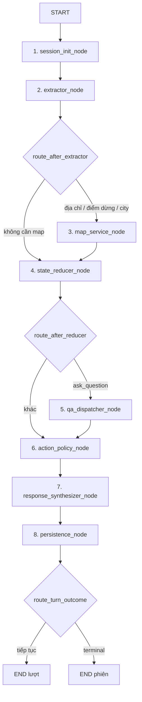

# ParrotGo: Smart Voice Taxi Booking System (MVP CLI)

Hệ thống Core AI hội thoại đặt xe thông minh cho tổng đài ParrotGo, điều phối qua LangGraph (8 nodes, 3 conditional edges), lưu trữ giao dịch SQLite, hỗ trợ RAG Chroma cho chính sách FAQ và chuẩn hóa địa danh/cổng đón.

---

## 1. Kiến trúc tổng quan

Mỗi lượt hội thoại từ ASR được truyền vào Core và trả lời qua chuỗi thoại thuần túy (clean speech text) để đưa thẳng sang TTS:



### 8 Nodes & 3 Conditional Edges:
1. **`session_init_node`**: Reset ngữ cảnh mỗi lượt, bảo toàn session state, nạp CRM profile.
2. **`extractor_node`**: NLU đa ý định, bóc tách slot, xử lý tự sửa đổi (self-correction), ngõ sâu, cổng Mega POI.
3. **`map_service_node`**: Tra cứu alias địa phương, giải quyết cổng đón, fuzzy match đường phố, tích hợp Vietmap (mock & live).
4. **`state_reducer_node`**: Cơ quan duy nhất cập nhật `booking_slots`, xử lý deny/confirm, tính lại `ready_to_book`.
5. **`qa_dispatcher_node`**: Truy vấn trạng thái phiên (State Inspector), công cụ ước tính lộ trình (Route tool), và tra cứu FAQ RAG (Chroma).
6. **`action_policy_node`**: Quyết định hành động thoại kế tiếp từ state (chỉ đọc).
7. **`response_synthesizer_node`**: Render mẫu thoại thuần TTS không chứa JSON/Markdown/ANSI/raw enums.
8. **`persistence_node`**: Giao dịch ACID đơn lẻ ghi transcript, audit log, CRM favorites và booking vào SQLite.

---

## 2. Cấu trúc mã nguồn

```text
ParrotGo/
├── data/
│   ├── parrotgo.db              # SQLite lưu trữ phiên, tin nhắn, cuốc xe, audit
│   ├── chroma_data/              # Vector database Chroma cho FAQ
│   └── seed_data/                # Dữ liệu mẫu địa danh và chính sách
│       ├── places.json
│       └── policy_faqs.json
├── src/
│   ├── config.py                 # Cấu hình Pydantic Settings
│   ├── core/
│   │   ├── state.py              # Schema chuẩn duy nhất
│   │   ├── validators.py         # Kiểm tra tính sẵn sàng, validation NLU và text
│   │   ├── time_utils.py         # Chuẩn hóa thời gian hẹn ISO và văn nói
│   │   ├── edges.py              # Định tuyến điều kiện trong LangGraph
│   │   ├── graph.py              # Lắp ghép StateGraph 8 node
│   │   └── nodes/                # 8 node LangGraph
│   ├── db/
│   │   ├── sqlite_manager.py     # DAL SQLite giao dịch toàn vẹn
│   │   ├── in_memory_cache.py    # Cache SQLite RAM địa danh, cổng, alias
│   │   └── chroma_client.py      # Chroma client an toàn khi rỗng
│   ├── services/
│   │   ├── llm_extractor.py      # Bộ trích xuất NLU (mock deterministic & LLM live)
│   │   ├── vietmap_client.py     # Client Vietmap 17 tình huống mock & live
│   │   ├── map_resolver.py       # Pipeline giải quyết địa chỉ toàn diện
│   │   ├── qa_dispatcher.py      # Hỏi đáp state, route, FAQ
│   │   ├── embedding_adapter.py  # Cấu hình embedding và manifest
│   │   └── templates.py          # Ngân hàng lời thoại chuẩn TTS
│   └── cli/
│       ├── runner.py             # Trình chạy hội thoại tương tác CLI
│       └── data.py               # Công cụ nạp và kiểm tra dữ liệu
├── tests/
│   ├── conftest.py
│   ├── test_db_layer.py
│   ├── test_extractor.py
│   ├── test_map_service.py
│   ├── test_qa.py
│   ├── test_planner.py
│   └── test_e2e_cli.py
├── requirements.txt           # Pinned dependencies cốt lõi
├── requirements-lock.txt      # Khóa toàn bộ cây phụ thuộc
├── setup_env.ps1              # Script tự động cài đặt môi trường (PowerShell)
├── setup_env.bat              # Script tự động cài đặt môi trường (Windows CMD)
├── setup_env.sh               # Script tự động cài đặt môi trường (Bash/Linux/WSL)
├── pyproject.toml
└── .env.example
```

---

## 3. Cài đặt và Khởi chạy

### Cách 1: Tự động qua Setup Script (Khuyên dùng)

- **Trên Windows (PowerShell):**
  ```powershell
  .\setup_env.ps1
  ```
- **Trên Windows (Command Prompt):**
  ```cmd
  setup_env.bat
  ```
- **Trên Linux / macOS / WSL (Bash):**
  ```bash
  chmod +x setup_env.sh
  ./setup_env.sh
  ```

Script sẽ tự động:
1. Tạo môi trường ảo `.venv`
2. Nâng cấp `pip`
3. Cài đặt chính xác các thư viện từ `requirements.txt`
4. Khởi tạo file `.env` từ `.env.example` (nếu chưa có)
5. Chạy smoke test và kiểm tra toàn bộ suite test

### Cách 2: Cài đặt thủ công
```bash
# Tạo và kích hoạt môi trường ảo
py -m venv .venv
.\.venv\Scripts\activate

# Cài đặt thư viện
pip install -r requirements.txt
pip install -e . --no-deps
```

### Chạy kiểm thử toàn bộ:
```bash
py -m pytest -v
```

### Chạy CLI đàm thoại tương tác:
```bash
py -m src.cli.runner --phone 0988888888 --name "Nguyễn Văn A" --city "Hà Nội"
```
*Lưu ý:* `stdout` chỉ xuất duy nhất lời thoại của bot (dành riêng cho TTS). Mọi thông tin log, prompt và trạng thái debug được xuất qua `stderr`.

---

## 4. Quản lý và Nạp dữ liệu

### Xác thực và nạp địa danh:
```powershell
py -m src.cli.data validate-places --input data/seed_data/places.json
py -m src.cli.data upsert-places --input data/seed_data/places.json
```

### Xác thực và nạp chính sách FAQ:
```powershell
py -m src.cli.data validate-faq --input data/seed_data/policy_faqs.json
py -m src.cli.data upsert-faq --input data/seed_data/policy_faqs.json
```

### Xuất bản snapshot địa lý:
```powershell
py -m src.cli.data export-places --output data/snapshot_places.json
```

## Demo đã bổ sung dữ liệu và kiểm tra live

- Địa danh được lưu bền vững trong data/snapshot_places.json (GEO_DATA_PATH). Lệnh upsert-places đọc snapshot hiện có rồi cập nhật; runner hydrate khi khởi động. Nếu snapshot trống, runner nạp seed. Có các chi nhánh Vincom lấy từ Vietmap; tên Vincom vẫn cần làm rõ chi nhánh. Cổng mẫu chưa kiểm chứng không được dùng làm điểm đón mặc định live.
- RAG dùng ONNX all-MiniLM-L6-v2, 384 chiều, cosine. Bật RAG_ENABLED=true; cấu hình embedding nằm trong .env.example. Lần đầu model có thể cần tải; máy này đã có cache. Chỉ FAQ approved, có nguồn/phiên bản và đủ độ liên quan được trả. FAQ mới mô tả khả năng thực của MVP.
- MAP_MODE và LLM_MODE khai báo trong .env được tôn trọng. Dùng MAP_MODE=live, LLM_MODE=gemini hoặc groq với key tương ứng để kiểm tra thật. Timeout/retry được cấu hình; lỗi live không âm thầm chuyển thành parser mock.
- Một booking chỉ trở thành booked sau khi SQLite commit. Khi commit lỗi, thông tin giữ trong phiên và khách xác nhận lại để thử lưu. Mỗi runner gắn riêng với DB của nó.

Nạp dữ liệu trước buổi demo:

~~~~powershell
.\.venv\Scripts\python.exe -m src.cli.data upsert-places --input data/seed_data/places.json
.\.venv\Scripts\python.exe -m src.cli.data upsert-faq --input data/seed_data/policy_faqs.json
~~~~

Kiểm tra live và lưu báo cáo (nếu có API key trong .env):

~~~~powershell
.\.venv\Scripts\python.exe scripts/live_demo_check.py
~~~~

Script dùng thông tin khách giả và DB tạm; báo cáo không chứa API key. Giới hạn số hành khách trong cấu hình là giới hạn đội xe demo, cần điều chỉnh theo đội xe thực tế.

Kết quả cập nhật 08/10/2026 sau sửa UX: 206 test đạt, 31 kiểm tra live đạt. Xem [báo cáo lời thoại ngắn](reports/clarification-ux-fix-2026-10-08.md) và [báo cáo dữ liệu/RAG](reports/demo-optimization-2026-10-08.md). FAQ có thể bổ sung trường questions (cách hỏi khác), keywords và excluded_keywords; giữ source, version và approved trong metadata.
