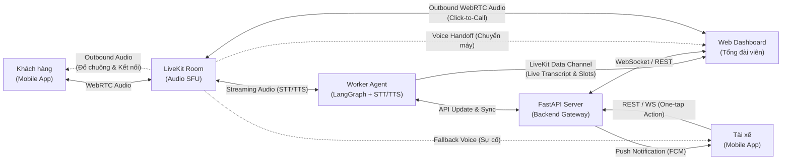

# THIẾT KẾ HỆ THỐNG TỔNG ĐÀI ĐẶT XE THÔNG MINH (PARROTGO)

## 1. Kiến trúc tổng thể hệ thống

Hệ thống kết hợp giữa truyền thông giọng nói thời gian thực (WebRTC) và kiến trúc hướng sự kiện (Event-driven) để tối ưu băng thông và tài nguyên máy chủ:

* **Tầng giao diện (Clients):**
  * **Mobile App Khách hàng:** Giao diện đặt xe qua thoại WebRTC, xem trạng thái cuốc xe và lộ trình di chuyển.
  * **Mobile App Tài xế:** Nhận cuốc xe, cập nhật trạng thái hành trình bằng thao tác một chạm (One-tap action) và tích hợp kênh gọi thoại khẩn cấp (Fallback Voice) với tổng đài viên khi phát sinh sự cố.
  * **Mobile App Tổng đài viên:** Tiếp nhận cuộc gọi chuyển tiếp khi khách hàng yêu cầu gặp người thật hoặc AI chuyển giao.
  * **Web Dashboard Tổng đài viên:** Bảng điều khiển trung tâm hiển thị luồng transcript thời gian thực, thông tin trích xuất cuốc xe, danh sách chuyến đi, công cụ can thiệp dữ liệu thủ công và tính năng gọi chủ động (Click-to-Call).

* **Tầng điều phối dịch vụ (Backend Gateway - FastAPI):**
  * Xử lý xác thực, cấp token LiveKit, quản lý vòng đời cuốc xe (Trip Lifecycle), lưu trữ cơ sở dữ liệu (PostgreSQL/MongoDB) và định tuyến thông báo đẩy (FCM).

* **Tầng truyền thông thời gian thực (Media & Data - LiveKit Cloud):**
  * **Audio SFU:** Quản lý truyền tải âm thanh đa chiều độ trễ thấp giữa Khách hàng, Agent, Tổng đài viên và Tài xế.
  * **Data Channels:** Kênh truyền dữ liệu siêu nhẹ phục vụ đồng bộ tức thì Live Transcript và trạng thái trích xuất (Slot-filling State) lên Dashboard.

* **Tầng AI xử lý giọng nói (LiveKit Worker Agents & Core AI):**
  * **Speech Pipeline:** STT (Speech-to-Text) và TTS (Text-to-Speech) tối ưu độ trễ thấp (Streaming Audio).
  * **AI Engine (LangGraph & Tools):** Quản lý ngữ cảnh hội thoại, trích xuất thực thể (Điểm đón, điểm đến, loại xe), gọi API bên ngoài và đồng bộ trạng thái hội thoại.

---

## 2. Luồng hoạt động chi tiết (Workflows)

### 2.1. Sơ đồ tương tác kiến trúc & Phân luồng dữ liệu (Data & Media Flow)

---

### 2.2. Sơ đồ luồng hoạt động tổng thể (End-to-End Flowchart)

```mermaid
flowchart TD
    %% GIAI ĐOẠN 1
    subgraph Phase1 ["Giai đoạn 1: Khách hàng gọi đặt xe & Tiếp nhận tự động bởi AI Agent"]
        Start1(["Khách hàng bấm Gọi trên Mobile App"]) --> Req1["Gửi Request khởi tạo cuộc gọi đến FastAPI"]
        Req1 --> InitLK["FastAPI tương tác LiveKit Cloud:<br/>- Tạo LiveKit Room<br/>- Kích hoạt LiveKit Worker Agent"]
        InitLK --> Token1["FastAPI cấp Access Token về App khách hàng"]
        Token1 --> ConnectRoom["Khách hàng kết nối vào LiveKit Room<br/>(Kênh WebRTC Audio 2 chiều)"]
        
        ConnectRoom --> VoiceConv["Đàm thoại thời gian thực:<br/>Khách hàng ◄──► AI Agent"]
        VoiceConv --> SpeechPipe["Speech Pipeline:<br/>Streaming Audio (STT bóc tách / TTS phản hồi)"]
        SpeechPipe --> LangGraphCore["LangGraph AI Core:<br/>Xử lý ngữ cảnh, bóc tách Entity (Slots) & Gọi Tools"]
        
        LangGraphCore --> DataChan["Đồng bộ tức thì qua LiveKit Data Channel:<br/>Đẩy Live Transcript & Slots (Tên, SĐT, Điểm đón/đến, Loại xe)"]
        DataChan -.-> LiveDash["Hiển thị trực tiếp trên Web Dashboard Tổng đài"]
        
        LangGraphCore --> EvalIntent{"Xác định khả năng xử lý?"}
    end

    %% GIAI ĐOẠN 2
    subgraph Phase2 ["Giai đoạn 2: Chuyển giao cuộc gọi cho Tổng đài viên (Human Handoff)"]
        EvalIntent -- "Khách yêu cầu người thật / Bot không xử lý được" --> TriggerHandoff["Agent kích hoạt tín hiệu Handoff qua FastAPI"]
        TriggerHandoff --> RingApp["FastAPI gửi tín hiệu rung chuông<br/>đến Mobile App của Tổng đài viên"]
        RingApp --> AgentAccept["Tổng đài viên bấm Nhận cuộc gọi"]
        AgentAccept --> JoinRoom["Cấp quyền kết nối thẳng vào LiveKit Room của khách"]
        
        JoinRoom --> HumanTalk["Tổng đài viên đàm thoại trực tiếp với Khách"]
        JoinRoom --> SilentMode["LiveKit Worker Agent chuyển sang<br/>'Silent Observer Mode':<br/>- Ngắt âm thanh phát (TTS)<br/>- Tiếp tục STT ngầm để lưu log & cập nhật DB"]
    end

    %% ĐIỂM CHỐT CUỐC XE
    EvalIntent -- "AI chốt đủ thông tin & Khách xác nhận" --> BookingConfirmed["Cuốc xe được XÁC NHẬN (Confirmed)"]
    HumanTalk --> BookingConfirmed

    %% GIAI ĐOẠN 3
    subgraph Phase3 ["Giai đoạn 3: Điều phối Tài xế & Cập nhật hành trình (Tối ưu hóa)"]
        BookingConfirmed --> DispatchDriver["FastAPI phát cuốc xe:<br/>Gửi Push Notification (FCM) đến App tài xế"]
        
        DispatchDriver --> StepByStep["Tài xế cập nhật trạng thái One-tap (REST / WS):<br/>1. Đã đến điểm đón<br/>2. Đã đón khách<br/>3. Hoàn thành chuyến đi"]
        StepByStep --> SyncBE["Gửi tín hiệu trực tiếp về FastAPI<br/>(Không cần kết nối phòng thoại)"]
        SyncBE -.-> LiveStatus["Hiển thị tức thì trạng thái lên Web Dashboard"]
        
        StepByStep --> CheckIncident{"Phát sinh sự cố hành trình?<br/>(Không tìm thấy khách, hủy xe, sự cố xe...)"}
        CheckIncident -- "Không có sự cố" --> TripSuccess(["Hoàn thành chuyến đi thành công"])
        
        CheckIncident -- "Có sự cố" --> CallSupport["Tài xế bấm 'Gọi hỗ trợ' trên App"]
        CallSupport --> CreateFallback["Hệ thống tạo LiveKit Room riêng biệt<br/>(Fallback Voice WebRTC)"]
        CreateFallback --> VoiceTroubleshoot["Tài xế & Tổng đài viên kết nối thoại giải quyết sự cố"]
        VoiceTroubleshoot --> TripSuccess
    end

    %% GIAI ĐOẠN 4
    subgraph Phase4 ["Giai đoạn 4: Giám sát và Can thiệp trên Web Dashboard"]
        LiveDash --> LiveMonitor["Bảng giám sát trực tiếp (Live Call Monitoring):<br/>- Xem danh sách cuộc gọi theo thời gian thực<br/>- Đọc Live Transcript ngay khi dứt câu<br/>- Theo dõi dữ liệu bóc tách (Slot values)"]
        LiveStatus --> LiveMonitor
        
        LiveMonitor --> CheckCorrection{"Cần can thiệp dữ liệu thủ công?"}
        CheckCorrection -- "Phát hiện sai lệch / Cần điều chỉnh" --> ManualOverride["Can thiệp thủ công (Manual Override):<br/>- Sửa địa chỉ đón/đến, đổi thông tin xe<br/>- Thay đổi trạng thái cuốc xe thủ công<br/>➔ Đồng bộ trực tiếp vào LangGraph & Database"]
        CheckCorrection -- "Không can thiệp" --> AuditHistory["Tra cứu & Quản lý lịch sử:<br/>- Tìm kiếm theo SĐT khách hàng<br/>- Xem lại Full Transcript cuộc gọi"]
        ManualOverride --> AuditHistory
    end

    %% GIAI ĐOẠN 5: CUỘC GỌI CHỦ ĐỘNG (OUTBOUND CALL)
    subgraph Phase5 ["Giai đoạn 5: Cuộc gọi chủ động từ Tổng đài viên (Outbound Calling)"]
        LiveMonitor --> TriggerOutbound["Tổng đài viên xem Danh sách / Lịch sử cuốc xe<br/>và bấm nút 'Gọi Khách hàng' hoặc 'Gọi Tài xế'"]
        AuditHistory --> TriggerOutbound
        
        TriggerOutbound --> ReqOutbound["Web Dashboard gửi Request tạo cuộc gọi đến FastAPI"]
        ReqOutbound --> InitOutboundRoom["FastAPI tương tác LiveKit Cloud:<br/>- Tạo LiveKit Outbound Room<br/>- Cấp Access Token cho Web Dashboard"]
        InitOutboundRoom --> RingTarget["FastAPI gửi Push Notification / Ringing<br/>đến App Khách hàng hoặc App Tài xế"]
        
        RingTarget --> TargetAnswers{"Người nhận bắt máy?"}
        TargetAnswers -- "Bắt máy" --> ConnectOutbound["App người nhận kết nối vào LiveKit Outbound Room"]
        ConnectOutbound --> OutboundTalk["Đàm thoại trực tiếp 2 chiều (WebRTC Audio):<br/>Tổng đài viên (Web Browser) ◄──► Khách hàng / Tài xế (App)"]
        OutboundTalk --> EndOutbound(["Kết thúc cuộc gọi & Ghi nhận log cuốc xe"])
        TargetAnswers -- "Từ chối / Nhỡ máy" --> MissedCall["Ghi nhận trạng thái cuộc gọi nhỡ trên Dashboard"]
        MissedCall --> EndOutbound
    end
```

---

### 2.3. Chi tiết các bước nghiệp vụ theo giai đoạn

#### Giai đoạn 1: Khách hàng gọi đặt xe & Tiếp nhận tự động bởi AI Agent
1. **Khởi tạo kết nối:** Khách hàng bấm gọi trên Mobile App. Request gửi đến **FastAPI**.
2. **Cấp phát phiên:** **FastAPI** tương tác với **LiveKit Cloud** tạo phòng, kích hoạt **LiveKit Worker Agent** tham gia, sau đó trả Access Token về cho App khách hàng kết nối vào phòng.
3. **Đối thoại và trích xuất dữ liệu:**
   * Khách hàng nói chuyện trực tiếp với AI Agent.
   * LangGraph xử lý logic nghiệp vụ, gọi tools kiểm tra địa chỉ và tính giá cước.
   * **Đồng bộ thời gian thực:** Song song với phản hồi giọng nói (TTS), Worker Agent liên tục đẩy văn bản phiên âm (Transcript) và dữ liệu biểu mẫu đã bóc tách (Tên, SĐT, Điểm đón, Điểm đến, Loại xe) qua **LiveKit Data Channel** trực tiếp đến **Web Dashboard** của tổng đài viên.

---

#### Giai đoạn 2: Chuyển giao cuộc gọi cho Tổng đài viên (Human Handoff)
1. **Kích hoạt chuyển tiếp:** Khi khách yêu cầu gặp người thật hoặc bot không xử lý được ý định sau nhiều lần thử, Agent kích hoạt tín hiệu Handoff qua **FastAPI**.
2. **Đổ chuông:** Hệ thống gửi tín hiệu rung chuông đến **Mobile App của Tổng đài viên**.
3. **Tiếp quản cuộc gọi:**
   * Tổng đài viên bấm nhận cuộc gọi và được cấp quyền kết nối thẳng vào LiveKit Room của khách hàng.
   * **LiveKit Agent** lập tức chuyển sang **Chế độ quan sát (Silent Observer Mode)**: Ngắt phát âm thanh (TTS), tiếp tục chạy STT ngầm để ghi nhận lời thoại giữa khách và tổng đài viên, đồng thời cập nhật dữ liệu lên hệ thống.

---

#### Giai đoạn 3: Điều phối tài xế & Cập nhật hành trình (Tối ưu hóa)
1. **Phát cuốc xe:** Khi cuốc xe được xác nhận (bởi AI hoặc Tổng đài viên), **FastAPI** đẩy thông báo (Push Notification) đến App tài xế.
2. **Cập nhật trạng thái qua nút bấm (Data-driven):**
   * Tài xế bấm **Đã đến điểm đón** ➔ **Đã đón khách** ➔ **Hoàn thành chuyến đi**.
   * Mỗi thao tác gửi tín hiệu trực tiếp về **FastAPI** để cập nhật trạng thái chuyến đi và hiển thị tức thì trên Web Dashboard mà không cần kết nối phòng thoại.
3. **Kênh thoại sự cố (Fallback Voice Channel):**
   * Nếu có vấn đề phát sinh (không tìm thấy khách, khách hủy xe, sự cố giao thông), Tài xế có thể bấm nút **Gọi hỗ trợ** trên App/Dashboard.
   * Lúc này hệ thống mới tạo một LiveKit Room riêng kết nối cuộc gọi thoại WebRTC giữa Tài xế và Tổng đài viên để xử lý.

---

#### Giai đoạn 4: Giám sát và Can thiệp trên Web Dashboard
* **Giám sát trực tiếp (Live Call Monitoring):**
  * Theo dõi danh sách các cuộc gọi đang diễn ra theo thời gian thực.
  * Nhấp vào một cuộc gọi để đọc ngay **Live Transcript** (chữ hiển thị tức thì khi người nói dứt câu qua Data Channel) và xem bảng thông tin trích xuất tự động (Slot values).
* **Can thiệp dữ liệu thủ công (Manual Override):**
  * Tổng đài viên có thể nhấp chuột trực tiếp vào các trường dữ liệu trên Dashboard để chỉnh sửa (ví dụ: sửa lại số nhà, đổi điểm đến) nếu AI nhận diện nhầm. Dữ liệu chỉnh sửa được đồng bộ thẳng vào phiên xử lý của LangGraph và Database.
  * Thay đổi trạng thái cuốc xe thủ công khi cần can thiệp hành chính.
* **Tra cứu & Lịch sử:**
  * Tìm kiếm theo số điện thoại khách hàng để kiểm tra lịch sử cuốc xe, xem lại toàn bộ bản ghi chép cuộc gọi (Full Transcript).

---

#### Giai đoạn 5: Cuộc gọi chủ động từ Tổng đài viên (Outbound Calling từ Web Dashboard)
1. **Kích hoạt cuộc gọi (Click-to-Call):**
   * Khi đang xem **Lịch sử cuốc xe** hoặc **Danh sách cuốc xe đang hoạt động**, tổng đài viên có thể bấm trực tiếp nút **Gọi khách hàng** hoặc **Gọi tài xế** trên giao diện Web Dashboard.
2. **Khởi tạo phòng thoại Outbound:**
   * Web Dashboard gửi request đến **FastAPI**.
   * **FastAPI** tương tác với **LiveKit Cloud** để khởi tạo một LiveKit Room riêng cho cuộc gọi chủ động và cấp token âm thanh WebRTC cho trình duyệt của tổng đài viên.
3. **Đổ chuông & Kết nối người nhận:**
   * **FastAPI** gửi tín hiệu cuộc gọi đến (Push Notification / Socket) để rung chuông trên **Mobile App của Khách hàng** hoặc **Mobile App của Tài xế**.
   * Khi khách hàng hoặc tài xế bấm nhận cuộc gọi, App của họ tự động kết nối vào phòng LiveKit đã tạo.
4. **Đàm thoại & Lưu trữ:**
   * Tổng đài viên nói chuyện trực tiếp với Khách hàng/Tài xế qua micro/tai nghe trình duyệt Web (WebRTC Audio hai chiều độ trễ thấp).
   * Khi cuộc gọi kết thúc, thông tin cuộc gọi (thời lượng, thời điểm, trạng thái nghe máy/nhỡ) được lưu vào lịch sử cuốc xe.

---

## 3. Bảng phân định trạng thái và quyền hạn

| Đối tượng | Kênh kết nối chính | Kênh phụ / Khi có sự cố | Dữ liệu truyền tải |
| :--- | :--- | :--- | :--- |
| **Khách hàng** | WebRTC Audio (với Agent) | WebRTC Audio (với Tổng đài viên khi Handoff / Outbound Call) | Luồng âm thanh hai chiều (In/Out) |
| **AI Worker Agent** | WebRTC Audio (vào LiveKit Room) | LiveKit Data Channel | Audio In/Out, Transcript, Slots JSON |
| **Tổng đài viên (App)** | Standby (Nhận Push Noti) | WebRTC Audio (vào LiveKit Room) | Luồng âm thanh hai chiều |
| **Tổng đài viên (Web)** | LiveKit Data Channel + WebSockets | WebRTC Audio (Click-to-Call Outbound), REST API can thiệp dữ liệu | Transcript thời gian thực, Trạng thái chuyến đi, Form can thiệp, Audio In/Out (Outbound Call) |
| **Tài xế** | REST API / WebSockets (App Action) | WebRTC Audio (Gọi hỗ trợ khẩn cấp / Nhận Outbound Call) | Tọa độ GPS, Trạng thái cuốc (Accepted/Picked/Done), Audio In/Out |
